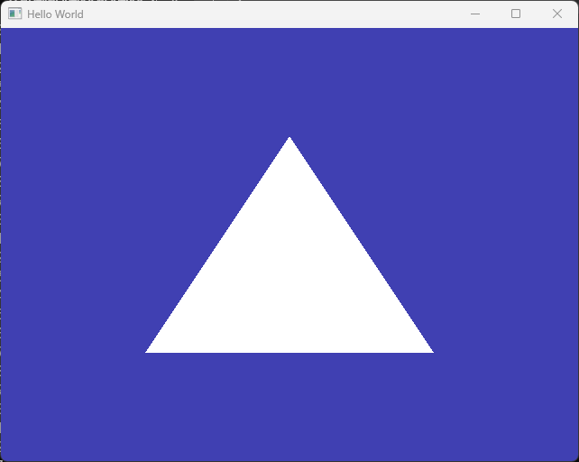
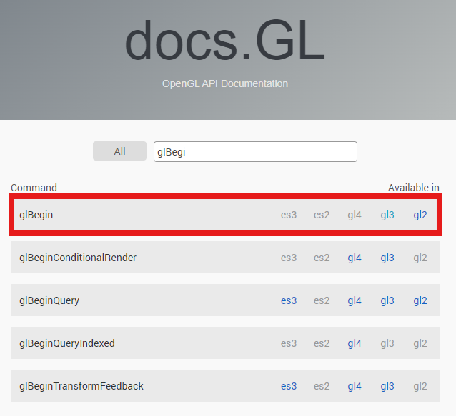
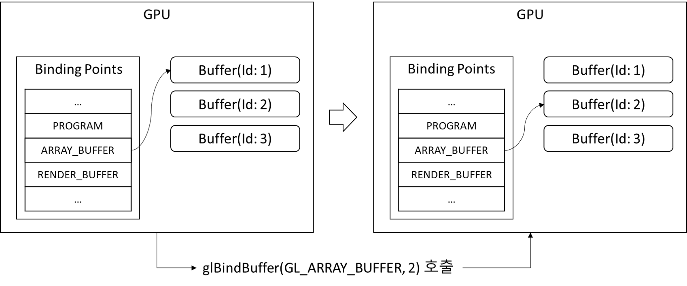

# Vertex Buffer

이번 장에서는 Vertex Buffer(정점 버퍼)에 대해 알아보도록 하겠습니다.

미리 말씀드리지만 화면에 무언가 의미 있는 것을 그리기 위해서는 아직 몇 장을 더 진행해야 하고, 이번 장에서는 크게 의미 있는 결과물이 나오지는 않습니다.

따라서 좀 재미는 없을수도 있습니다. 하지만 그래픽 카드의 동작 방식을 혼동 없이 이해하기 위해서는 꼭 필요한 내용이니 집중해서 보시면 좋겠습니다.

## 시작 코드

[이전 문서](./01_installation.md)에서는 설치 테스트를 위해 문제가 생길 경우 오류 메시지도 출력해주고, 여러 기능들이 잘 동작하는지를 확인하기 위해 좀 extensive한 예시 코드를 사용했습니다.

이 장에서는 이해를 돕기 위해 안정성은 좀 떨어지지만, 꼭 필요한 코드만을 남긴 상태에서 다시 출발해 보도록 하겠습니다. 욕심이 있으신 분들은 기존의 좀 더 완전한 코드에서 스스로 추가 작성하여 시작하셔도 됩니다.

[시작 코드](assets/02_vertex_buffer/src/main_start.cpp)는 아래와 같고, 간단한 코멘트를 남겨 두었습니다. 실행 결과는 이전 문서에서와 동일할 것이라는 것을 예상하실 수 있을 겁니다.

```cpp title="main.cpp"
#define GLEW_STATIC
#include <GL/glew.h>
#include <GLFW/glfw3.h>
#include <iostream>

int main(void)
{
	// GLFW 초기화
	if (!glfwInit())
		return -1;

	// Window 정의 및 생성
	GLFWwindow* window = glfwCreateWindow(640, 480, "Hello World", NULL, NULL);
	// 현재 윈도우를 그릴 대상으로 설정
	glfwMakeContextCurrent(window);

	// GLEW 초기화
	glewInit();

	// 배경색 설정
	glClearColor(0.25, 0.25, 0.7, 1);

	// Rendering Loop
	while (!glfwWindowShouldClose(window)) // 윈도우가 닫히면 루프 탈출
	{
		glClear(GL_COLOR_BUFFER_BIT); // <- 배경색 그리기
		glfwSwapBuffers(window); // <- 윈도우에 이미지 표시
		glfwPollEvents(); // <- 윈도우가 닫히는지 탐지하는 부분
	}

	// Rendering Loop가 끝나면 종료
	glfwTerminate();
	return 0;
}
```

### Rendering Loop(렌더링 루프)

하나 설명드릴 부분은 렌더링 루프입니다. 우리가 배우는 온라인(실시간) 컴퓨터 그래픽스 기술은 실시간으로 이미지를 생성하는 기술입니다.

사용자가 W 키를 누르면 캐릭터가 앞으로 움직여서 앞으로 이동한 화면을 보여주어야 하고, A 키를 누르면 왼쪽으로 고개를 돌린 화면을 보여주어야 합니다.

즉, 기본적으로 이미지를 하나 만들어서 그걸 (정적으로) 계속 보여주는 것이 아니라, 입력이 들어오는 그 즉시 그에 반응하는 새로운 이미지를 보여줘야 한다는 뜻입니다.

이를 위해서 취하는 방법은 이미지가 변하든 변하지 않든 가능한 (일단은) 최대한의 속도로 새로운 이미지를 만들어서 계속 화면에 뿌려주는 것입니다.

그리고 이러한 과정이 프로그램이 종료될 때까지 지속되어야 하므로 기본적으로 while문을 사용한 무한 루프를 돌리면서 화면을 지우고 그리고를 반복하는 것입니다.

간단히 확인해 보기 위해서 아래와 같이 코드를 작성해 볼 수 있겠습니다. 어떤 속도로 while문이 돌고 있는지를 대략적으로 확인해 볼 수 있습니다. (물론 콘솔 창에 문자를 출력하느라 걸리는 시간 등이 추가되지만, 일단 무시합시다.)

:::info
왼쪽의 +는 기존 코드에서 추가되는 부분, -는 기존 코드에서 삭제되는 부분을 의미합니다.
:::

```diff title="main.cpp"
...
// Rendering Loop
//diff-add
int frame_count = 0;
while (!glfwWindowShouldClose(window)) // 윈도우가 닫히면 루프 탈출
{
    //diff-add
    std::cout << frame_count << std::endl;
    //diff-add
    frame_count++;
    glClear(GL_COLOR_BUFFER_BIT);
...
```

이렇게 화면을 계속 그리기 위한 while문을 컴퓨터 그래픽스에서는 **렌더링 루프**라 하며, 1초에 화면이 몇 번 새로 그려지는지를 **FPS(Frames per Second)**라 합니다.


## 삼각형 그리기(아님)

이제 화면에 삼각형을 하나 그려볼 것입니다. 그런데 "(아님)"을 붙인 이유는 앞으로는 이런 식으로 삼각형을 그릴 것이 아니기 때문입니다.

무슨 이야기인지는 조금 이따가 하기로 하고 일단 코드를 작성해서 한 번 결과물부터 봅시다.

```cpp title="main.cpp"
...
// Rendering Loop
int frame_count = 0;
while (!glfwWindowShouldClose(window)) // 윈도우가 닫히면 루프 탈출
{
    std::cout << frame_count << std::endl;
    frame_count++;
    glClear(GL_COLOR_BUFFER_BIT);

    //diff-add
    glBegin(GL_TRIANGLES);
    //diff-add
    glVertex2f(-0.5f, -0.5f);
    //diff-add
    glVertex2f( 0.0f,  0.5f);
    //diff-add
    glVertex2f( 0.5f, -0.5f);
    //diff-add
    glEnd();

    glfwSwapBuffers(window);
...
```

실행해 보면 아래와 같은 화면이 보입니다.



삼각형이 그려졌네요! 그리고 화면 가운데 좌표가 (0,0)이라고 알고 계시면, 왜 저렇게 삼각형이 그려졌는지를 알 수 있으실겁니다. 숫자들을 바꿔서 예상한 대로 삼각형이 다른 방식으로 그려지는지를 한 번 확인해 보세요.

강의에서 설명드린 것과 같이, 컴퓨터 그래픽스에서 물체들은 삼각형의 집합으로 정의됩니다. 따라서 삼각형을 그릴 수 있으면 이론적으로 모든 물체를 그릴 수 있다는 이야기입니다. 그런데 뭐가 문제인 걸까요? 왜 우리는 이런 기능을 사용하지 않는걸까요?

위 `glBegin()/glEnd()` 코드는 오래 전 OpenGL의 유산으로, 현대에는 사용되지 않는 방식이라서 그렇습니다. 두 가지 증거를 보여드리면 먼저 OpenGL의 레퍼런스를 쉽게 찾아볼 수 있는 [docs.gl](https://docs.gl/)에서 `glBegin()`을 찾아 보시면 gl2와 3에는 해당 함수가 있지만 gl4, es2, es3에는 해당 항목이 없다는 것을 알 수 있습니다.



또한 StackOverflow에서 관련 검색을 해 보면 이미 11년전(..)에도 오래된 기능이니 사용하지 않는 것이 좋다는 [답변](https://gamedev.stackexchange.com/questions/34108/opengl-vbo-or-glbegin-glend)이 있습니다.

이런 식의 오래된 기능들은 [Legacy OpenGL](https://www.khronos.org/opengl/wiki/Legacy_OpenGL)이라 불리며, 2024년 현재 이러한 방식을 배우는 것은 도움이 되지 않는다고 판단하였습니다. (현대의 그래픽스 응용 프로그램들이 이러한 방식으로 동작한다는 잘못된 생각을 심어주는 것을 방지하기 위함)

따라서 약간은 비 직관적일 수도 있지만, 이제 현대(modern)의 그래픽스는 어떤 방식으로 동작하는지(동작해야 하는지) 살펴보도록 하겠습니다.

<details>
<summary>사라진 이유</summary>

`glBegin()/glEnd()` 등의 함수는 immediate mode라고 해서 그리고자 하는 데이터를 CPU에서 GPU로 그때그때 전달하는 방식입니다. (드라이버에 따라 예전에는 아마 내부적으로 최적화 등을 하지 않았을까 싶긴 하지만) CPU와 GPU간의 통신은 상당히 비용이 높은 편이라 비효율적이기 때문에 아래 설명할 방식으로 접근하는 것이 표준으로 자리잡았습니다.
</details>


## 삼각형 그리기

먼저 위 코드에서 삼각형을 그리기 위한 핵심 데이터를 살펴 보자면 (-0.5f, -0.5f)와 같은 점의 좌표값들입니다. 그리고 우리는 GPU를 사용해서 연산을 수행할 것이기 때문에 먼저 그래픽 카드 쪽으로 이 데이터를 넘겨주어야 합니다.

이렇게 데이터를 넘겨주고, 삼각형을 그리는 전체적인 과정은 다음과 같습니다.

1. (준비) CPU-side에서 데이터 준비
2. (준비) GPU-side에서 버퍼 생성
3. (준비) GPU-side에서 버퍼 활성화
4. (준비) CPU-side에서 GPU-side로 데이터 복사
5. (렌더링) GPU에서 활성화된 버퍼의 데이터를 활용해 삼각형 그리기

뭔가 상당히 복잡해 보이지만, 개념만 잘 이해하시면 어렵지 않습니다.

### 1. (준비) CPU-side에서 데이터 준비

아까 말씀드린 삼각형을 그리기 위한 핵심 데이터는 점의 좌표값입니다. 그 좌표값을 일단 메모리에 올려 두어야 GPU에 복사를 할 수 있겠죠? 

따라서 우리가 접근할 수 있는 메모리에 먼저 데이터를 쓰는 과정이 필요하고, 그것이 1번 과정입니다.

:::info
Introduction에 말씀드린 것처럼 우리는 직접 그래픽카드에 명령을 내릴 수 없습니다. 직접 그래픽카드에 데이터를 집어넣을 수도 없습니다.

데이터를 집어넣는 것도 OpenGL API를 사용해서만 가능합니다.
:::

:::info
위에서 `CPU-side = CPU + 메인 메모리`를 의미하며 `GPU-side = GPU + 그래픽 카드의 메모리`를 의미합니다. 그래픽 카드에는 연산 장치인 GPU와, GPU에서 빠르게 접근할 수 있는 메모리(VRAM)이 별도로 존재합니다.

따라서 정확히 말하자면 우리는 메인 메모리의 데이터를 VRAM으로 전달하는 것이고, 이를 간단히 `CPU-side`, `GPU-side`로 표기한 것입니다. (Vulkan에서는 호스트(host)와 디바이스(device)로 명명합니다.)

향후 예를들어 제가 *"CPU에서 GPU로 데이터를 전달한다"* 라고 한다면 정확히는 위와 같은 의미인데, 그냥 단축해서 이야기 하는 거라고 생각해 주십시오.
:::

1번 과정을 위한 코드를 추가해 봅시다.

```cpp title="main.cpp"
...
// 배경색 설정
glClearColor(0.25, 0.25, 0.7, 1);

//diff-add
float positions[6] = {
//diff-add
    -0.5f, -0.5f,
//diff-add
     0.0f,  0.5f,
//diff-add
     0.5f, -0.5f
//diff-add
};

// Rendering Loop
int frame_count = 0;
while (!glfwWindowShouldClose(window)) // 윈도우가 닫히면 루프 탈출
{
...
```

그냥 배열을 하나 정의해서 값을 저장해 둔 것입니다. 더 설명할 것도 없죠. 여러분은 이 데이터가 메인 메모리에 저장된다는 것과 어떠한 방식으로 저장되는지를 이미 다른 강의들을 통해 배우셨을 겁니다.


### 2. (준비) GPU-side에서 버퍼 생성

다음으로는 **GPU의 메모리**에 데이터를 받을 부분을 만들어야 합니다. 이렇게 데이터가 저장될 영역을 일반적으로 [버퍼(Buffer)](https://en.wikipedia.org/wiki/Data_buffer)라고 부르고, 여기서도 마찬가지입니다.

우리가 `int a`이라고 하면 운영체제가 메모리의 적절한 영역에 정수형 변수 하나를 저장하기 위한 공간을 만드는 것처럼 `glGenBuffers()` 함수를 호출하면 GPU가 **GPU 메모리**의 적절한 영역에 데이터를 저장하기 위한 공간을 마련합니다. **그리고 그 공간의 ID를 알려 줍니다.**

실제 코드는 아래와 같습니다.

```cpp title="main.cpp"
...
float positions[6] = {
    -0.5f, -0.5f,
     0.0f,  0.5f,
     0.5f, -0.5f
};

//diff-add
unsigned int bufferID;
//diff-add
glGenBuffers(1, &bufferID);

// Rendering Loop
int frame_count = 0;
while (!glfwWindowShouldClose(window)) // 윈도우가 닫히면 루프 탈출
{
...
```

딱 두줄인데요, CPU쪽에 ID를 저장할 변수(`bufferID`)를 만들어 두고, `glGenBuffers()`를 호출하면서 두 번째 인자로 그 변수의 주소를 넘겨주면 API 호출을 통해 GPU는 버퍼를 하나 마련해 둔 뒤에 그 버퍼의 ID를 bufferID에 써줍니다. 첫 번째 인자는 만들 버퍼의 개수인데 여러 개를 한꺼번에 만들 수도 있지만 지금은 하나만 만들면 되기 때문에 1을 넣어 주었습니다.

향후 살펴보겠지만 이 ID를 가지고 데이터를 명시하게 되기 때문에 아주 중요하다고 볼 수 있겠습니다. 이 ID는 이름(name)이나 핸들(handle)이라고 부르기도 합니다.

:::tip
앞으로 다양한 OpenGL 함수들이 나타날텐데, 어떤 인자가 어떤 용도인지 잘 기억하지 못하실 수 있습니다. 그럴 때는 꼭 [docs.gl](https://docs.gl/) 문서에서 찾아보세요!
:::


### 3. (준비) GPU-side에서 버퍼 활성화

이 부분이 아주 중요하면서도 헷갈리는 부분입니다. OpenGL에서는 **버퍼를 만들었다고 해서, 그 버퍼가 지금 당장 사용 가능하다는 뜻은 아닙니다!**

따라서 버퍼를 사용하겠다고 명시하는 과정이 필요하며 이를 위해 `glBindBuffer()` 함수를 사용합니다. 별로 어려운 것은 아니고, 한 줄만 추가해 주면 됩니다.

```cpp title="main.cpp"
...
unsigned int bufferID;
glGenBuffers(1, &bufferID);
//diff-add
glBindBuffer(GL_ARRAY_BUFFER, bufferID);

// Rendering Loop
int frame_count = 0;
while (!glfwWindowShouldClose(window)) // 윈도우가 닫히면 루프 탈출
{
...
```

`glBindBuffer()`의 첫 번째 인자는 어떤 종류의 버퍼를 활성화 할 것인지 지정해 주기 위한 상수값이고, 두 번째 인자는 활성화할 버퍼의 ID입니다. 우리는 방금 만든 그 버퍼를 활성화 하였습니다.


### 4. (준비) CPU-side에서 GPU-side로 데이터 복사

이제 1번 과정을 통해 만들어진 데이터를 GPU(의 버퍼)로 보낼 겁니다. 마찬가지로 적절한 함수를 호출해 주면 됩니다.

```cpp title="main.cpp"
...
unsigned int bufferID;
glGenBuffers(1, &bufferID);
glBindBuffer(GL_ARRAY_BUFFER, bufferID);
//diff-add
glBufferData(GL_ARRAY_BUFFER, 6 * sizeof(float), positions, GL_STATIC_DRAW);

// Rendering Loop
int frame_count = 0;
while (!glfwWindowShouldClose(window)) // 윈도우가 닫히면 루프 탈출
{
...
```

이러한 작업을 하는 함수는 `glBufferData()` 함수이고, 첫 번째 인자로는 어떤 종류의 버퍼인지를 상수를 통해 설정하고, 두 번째 인자로는 데이터의 크기를 알려줍니다. 

세 번째 인자로는 positions 배열 자체를 넘겨 주었는데 정확히는 데이터 시작 지점의 메모리 주소를 넘겨준 것입니다. 마지막 인자는 사용법에 관한 힌트값인데 지금은 신경쓰지 않으셔도 됩니다.

이 함수가 실행되는 순간 실제로 GPU 메모리에 우리가 position 배열에 정의한 데이터들이 복사되는 것입니다.

이 시점에서 하나 혼동하기 쉬운, 짚고 넘어가야 할 내용이 있습니다.

### GPU의 바인딩 개념

**제가 여기까지는 "활성화"라고 설명했는데 앞으로는 "바인딩"이라고 이야기를 할겁니다. 이에 관한 추가적인 설명을 드리겠습니다.**

아래 그림에서 보시는 것처럼 GPU는 내부적으로 바인딩 포인트(Binding Point)들을 가지고 있는데 **각각의 바인딩 포인트에 대해서 하나의 버퍼만 바인딩이 가능**합니다.

예를들어 아래 왼쪽 그림처럼 원래 ARRAY_BUFFER라는 바인딩 포인트에 1번 ID를 가지고 있는 버퍼가 바인딩이 되어 있다가 우리가 `glBindBuffer()` 호출을 통해 2번 ID를 가진 버퍼를 바인딩하면, 오른쪽 그림과 같은 상태가 됩니다.



따라서 **그 이후에 `glBufferData()` 를 호출했다면 2번 ID 버퍼의 위치에 데이터가 들어가게 됩니다.**

위에서 추가한 코드를 다시 한 번 보겠습니다.

```cpp
glBufferData(GL_ARRAY_BUFFER, 6 * sizeof(float), positions, GL_STATIC_DRAW);
```

보시다시피 함수의 인자를 가지고 알 수 있는 것은 "ARRAY_BUFFER에 데이터를 넣어라"이지, "1번 버퍼에 데이터를 넣어라"가 아닙니다. (`bufferID`를 인자로 넘기지 않습니다)

위 함수가 호출되는 순간 ARRAY_BUFFER라는 바인딩 포인트에 바인딩되어있는 버퍼에 데이터를 집어넣도록 설계가 되어있습니다. 

아래 예시를 보시면 확실히 이해가 가실 겁니다. 즉, "`glBufferData` 호출 시점에 바인딩되어있는 버퍼에 데이터가 들어간다"는 겁니다.

```cpp
glBindBuffer(GL_ARRAY_BUFFER, 1);
glBufferData(GL_ARRAY_BUFFER, 6 * sizeof(float), positions, GL_STATIC_DRAW); // 1번 버퍼에 데이터가 들어감

glBindBuffer(GL_ARRAY_BUFFER, 2);
glBufferData(GL_ARRAY_BUFFER, 6 * sizeof(float), positions, GL_STATIC_DRAW); // 2번 버퍼에 데이터가 들어감

glBindBuffer(GL_ARRAY_BUFFER, 3); // 3번 버퍼를 바인딩했다가,
glBindBuffer(GL_ARRAY_BUFFER, 1); // 1번 버퍼를 바인딩하는 것으로 바꿨음
glBufferData(GL_ARRAY_BUFFER, 6 * sizeof(float), positions, GL_STATIC_DRAW); // 1번 버퍼에 데이터가 들어감!
```

### 5. (렌더링) GPU에서 활성화된 버퍼의 데이터를 활용해 삼각형 그리기

마지막으로 삼각형을 그리는 부분은 아래 코드와 같습니다. "그리기"는 화면에 그리는 것이기 때문에, 기본적으로 렌더링 루프에서 수행합니다.

```cpp title="main.cpp"
...
while (!glfwWindowShouldClose(window)) // 윈도우가 닫히면 루프 탈출
{
    std::cout << frame_count << std::endl;
    frame_count++;
    glClear(GL_COLOR_BUFFER_BIT);

    //diff-remove
    glBegin(GL_TRIANGLES);
    //diff-remove
    glVertex2f(-0.5f, -0.5f);
    //diff-remove
    glVertex2f(0.0f, 0.5f);
    //diff-remove
    glVertex2f(0.5f, -0.5f);
    //diff-remove
    glEnd();
    //diff-add
    glDrawArrays(GL_TRIANGLES, 0, 3);

    glfwSwapBuffers(window); 
    glfwPollEvents(); // <- 윈도우가 닫히는지 탐지하는 부분
}
...
```

기존의 옛날 문법들은 삭제하고 `glDrawArrays()` 호출을 추가했습니다. 첫 번째 인자는 보이는 그대로 삼각형을 그리겠다는 의미이고, 두 번째 인자는 몇 번째 데이터부터 그릴 것인지, 세 번째 인자는 몇 개의 점을 그릴 것인지를 의미합니다.

우리는 처음 데이터부터 3개의 점을 사용해 삼각형을 그릴 것이므로 두 번째와 세 번째 인자를 `0`과 `3`으로 설정했습니다.

이미 모든 데이터가 GPU에 복사되어 있고, `bufferID` 에 해당하는 버퍼가 ARRAY_BUFFER에 바인딩 되어 있는 상태이므로 `bufferID`에 저장된 데이터로 삼각형을 그리게 될 것입니다.

*하지만 실행해 보면 현재는 삼각형이 화면에 보이지 않을 것입니다.* 그리고 이것은 기대한 대로의 결과입니다.

강의에서 설명 드리겠지만 실제로 삼각형을 그리려면, 삼각형을 **어떻게** 그릴 것인지를 GPU가 계산해야 하는데 그 계산은 자동적으로 이루어지는 것이 아닙니다.

이 역시 우리가 프로그램을 따로 작성해서 GPU에 전달해 주어야 하며 이러한 프로그램을 셰이더(Shader)라 합니다.

다음 문서에서 이러한 셰이더를 작성해 볼 것이니 기대해 주시고, 이 문서에서는 두 가지 내용을 더 말씀 드리고 마치도록 하겠습니다.

## 마치며

1. `glDrawArrays()`도, 어떤 버퍼를 그리라고 지정하지 않습니다. 따라서 아래와 같이 동작하리라는 것은 예상하실 수 있을 겁니다.

```cpp
glBindBuffer(GL_ARRAY_BUFFER, 1);
glDrawArrays(GL_TRIANGLES, 0, 3); // 1번 버퍼의 데이터로 삼각형을 그림

glBindBuffer(GL_ARRAY_BUFFER, 2);
glDrawArrays(GL_TRIANGLES, 0, 3); // 2번 버퍼의 데이터로 삼각형을 그림

glBindBuffer(GL_ARRAY_BUFFER, 3); // 3번 버퍼를 바인딩했다가,
glBindBuffer(GL_ARRAY_BUFFER, 1); // 1번 버퍼를 바인딩하는 것으로 바꿨음
glDrawArrays(GL_TRIANGLES, 0, 3); // 따라서 1번 버퍼의 데이터로 삼각형을 그림
```

2. `glDrawArrays()`의 세 번째 인자가 우리가 3개의 점으로 삼각형을 그린다는 의미라고 했습니다. 그런데 잘 생각해 보면 우리가 CPU에서 GPU로 복사한 데이터는 `[-0.5f, -0.5f, 0.0f, 0.5f, 0.5f, -0.5f]` 여섯 개의 숫자가 순차적으로 들어있는 배열일 뿐입니다. 이 숫자들이 `(-0.5f, -0.5f)/(0.0f, 0.5f)/(0.5f, -0.5f)`의 세 점을 의미하는지, `(-0.5f, -0.5f, 0.0f)/(0.5f, 0.5f, -0.5f)`의 두 점을 의미하는지는 어떻게 판단하는걸까요? 


## 연습 문제

1. 현재는 세 점에 대한 6개 값을 GPU로 복사하고 있습니다. 만일 네 점에 대한 8개 값을 복사하려면 코드가 어떻게 바뀌어야 할지 생각해 보세요.

---

## 관련 링크
- [시작 소스 코드](assets/02_vertex_buffer/src/main_start.cpp)
- [종료 소스 코드](assets/02_vertex_buffer/src/main_end.cpp)
- [docs.gl](https://docs.gl/)
- [GPU 상태 다이어그램 예시](https://webgl2fundamentals.org/webgl/lessons/resources/webgl-state-diagram.html?exampleId=triangle#no-help)
