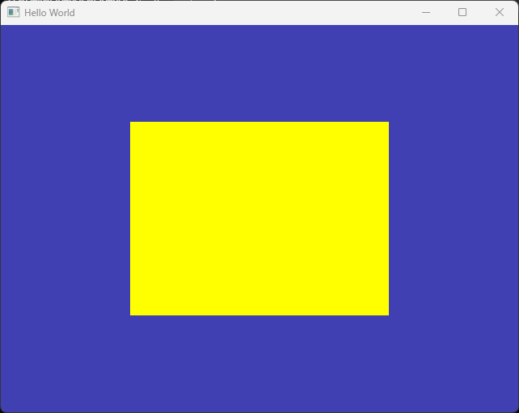

# Index Buffer

이번 문서에서는 인덱스 버퍼(Index buffer)의 의미와 그 사용법에 대해서 알아보도록 하겠습니다.

인덱스 버퍼는 동일한 정점 데이터를 재사용 할 수 있는 상황에서 메모리 효율성을 높이기 위해 사용하는 방법입니다.

예를 들어 사각형을 그리려고 할 때, 삼각형 두 개가 필요하므로 3 * 2 개의 정점 위치를 GPU에 전달하여 화면에 그리는 방법도 있지만 사실 사각형을 정의하는 데는 Unique한 정점 위치는 4개만 필요하므로 이 네 개의 정점과 인덱스 버퍼를 GPU에 전달하여 삼각형 두 개를 화면에 그릴 수 있습니다.

## 정점과 인덱스 버퍼 정의

사각형을 그리기 위해 기존에 정의해둔 `positions` 배열의 점을 4개로(float 8개로) 늘리고, 인덱스 배열을 새로 정의합시다.

```cpp title="main.cpp"
...
//diff-remove
float positions[6] = {
    //diff-remove
    -0.5f, -0.5f,
    //diff-remove
    0.0f,  0.5f,
    //diff-remove
    0.5f, -0.5f
    //diff-remove
};
//diff-add
float positions[] = {
    //diff-add
    -0.5f, -0.5f, //0번 정점으로 사용할 좌표값들
    //diff-add
     0.5f, -0.5f, //1번 정점
     //diff-add
     0.5f,  0.5f, //2번 정점
     //diff-add
    -0.5f,  0.5f, //3번 정점
    //diff-add
};
//diff-add
unsigned int indices[] = { 
    //diff-add
    0, 1, 2, //vertex 0,1,2로 이루어진 삼각형
    //diff-add
    2, 3, 0  //vertex 2,3,0로 이루어진 삼각형
    //diff-add
};
...
```

먼저 기존 `positions` 배열을 삭제하고, 새로 8개의 정점 좌표를 가지고 있는 `positions` 배열을 정의해 주었습니다. 값들을 살펴보면 사각형이 화면 정 가운데 그려질 것이라는 것을 예상하실 수 있을겁니다.

그 아래에는 `indices`를 새로 정의해 주었고, 이 배열이 GPU에서 인덱스 버퍼로 사용될 값들을 담고 있습니다. `0,1,2`번 정점이 오른쪽 아래 삼각형, `2,3,0`번 정점이 왼쪽 위 삼각형을 정의합니다.

`indices` 배열도, 단지 6개의 부호없는 정수값을 가진 배열일 뿐이지만 알아보기 쉽도록 줄바꿈을 해 주었습니다. GPU에서 몇 개씩 값을 끊어서 사용해야 할지는 우리가 알려주어야 합니다.

:::note
정점들이 반시계(ccw) 방향으로 정의되어 있어야 하고, 그 이유는 강의 시간에 설명 드립니다.
:::

:::tip
배열의 초기화 시점에 요소 숫자가 고정되어 있다면 꼭 배열의 크기를 직접 입력하지 않아도 됩니다.
:::

## 인덱스 버퍼 생성과 데이터 복사

다음은 기존 [정점 버퍼](./02_vertex_buffer.md)와 유사한 방식으로 GPU에 인덱스 버퍼를 생성하고, 메모리에 값을 복사합니다.

```cpp title="main.cpp"
...
unsigned int bufferID;
glGenBuffers(1, &bufferID);
glBindBuffer(GL_ARRAY_BUFFER, bufferID);
//diff-remove
glBufferData(GL_ARRAY_BUFFER, 6 * sizeof(float), positions, GL_STATIC_DRAW);
//diff-add
glBufferData(GL_ARRAY_BUFFER, 8 * sizeof(float), positions, GL_STATIC_DRAW);

glEnableVertexAttribArray(0); 
glVertexAttribPointer(0, 2,	GL_FLOAT, GL_FALSE, sizeof(float) * 2, 0); 

//diff-add
unsigned int ibo;
//diff-add
glGenBuffers(1, &ibo); //1. 인덱스 버퍼 생성
//diff-add
glBindBuffer(GL_ELEMENT_ARRAY_BUFFER, ibo); //2. ELEMENT_ARRAY_BUFFER 바인딩
//diff-add
glBufferData(GL_ELEMENT_ARRAY_BUFFER, 6 * sizeof(unsigned int), indices, GL_STATIC_DRAW);  //3. 데이터 전달
...
```

`positions` 배열이 float 8개로 값이 늘어났기 때문에 정점 버퍼를 복사하는 범위를 늘려 줍니다.

아래에는 저의 동일한 방식으로 인덱스 버퍼를 GPU로 복사해 줍니다. 이 때, 바인딩 포인트가 `GL_ARRAY_BUFFER`가 아니라 `GL_ELEMENT_ARRAY_BUFFER`인 것에 유의하세요. GPU가 화면을 그릴 때, 정점의 인덱스로 사용할 값들은 이 `GL_ELEMENT_ARRAY_BUFFER` 바인딩 포인트를 참조하여 얻어오게 됩니다.

`glBufferData()` 함수 사용법도 기존과 유사합니다. 전달해야 할 데이터의 byte 크기는 `6 * sizeof(unsigned int)` 입니다.

참고로 GPU에서 생성한 인덱스 버퍼의 ID를 위 코드에서는 `ibo`라고 이름을 지었습니다. 이는 Index Buffer Object의 약자로, 해당 버퍼가 인덱스 버퍼임을 이름만 보고도 알 수 있게 해줍니다.

(따라서 위쪽의 정점 버퍼 ID인 `bufferID`도 나중에는 이름을 수정 해 줄겁니다. 이름만 보고는 무슨 데이터가 들어있는 버퍼인지 알기가 어렵지요.)

## 인덱스 버퍼 사용해서 삼각형 그리기

이제 정점 버퍼와 인덱스 버퍼가 GPU에 생성되었고 데이터가 들어가 있으니, 이를 활용해서 삼각형을 그리도록 명령만 해 주면 됩니다.

```cpp title="main.cpp"
...
    // In rendering Loop

    glClear(GL_COLOR_BUFFER_BIT);

    //diff-remove
    glDrawArrays(GL_TRIANGLES, 0, 3);
    //diff-add
    glDrawElements(GL_TRIANGLES, 6, GL_UNSIGNED_INT, nullptr);

    glfwSwapBuffers(window); 
...
```

**인덱스 버퍼를 사용해 삼각형을 그릴때는 `glDrawElements()` 함수를 사용해야 합니다.**

[`glDrawElements()`의 문서](https://docs.gl/gl3/glDrawElements)를 보면 어떻게 사용해야 하는지 잘 나타나 있습니다.

- 첫 번째 인자: 전과 동일하게 우리가 삼각형을 그릴 것임을 의미합니다.
- 두 번째 인자: 몇 개의 인덱스를 사용할 것인지를 의미합니다.
- 세 번째 인자: 각 인덱스의 타입을 의미합니다.
- 네 번째 인자: 인덱스의 시작 지점이 0번 위치가 아닐 경우, 그 시작 지점의 포인터입니다.

이제 실행해 보면 아래와 같은 화면을 볼 수 있습니다.



간단한 퀴즈를 내 볼테니 한 번 답변들을 생각해 보세요.

1. `glDrawElements()`의 두 번째 인자를 3으로 바꾸면 어떤 결과가 나타날까요?

2. `glBufferData()`의 두 번째 인자가 `3 * sizeof(unsigned int)` 라면?

3. 정점 버퍼는 2개씩 끊어 읽도록 `glVertexAttribPointer()`에서 이를 명시해 주었습니다. 인덱스를 3개씩 끊어서 삼각형 하나를 구성하도록 하는 것은 무엇을 통해 명시되는 것일까요?

이번 내용은 간단해서 더 드릴 말씀은 없네요. 연습문제를 진행한 뒤 마치도록 하겠습니다.

## 연습 문제

1. 화면에 오각형이 그려지도록 코드를 수정해 보세요. 삼각형을 5개로 정의하여 그릴 수 있습니다.

2. `GL_TRIANGLES` 대신 사용할 수 있는 다른 옵션들을 사용해 한 번 그리기를 수행해 보세요. 그것들 각각이 어떤 기능을 하는지도 한 번 찾아보세요.

3. `glDrawElements()`의 두 번째 인자를 3으로 바꾸면 오른쪽 아래 삼각형만 그려지게 됩니다. 다른 부분의 코드를 건드리지 않고, 해당 함수만 수정해서 왼쪽 위 삼각형"만" 그려지도록 해 보세요. (검색이 필요하실 겁니다.)

## 관련 링크
- [소스 코드](assets/05_index_buffer/src/main_end.cpp)