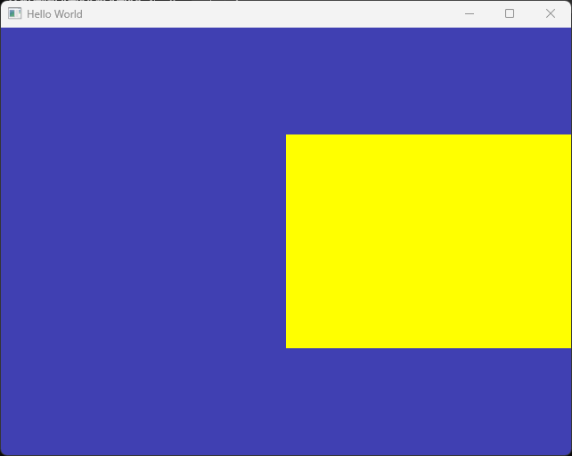
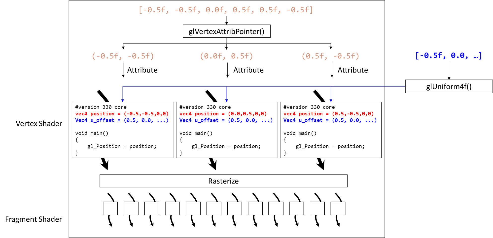

# Shader Uniform

이번 문서에서는 셰이더의 유니폼 변수의 의미와 간단한 사용법을 알아볼 것입니다.

정점 셰이더의 입력으로 전달할 수 있는 데이터는 크게 두 종류가 있는데, 한 가지가 이전에 알아본 [정점 어트리뷰트](./03_shader_and_vertex_attribute.md)이고, 다른 한 가지가 이번 시간에 알아볼 유니폼입니다.

## 유니폼

셰이더의 유니폼 변수는 per-object 데이터를 입력하기 위해 사용됩니다. 

어트리뷰트는 각 정점의 데이터를 입력하기 위해 사용되었다면, 유니폼은 **모든 정점에 공통적으로 사용되는 데이터**를 입력하기 위해 사용됩니다.

간단한 예를 들어 보면, 각 정점의 위치값은 정점별로 다를 것입니다. 우리가 지난 시간에 작성한 코드를 기준으로는 보면, 그리기를 수행할 시점에 4개의 셰이더 프로그램이 실행될 것이고, 각 셰이더 프로그램의 `position` 어트리뷰트에 각각 `(-0.5f, -0.5f)`, `(0.5f, -0.5f)`, `(0.5f,  0.5f)`, `(-0.5f,  0.5f)` 값이 할당되어 있을 것입니다.

잘 기억이 나지 않는다면 [어트리뷰트 개념도](03_shader_and_vertex_attribute.md#정점-어트리뷰트)를 참고하세요.

만일 우리가 이 사각형을 오른쪽으로 0.5만큼 이동시키고 싶다면 어떻게 해야 할까요? 지금까지 배운 내용만으로는 먼저 `positions` 배열(CPU-side)의 X값들에 0.5씩을 더해서 새로운 배열을 만들고, 그 데이터를 다시 GPU로 복사해서 넘긴 뒤에 그리기를 수행해야 합니다.

전에도 말씀 드렸듯이 CPU에서 GPU로의 복사 비용은 큽니다. 모든 정점들이 그냥 X값에 0.5만 더하면 되는데, 값을 바꾼다고 정점 배열 전체를 복사해서 넘기는 것은 비효율적이겠죠. 

이런 상황에서 우리는 유니폼을 사용할 것입니다. 그러면 앞에 이야기한 내용을 유니폼을 이용해 한 번 구현해 봅시다.

## 셰이더에서의 유니폼 변수

먼저 셰이더를 수정해서 유니폼 변수를 새로 정의해 줍시다.

```glsl title="resources/shaders/basic.shader"
#shader vertex
#version 330 core

layout(location = 0) in vec4 position; 

//diff-add
uniform vec4 u_offset;

void main()
{
    //diff-remove
    gl_Position = position; 
    //diff-add
    gl_Position = position + u_offset; 
};
...
```

보시다시피 정점 셰이더 프로그램의 상단에 새로운 vec4 타입의 변수 `u_offset`을 정의해 주었습니다. 변수를 유니폼 변수로 선언하기 위해서는 첫부분에 `uniform` 키워드를 적어주면 됩니다.

그리고 `main()` 함수에서는 이제 position이라는 (어트리뷰트) 변수값에 `u_offset` 유니폼 값을 더해주게 했습니다. 앞서 설명했듯이 유니폼은 모든 정점에 공통적으로 적용되는 값이므로, 만일 우리가 `u_offset = vec4(0.5, 0.0, 0.0, 0.0)`으로 설정해 주기만 하면 이제 `gl_Position`에 대입되는 각 정점의 위치값들은 모두 오른쪽으로 0.5만큼 이동한 값이 될 것입니다.

그러면 이제 남은 것은 `u_offset = vec4(0.5, 0.0, 0.0, 0.0)`으로 설정하는 방법이겠죠?

## 유니폼 변수 값 할당

유니폼 변수의 값 설정은 역시나 OpenGL API를 사용해 진행합니다.

과정은 간단한데요, 1) 값을 할당하고 싶은 유니폼 변수의 위치 찾기, 2) 해당 위치에 값 넣어주기 의 두 단계 과정입니다.

```cpp title="main.cpp"
...

glUseProgram(shaderID);

//diff-add
int location = glGetUniformLocation(shaderID, "u_offset");
//diff-add
glUniform4f(location, 0.5f, 0.0f, 0.0f, 0.0f);

// Rendering Loop
int frame_count = 0;
while (!glfwWindowShouldClose(window)) 
...
```

사용하는 함수는 `glGetUniformLocation()`과 `glUniform4f()` 입니다. 

`glGetUniformLocation()`에서 첫 번째 인자로 어떤 셰이더 프로그램이 대상인지, 두 번째 인자로는 유니폼 변수의 이름을 문자열로 넘겨줍니다. 그러면 그 유니폼 변수의 위치를 반환해줍니다.

이제 `glUniform4f()`에 첫 번째 인자로 그 위치를 넘겨주고 나머지 인자들에 설정하고 싶은 값들을 넘겨주면 됩니다. `u_offset`은 `vec4` 타입이므로 네 개의 float값이 필요하므로 `glUniform4f()`를 사용합니다.

:::note
셰이더 프로그램의 유니폼 타입에 따라 이렇게 값을 설정하는 별도의 OpenGL API들이 존재합니다. 유니폼이 `vec2` 타입이면 `glUniform2f()`를, `int` 타입이면 `glUniform1i()`를 사용해야 하는 식입니다.

전체 목록은 [문서](https://docs.gl/gl3/glUniform)를 참고하시면 됩니다.
:::

이제 실행을 해보면 아래와 같은 결과를 보실 수 있습니다.



계획한 대로 사각형이 오른쪽으로 잘 이동해 있네요.

지금 상황을 개념적으로 그림으로 표현해 보면 아래와 같습니다. 유니폼은 해당 셰이더 프로그램 전체가 동일한 값을 사용한다는 것이 핵심입니다.




## 유니폼을 사용한 애니메이션

이제 유니폼을 약간 응용해서 애니메이션을 만들어 보겠습니다. 실시간으로 유니폼 값을 바꾸며 사각형을 그림으로써 사각형이 움직이는 장면을 만들어 보겠습니다.

코드는 아래와 같습니다.

```cpp title="main.cpp"
...
// Rendering Loop
//diff-remove
int frame_count = 0;
//diff-add
float offset = 0.0f;
//diff-add
float increment = 0.001f;
while (!glfwWindowShouldClose(window)) 
{
    //diff-remove
    //std::cout << frame_count << std::endl;
    //diff-remove
    frame_count++;
    
    glClear(GL_COLOR_BUFFER_BIT);
    
    //diff-add
    glUniform4f(location, offset, 0.0f, 0.0f, 0.0f);
    //diff-add
    offset += increment;

    glDrawElements(GL_TRIANGLES, 6,	GL_UNSIGNED_INT, nullptr);

    glfwSwapBuffers(window); 
    glfwPollEvents(); 
}
...
```

frame count 관련 코드는 이제 그다지 필요가 없어서 지우겠습니다. 그리고 렌더링 루프를 돌 때마다 offset 값을 조금씩 증가시켜주면서 `glUniform4f()`를 통해 계속 새로운 값을 셰이더 프로그램에 전달하도록 했습니다.

이제 프로그램을 실행해 보면 아래와 같이 움직이는 장면을 보실 수 있을겁니다.


좀 더 자세히 설명해 보자면 아래와 같습니다.

- `glDrawElements()` 라는 명령은 현재 상태를 기반으로 화면을 그리라는 의미
- 렌더링 루프의 첫 반복(frame=0)에서 그 상태는,
    - `GL_ARRAY_BUFFER` 바인딩 포인트에는 GPU의 어떤 버퍼가 바딩인 되어 있는데, 그 버퍼에는 `positions` 배열 내용이 복사되어 있는 상태
    - `GL_ELEMENT_ARRAY_BUFFER` 바인딩 포인트에는 GPU의 어떤 버퍼가 바인딩 되어 있는데, 그 버퍼에는 `indices` 배열 내용이 복사되어 있는 상태
    - PROGRAM으로는 `basic.shader`의 내용이 컴파일/링크되어 GPU에서 실행 가능한 셰이더 프로그램이 바인딩 되어있는 상태
        - 셰이더 프로그램의 `location = 0` 어트리뷰트에 float 2개씩 끊어서 값을 넣으라고 설정된 상태
        - 셰이더 프로그램의 `u_offset` 유니폼에 `(0, 0, 0, 0)` 이 할당된 상태
- 렌더링 루프의 두 번째 반복에서의 그 상태는,
    - 위와 모두 동일하되, 셰이더 프로그램의 `u_offset` 유니폼에 `(0.001, 0, 0, 0)`이 할당된 상태
- 렌더링 루프의 세 번째 반복에서의 상태는... (계속)

위에서 설명한 내용들의 각 "상태" 설정이 코드의 어느 부분에서 이루어지고 있는지 파악을 할 수 있다면, 앞으로 내용을 학습하는 데 전혀 문제가 없으실 겁니다.


## 마치며

1. 강의 시간에 Model/View/Projection 변환 행렬에 대해 이미 배웠거나, 곧 배우실 겁니다. 화면에 그리는 물체를 구성하는 삼각형의 모든 정점에 대해 동일한 행렬 변환이 적용되어야 하므로, 이러한 변환 행렬들이 유니폼 변수로 셰이더에 전달됩니다.

2. 유니폼 변수는 정점 셰이더뿐만 아니라 프래그먼트 셰이더에서도 동일한 방식으로 사용됩니다. 모든 프래그먼트 연산에 대해서 동일한 값을 사용하고 싶을 때 셰이더 프로그램에 유니폼을 정의하고, `glGetUniformLocation()`과 `glUniformXX()`를 사용하면 됩니다.


## 연습 문제

1. `u_offset` 유니폼을 `vec2` 타입으로 바꾸고, 동일한 결과가 나타나도록 코드를 수정해 보세요.

2. 사각형이 좌우로 반복 운동하도록 코드를 수정해 보세요.

3. 사각형이 빨간색으로 그려지도록 프래그먼트 셰이더에 유니폼을 추가하고, 값을 전달해 보세요.

---

## 관련 링크
- [main.cpp 소스 코드](assets/06_shader_uniform/src/main_end.cpp)
- [basic.shader 소스 코드](assets/06_shader_uniform/src/basic.shader)
- [glUniform](https://docs.gl/gl3/glUniform)
