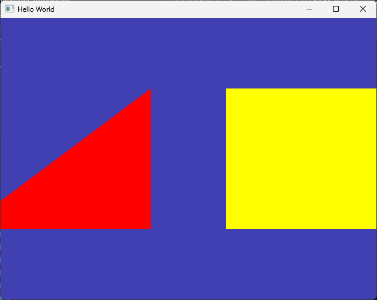

# Vertex Array Object (VAO)

Modern OpenGL을 공부하시다 보면 반드시 VAO에 대해서 들어보시게 될 겁니다.

실제 동작하는 그래픽스 프로그램을 구현하다 보면 화면 상에 여러 물체들을 그리게 될텐데, 앞서 설명한것처럼 하나의 물체를 그리기 위해서는 Vertex, Index, Program과 같은 다양한 상태들이 관여하게 됩니다.

이렇게 다양한 상태들을 보다 편리하게 관리하기 위한 방법으로 만들어진 개념이 VAO입니다. VAO가 왜 필요한지는 우선 VAO가 없으면 어떻게 해야하는지부터 살펴보면 구체적으로 이해가 되실 겁니다.

## Multiple Objects - without VAO

예제 코드를 확장해서, 사각형 하나와 삼각형 하나를 화면에 그리도록 한 번 만들어 보겠습니다. 또한 삼각형과 사각형이 서로 다른 셰이더 프로그램을 사용하도록 할 겁니다.

실제 상황에서는 예를 들자면 여러 삼각형들로 이루어진 캐릭터 3D 모델 하나와 배경 3D 모델 하나를 화면에 그리는 상황으로 생각하면 됩니다.

### 사전 준비

먼저 삼각형을 위한 셰이더 파일을 하나 추가적으로 만들어줍니다. 기존 셰이더 코드와 완전히 동일하지만, 색상만 다른 색으로 해 주었습니다.

```glsl title="resources/shaders/basic_red.shader"
#shader vertex
#version 330 core

layout(location = 0) in vec4 position; 

uniform vec4 u_offset;

void main()
{
	gl_Position = position + u_offset; 
};

#shader fragment
#version 330 core

layout(location = 0) out vec4 color;

void main()
{
    color = vec4(1.0, 0.0 ,0.0, 1.0); // red color
};
```

다음으로 삼각형과 사각형 데이터를 정의합니다. 기존 사각형 데이터를 위한 배열들 아래에 삼각형을 위한 배열을 추가적으로 정의해 주었습니다.

```cpp title="main.cpp"
...
unsigned int indices[] = { 
    0, 1, 2, //vertex 0,1,2로 이루어진 삼각형
    2, 3, 0  //vertex 2,3,0로 이루어진 삼각형
};

//diff-add
float triangle_positions[] = {
    //diff-add
    -0.5f, -0.5f, //0
    //diff-add
    0.5f, -0.5f, //1
    //diff-add
    0.5f,  0.5f, //2
    //diff-add
};

//diff-add
unsigned int triangle_indices[] = {
    //diff-add
    0, 1, 2, //vertex 0,1,2로 이루어진 삼각형
    //diff-add
};
...
```

그리고 삼각형 정점 데이터를 GPU에 복사하기 위해 버퍼를 만들고, 바인딩하고, 데이터를 넣어 주었고요.

```cpp title="main.cpp"
...
unsigned int bufferID;
glGenBuffers(1, &bufferID);
glBindBuffer(GL_ARRAY_BUFFER, bufferID);
glBufferData(GL_ARRAY_BUFFER, 8 * sizeof(float), positions, GL_STATIC_DRAW);

glEnableVertexAttribArray(0); 
glVertexAttribPointer(0, 2,	GL_FLOAT, GL_FALSE, sizeof(float) * 2, 0); 

//diff-add
unsigned int triangle_bufferID;
//diff-add
glGenBuffers(1, &triangle_bufferID);
//diff-add
glBindBuffer(GL_ARRAY_BUFFER, triangle_bufferID);
//diff-add
glBufferData(GL_ARRAY_BUFFER, 6 * sizeof(float), triangle_positions, GL_STATIC_DRAW);

//diff-add
glEnableVertexAttribArray(0);
//diff-add
glVertexAttribPointer(0, 2, GL_FLOAT, GL_FALSE, sizeof(float) * 2, 0);
...
```

삼각형 인덱스 데이터에 대해서도 기존과 같이 작업을 해 줍니다.

```cpp title="main.cpp"
...
unsigned int ibo;
glGenBuffers(1, &ibo); //1. 인덱스 버퍼 생성
glBindBuffer(GL_ELEMENT_ARRAY_BUFFER, ibo); //2. ELEMENT_ARRAY_BUFFER 바인딩
glBufferData(GL_ELEMENT_ARRAY_BUFFER, 6 * sizeof(unsigned int), indices, GL_STATIC_DRAW);  //3. 데이터 전달

//diff-add
unsigned int triangle_ibo;
//diff-add
glGenBuffers(1, &triangle_ibo); //1. 인덱스 버퍼 생성
//diff-add
glBindBuffer(GL_ELEMENT_ARRAY_BUFFER, triangle_ibo); //2. ELEMENT_ARRAY_BUFFER 바인딩
//diff-add
glBufferData(GL_ELEMENT_ARRAY_BUFFER, 3 * sizeof(unsigned int), triangle_indices, GL_STATIC_DRAW);  //3. 데이터 전달
...
```

또한 셰이더가 두 개이니 둘 다 GPU상에서 빌드해서 프로그램으로 만들어 둡니다. 

렌더링 시점에 삼각형과 사각형은 다른 셰이더 프로그램을 사용할 것이기 때문에 `glUseProgram()`은 미리 호출하지 않습니다. 또한 `glUniform4f()`도 애니메이션을 할 때처럼 렌더링 직전에 호출할 것이기 때문에 미리 호출하지 않습니다. 대신 `offset` 유니폼 입력을 위한 location들은 미리 얻어둡니다.

```cpp title="main.cpp"
ShaderProgramSource source = ParseShader("resources/shaders/basic.shader");
unsigned int shaderID = CreateShader(source.VertexSource, source.FragSource);
//diff-remove
glUseProgram(shaderID);
//diff-add
int square_offset_location = glGetUniformLocation(shaderID, "u_offset");

//diff-remove
int location = glGetUniformLocation(shaderID, "u_offset");
//diff-remove
glUniform4f(location, 0.5f, 0.0f, 0.0f, 0.0f);

//diff-add
ShaderProgramSource triangle_source = ParseShader("resources/shaders/basic_red.shader");
//diff-add
unsigned int triangle_shaderID = CreateShader(triangle_source.VertexSource, triangle_source.FragSource);
//diff-add
int triangle_offset_location = glGetUniformLocation(triangle_shaderID, "u_offset");
```

:::note
여기까지는 VAO 사용 여부와 관계없이, 여러 물체를 화면에 그리려면 당연히 해 주어야 하는 데이터 정의 작업입니다.

이러한 과정을 위한 코드를 단순화 하는 것은 나중 문서에서 클래스를 활용해 추상화 하는 것으로 해결할 예정입니다.
:::

### 렌더링 루프

마지막으로 렌더링 루프를 전체적으로 아래와 같이 수정합니다.

```cpp title="main.cpp"
// Rendering Loop
while (!glfwWindowShouldClose(window)) 
{
    glClear(GL_COLOR_BUFFER_BIT);

    //--- 사각형 그리기
    // 1) 사각형을 위한 버퍼 바인딩
    glBindBuffer(GL_ARRAY_BUFFER, bufferID);
    glBindBuffer(GL_ELEMENT_ARRAY_BUFFER, ibo);
    glEnableVertexAttribArray(0);
    glVertexAttribPointer(0, 2, GL_FLOAT, GL_FALSE, sizeof(float) * 2, 0);

    // 2) 사각형 그리기 프로그램 준비
    glUseProgram(shaderID);
    float square_offset = 0.7f;
    glUniform4f(square_offset_location, square_offset, 0.0f, 0.0f, 0.0f);

    // 3) 사각형 그리기
    glDrawElements(GL_TRIANGLES, 9,	GL_UNSIGNED_INT, nullptr);

    // 4) 사각형 관련 상태 정리
    glBindBuffer(GL_ARRAY_BUFFER, 0); // unbind
    glBindBuffer(GL_ELEMENT_ARRAY_BUFFER, 0); // unbind
    glUseProgram(0); // unbind

    //--- 삼각형 그리기
    // 1) 삼각형을 위한 버퍼 바인딩
    glBindBuffer(GL_ARRAY_BUFFER, triangle_bufferID);
    glBindBuffer(GL_ELEMENT_ARRAY_BUFFER, triangle_ibo);
    glEnableVertexAttribArray(0);
    glVertexAttribPointer(0, 2, GL_FLOAT, GL_FALSE, sizeof(float) * 2, 0);

    // 2) 삼각형 그리기 프로그램 준비
    glUseProgram(triangle_shaderID);
    float triangle_offset = -0.7f;
    glUniform4f(triangle_offset_location, triangle_offset, 0.0f, 0.0f, 0.0f);

    // 3) 삼각형 그리기
    glDrawElements(GL_TRIANGLES, 3, GL_UNSIGNED_INT, nullptr);

    // 4) 삼각형 관련 상태 정리
    glBindBuffer(GL_ARRAY_BUFFER, 0); // unbind
    glBindBuffer(GL_ELEMENT_ARRAY_BUFFER, 0); // unbind
    glUseProgram(0); // unbind

    glfwSwapBuffers(window); 
    glfwPollEvents(); 
}
```

:::warning
이전 챕터에서 사용했던 `offset`과 `increment`를 삭제하였으니 참고하십시오.
:::

많이 수정되었는데 일단 몇 가지 설명 드리겠습니다.

- "1) 사각형을 위한 버퍼 바인딩"
    - 사각형 관련 버퍼들을 바인딩하고, 어트리뷰트 설정을 해 줍니다.
    - 만일 이 작업을 하지 않고 Draw를 한다면, 렌더링 루프 이전 바인딩된 버퍼는 삼각형 관련 버퍼들이기 때문에 사각형이 아니라 삼각형이 그려질겁니다.
- "2) 사각형 그리기 프로그램 준비"
    - 사각형용 셰이더 프로그램으로 사각형을 그릴 것이므로 해당 프로그램을 바인딩하고, 유니폼들을 설정해줍니다.
- "3) 사각형 그리기"
    - 사각형을 그리기 위한 상태들이 설정되었으니 그리기를 수행하면 화면 오른쪽에 사각형이 그려집니다.
- "4) 사각형 관련 상태 정리"
    - 이 뒤에 삼각형을 추가적으로 그릴 것이므로, 사각형 관련 상태를 정리, 즉 언바인딩해 줍니다.
    - 언바인딩의 대상은 버퍼들과 프로그램입니다.

:::info
버퍼를 언바인딩하려면 `glBindBuffer()` 함수의 두 번째 인자로 `0`을 넘겨주면 됩니다. 첫 번째 인자는 당연히 "어떤" 바인딩 포인트의 버퍼를 언바인딩할 것인지를 명시하는 것입니다.

`glUseProgram()`의 언바인딩은 바인딩 포인트를 설정할 필요가 없기 때문에 인자 하나로 `0`만 넘겨주면 됩니다.
:::

:::warning
그리기가 끝나고, 해당하는 상태들을 언바인딩 하지 않아도, "운이 좋다면" 내가 의도한대로 화면이 그려질 수도 있지만 그렇지 않을 가능성이 큽니다.

제대로 된 상태 설정이 되지 않았을 경우 화면이 그려지지 않도록 언바인딩 해 두는 것이 나중의 실수를 방지하기 위해 오히려 좋습니다. (assert 같은거죠.)
:::

여기까지 수정하고 실행해 보면 아래와 같이 두 물체가 잘 그려지는 것을 볼 수 있습니다.



:::info
여기까지의 코드를 아래 [관련 링크](#관련-링크)에서 별도로 다운받으실 수 있습니다.
:::


## Multiple Objects - with VAO

여기까지만 봐도 골치가 많이 아파지실 겁니다. 앞서 말씀드렸듯이 데이터 정의, 별도의 셰이더 프로그램은 어쩔 수 없이 필요한 작업입니다.

하지만 실제 렌더링 시점에서 우리가 바인딩/언바인딩 해주어야 하는 상태가 많고, 하나만 삐끗해도 의도한대로 결과가 나오지 않습니다.

이러한 실수를 방지하고, 올바른 물체를 의도한 시점에 잘 그리기 위해서 VAO를 사용해야 합니다.

### VAO 간단 설명

VAO는 정점 버퍼와 인덱스 버퍼를 사용해 셰이더에서 정점 데이터를 어떻게 읽어와야 할 지를 저장해 놓는 객체입니다.

즉, 기존 코드에서는 아래 함수들을 통해 변화하는 상태를 저장해 두는 객체라고 보시면 됩니다.

- `glBindBuffer()`
- `glBufferData()`
- `glEnableVertexAttribArray()`
- `glVertexAttribPointer()`

따라서 우리가 VAO를 한 번 설정해 두고 나면, 이제 사각형을 그렸다가 그 다음에 삼각형을 그릴 때 위 함수들을 하나하나 바인딩/언바인딩해 가며 상태를 설정하지 않고, VAO만 바인딩시켜주면 알아서 기존에 설정된 상태들이 바인딩된다고 보시면 됩니다.

### VAO 생성 및 상태 저장

이제 VAO를 만들고 이렇게 만든 VAO에 상태들을 기록해 봅시다.

먼저 아래와 같이 사각형을 위한 vao를 생성합니다. 정점 버퍼 생성 앞부분에 추가해 줍니다. 추가적으로 정점 버퍼의 ID를 기존에는 `bufferID`라는 이름을 그대로 썼는데 사각형을 위한 정점 버퍼라는 의미에서 `square_vbo`로 이름을 변경해 줍니다.

```cpp title="main.cpp"
...
// diff-add
unsigned int square_vao;
// diff-add
glGenVertexArrays(1, &square_vao); //vao 생성
// diff-add
glBindVertexArray(square_vao);

// diff-remove
unsigned int bufferID;
// diff-remove
glGenBuffers(1, &bufferID);
// diff-remove
glBindBuffer(GL_ARRAY_BUFFER, bufferID);
// diff-remove
glBufferData(GL_ARRAY_BUFFER, 8 * sizeof(float), positions, GL_STATIC_DRAW);
//diff-add
unsigned int square_vbo;
//diff-add
glGenBuffers(1, &square_vbo);
//diff-add
glBindBuffer(GL_ARRAY_BUFFER, square_vbo);
//diff-add
glBufferData(GL_ARRAY_BUFFER, 8 * sizeof(float), positions, GL_STATIC_DRAW);
...
```

다음으로 기존 사각형 인덱스 버퍼 설정 부분을 앞쪽으로 옮겨 오고 이름을 `square_ibo`로 변경해 줍시다. 앞쪽으로 옮겨오는 것이 중요한데, 조금 뒤에 설명 드리겠습니다.

```cpp title="main.cpp"
unsigned int square_vbo;
glGenBuffers(1, &square_vbo);
glBindBuffer(GL_ARRAY_BUFFER, square_vbo);
glBufferData(GL_ARRAY_BUFFER, 8 * sizeof(float), positions, GL_STATIC_DRAW);

glEnableVertexAttribArray(0); 
glVertexAttribPointer(0, 2,	GL_FLOAT, GL_FALSE, sizeof(float) * 2, 0); 

//diff-add
unsigned int square_ibo;
//diff-add
glGenBuffers(1, &square_ibo); //1. 인덱스 버퍼 생성
//diff-add
glBindBuffer(GL_ELEMENT_ARRAY_BUFFER, square_ibo); //2. ELEMENT_ARRAY_BUFFER 바인딩
//diff-add
glBufferData(GL_ELEMENT_ARRAY_BUFFER, 6 * sizeof(unsigned int), indices, GL_STATIC_DRAW);  //3. 데이터 전달

unsigned int triangle_bufferID;
... // 생략

//diff-remove
unsigned int ibo;
//diff-remove
glGenBuffers(1, &ibo); //1. 인덱스 버퍼 생성
//diff-remove
glBindBuffer(GL_ELEMENT_ARRAY_BUFFER, ibo); //2. ELEMENT_ARRAY_BUFFER 바인딩
//diff-remove
glBufferData(GL_ELEMENT_ARRAY_BUFFER, 6 * sizeof(unsigned int), indices, GL_STATIC_DRAW);  //3. 데이터 전달
```

**마지막으로 VAO, VBO, IBO들을 언바인딩 해줍니다.** 순서가 중요합니다. **먼저 VAO를 언바인딩 하고** VBO와 IBO를 언바인딩 해줍니다.

```cpp title="main.cpp"
unsigned int square_ibo;
glGenBuffers(1, &square_ibo); //1. 인덱스 버퍼 생성
glBindBuffer(GL_ELEMENT_ARRAY_BUFFER, square_ibo); //2. ELEMENT_ARRAY_BUFFER 바인딩
glBufferData(GL_ELEMENT_ARRAY_BUFFER, 6 * sizeof(unsigned int), indices, GL_STATIC_DRAW);  //3. 데이터 전달

//diff-add
glBindVertexArray(0); //vao unbind
//diff-add
glBindBuffer(GL_ARRAY_BUFFER, 0); 
//diff-add
glBindBuffer(GL_ELEMENT_ARRAY_BUFFER, 0); 
```

전체적인 과정을 다시 한번 짚어 보면 아래와 같습니다. VAO는 정점과 인덱스 설정을 저장하는 기능이라는 것을 생각해 보면 왜 기록 준비가 된 상태에서 나머지를 수행해야 하는지, 왜 나머지 언바인딩보다 VAO를 먼저 언바인딩 해야 하는지가 감이 오실 겁니다.

1. VAO 생성 및 바인딩 (i.e. VAO 기록 준비)
2. VBO 생성 및 바인딩 및 데이터 복사
3. 어트리뷰트 포인터(읽어오는법) 설정
4. IBO 생성 및 바인딩 및 데이터 복사
5. VAO 먼저 언바인딩 (i.e. VAO 기록 종료)
6. 나머지 언바인딩

만일 6번을 5번보다 먼저 수행하게 되면, VAO 기록 종료 이전에 데이터가 사라지는 것과 마찬가지이므로 VAO에 상태가 제대로 기록되지 않습니다.

다음으로 삼각형에 대해서도 유사하게 코드를 수정/정리 해 줍니다.

```cpp title="main.cpp"
//--- 삼각형 VAO 설정
unsigned int triangle_vao;
glGenVertexArrays(1, &triangle_vao); 
glBindVertexArray(triangle_vao); // <-- 기록 시작

unsigned int triangle_vbo;
glGenBuffers(1, &triangle_vbo);
glBindBuffer(GL_ARRAY_BUFFER, triangle_vbo);
glBufferData(GL_ARRAY_BUFFER, 6 * sizeof(float), triangle_positions, GL_STATIC_DRAW);

glEnableVertexAttribArray(0);
glVertexAttribPointer(0, 2, GL_FLOAT, GL_FALSE, sizeof(float) * 2, 0);

unsigned int triangle_ibo;
glGenBuffers(1, &triangle_ibo);
glBindBuffer(GL_ELEMENT_ARRAY_BUFFER, triangle_ibo);
glBufferData(GL_ELEMENT_ARRAY_BUFFER, 3 * sizeof(unsigned int), triangle_indices, GL_STATIC_DRAW);

glBindVertexArray(0); // <-- 기록 종료
glBindBuffer(GL_ARRAY_BUFFER, 0);
glBindBuffer(GL_ELEMENT_ARRAY_BUFFER, 0);
```

:::note
셰이더 프로그램은 VAO와 관련이 없습니다. 프로그램의 상태는 별도로 관리해 주어야 합니다.
:::

### VAO를 활용한 Multiple Object 렌더링

이제 삼각형과 사각형을 VAO 설정값으로 렌더링 합니다. 기존과 동일한 방식으로, 그리기 함수를 수행하기 전에 VAO가 바인딩 되어있으면 됩니다.

```cpp title="main.cpp"
while (!glfwWindowShouldClose(window)) 
{
    glClear(GL_COLOR_BUFFER_BIT);
    //--- 사각형 그리기
    //diff-remove
    // 1) 사각형을 위한 버퍼 바인딩
    //diff-remove
    glBindBuffer(GL_ARRAY_BUFFER, bufferID);
    //diff-remove
    glBindBuffer(GL_ELEMENT_ARRAY_BUFFER, ibo);
    //diff-remove
    glEnableVertexAttribArray(0);
    //diff-remove
    glVertexAttribPointer(0, 2, GL_FLOAT, GL_FALSE, sizeof(float) * 2, 0);
    //diff-add
    // 1) 사각형을 위한 VAO 바인딩
    //diff-add
    glBindVertexArray(square_vao);

    // 2) 사각형 그리기 프로그램 준비
    glUseProgram(shaderID);
    float square_offset = 0.7f;
    glUniform4f(square_offset_location, square_offset, 0.0f, 0.0f, 0.0f);

    // 3) 사각형 그리기
    glDrawElements(GL_TRIANGLES, 9, GL_UNSIGNED_INT, nullptr);

    //diff-remove
    // 4) 사각형 관련 상태 정리
    //diff-remove
    glBindBuffer(GL_ARRAY_BUFFER, 0); // unbind
    //diff-remove
    glBindBuffer(GL_ELEMENT_ARRAY_BUFFER, 0); // unbind
    //diff-remove
    glUseProgram(0); // unbind
    //diff-add
    // 4) 사각형 VAO 정리
    //diff-add
    glBindVertexArray(0);

    ... // 삼각형 관련 코드
```

아주 드라마틱 하진 않지만 코드가 꽤 간략해 진 것을 볼 수 있습니다. 사각형을 그리기 위한 모든 정점 관련 정보가 VAO에 기록되어 있으니 이제 해당 VAO만 바인딩 해 주면 기존과 동일하게 그려지는 것을 볼 수 있습니다.

마지막으로 하나 소소하게 수정할 부분은 GLFW Window에서 사용할 OpenGL 버전을 명시해 주는 것입니다. OpenGL은 다양한 버전이 있고 버전에 따라 기능이 추가되고 사라지기도 합니다. 예전 버전에 대한 Backward compatibility를 갖추는 것은 개발의 편의성을 위해서는 장점이지만, Modern OpenGL에 맞지 않는 활용법에 대해서도 "가능한" 코드가 실행 가능하기 때문에 학습하는 입장에서는 좋지 않습니다.

따라서 GLFW 윈도우 생성 이전에 `glfwWindowHint()` 함수를 사용해 우리가 사용할 버전을 명시해 주도록 추가해 줍시다. 일반적으로 3.3 이후 버전을 Modern OpenGL이라고 합니다.

```cpp title="main.cpp"
// GLFW 초기화
if (!glfwInit())
    return -1;

//diff-add
glfwWindowHint(GLFW_CONTEXT_VERSION_MAJOR, 3); 
//diff-add
glfwWindowHint(GLFW_CONTEXT_VERSION_MINOR, 3);
//diff-add
glfwWindowHint(GLFW_OPENGL_PROFILE, GLFW_OPENGL_CORE_PROFILE);

// Window 정의 및 생성
GLFWwindow* window = glfwCreateWindow(640, 480, "Hello World", NULL, NULL);
// 현재 윈도우를 그릴 대상으로 설정
glfwMakeContextCurrent(window);
```

다음 몇 개 문서에서는 VAO, VBO들과 Shader 관련 코드를 클래스 구현으로 바꾸어 `main.cpp`를 정리하고, 이후 좀 더 구조화된 코드를 사용할 수 있도록 리팩터링을 해 보겠습니다.

## 마치며

1. [VAO를 사용하지 않는 코드 부분](#multiple-objects---without-vao)에서는 사실 VAO를 사용하지 "않은" 것이 아니라 "기본(default) VAO"를 사용하고 있었습니다. 우리가 명시적으로 만들지 않아도 사실 기본 VAO가 하나 있어서 우리가 거기에 버퍼를 바인딩하고, 어트리뷰트 포인터를 설정한 뒤 사각형을 그린 것입니다. 그리고 그 뒤에 삼각형을 그릴때는 다시 기본 VAO에다가 다른 상태를 설정하고 그린 것입니다.

2. VBO에 기록되는 정보는 사실 조금 미묘합니다. VBO의 경우는 버퍼 핸들(ID)만이기 때문에 예를들어 아래처럼 실제 데이터를 복사하는 `glBufferData()`는 VAO 언바인딩 이후에, 렌더링 전에만 이루어져도 무방하긴 합니다. 반면 어트리뷰트 포인터와 IBO는 반드시 VAO 언바인딩 전에 이루어져야 합니다.

물론 특수한 상황에서

```cpp
unsigned int square_vao;
glGenVertexArrays(1, &square_vao); 
glBindVertexArray(square_vao); // <-- 기록 시작

unsigned int square_vbo;
glGenBuffers(1, &square_vbo);
glBindBuffer(GL_ARRAY_BUFFER, square_vbo);
//diff-remove
glBufferData(GL_ARRAY_BUFFER, 8 * sizeof(float), positions, GL_STATIC_DRAW);

glEnableVertexAttribArray(0); 
glVertexAttribPointer(0, 2, GL_FLOAT, GL_FALSE, sizeof(float) * 2, 0);

unsigned int square_ibo;
glGenBuffers(1, &square_ibo); 
glBindBuffer(GL_ELEMENT_ARRAY_BUFFER, square_ibo); 
glBufferData(GL_ELEMENT_ARRAY_BUFFER, 6 * sizeof(unsigned int), indices, GL_STATIC_DRAW);

glBindVertexArray(0); // <-- 기록 종료
//diff-add
glBufferData(GL_ARRAY_BUFFER, 8 * sizeof(float), positions, GL_STATIC_DRAW);
glBindBuffer(GL_ARRAY_BUFFER, 0); 
glBindBuffer(GL_ELEMENT_ARRAY_BUFFER, 0); 
```

---

## 관련 링크
- [VAO 사용하지 않는 코드](assets/07_vertex_array_object/src/main_without_vao.cpp)
- [learopengl.com VAO 섹션](https://learnopengl.com/Getting-started/Hello-Triangle)
