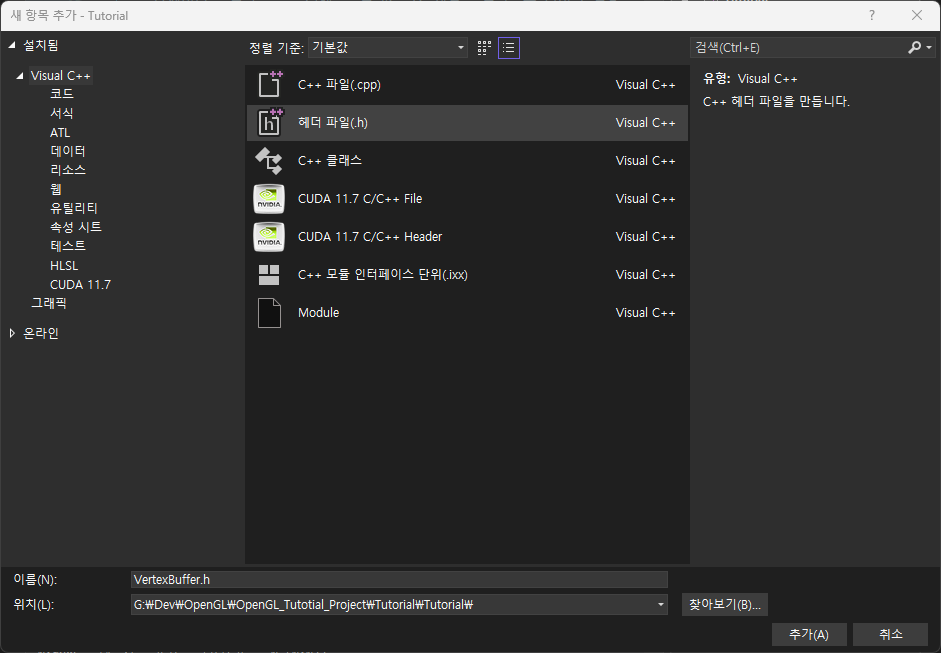

# Vertex/Index Buffer Abstraction

이번 장에서는 클래스를 사용한 추상화를 통해 기존 코드를 정리해 보도록 하겠습니다.

지금까지 작성한 코드를 보면 아시겠지만 결과물(삼각형과 사각형 하나)에 비해 코드가 꽤 긴 것을 보실 수 있습니다.

이렇게 되면 앞으로 다양한 그래픽스 기능들을 활용해 보는 과정에서 더더욱 코드가 길어질 것이고, 어디서 무엇을 하고 있는 것인지 파악하기가 어려워질 것입니다.

따라서 이 장에서는 VertexBuffer/IndexBuffer 클래스를 구현하여 기존 코드를 캡슐화해서 좀 더 명료하게 읽히도록 수정해 보겠습니다.

## VertexBuffer Class

먼저 VertexBuffer 클래스부터 추가해 봅시다.

Visual Studio에서 프로젝트를 우클릭하고 "추가▶새 항목" 메뉴를 클릭한 뒤 아래 그림과 같이 `VertexBuffer.h` 파일을 생성해 줍시다.



그러면 `VertexBuffer.h` 파일이 추가되고 코드 에디터가 열릴 것입니다. 여기에 아래와 같은 코드를 작성해 줍니다.

```cpp title="VertexBuffer.h"
#pragma once

class VertexBuffer
{
private:
	unsigned int vbo;
public:
	VertexBuffer(const void* data, unsigned int size);
	~VertexBuffer();

	void Bind() const;
	void Unbind() const;
};
```

`main.cpp`의 VBO 생성 부분에서 우리는 `glGenBuffers()`, `glBindBuffer()`, `glBufferData()` 세 개의 함수를 호출하여 주어진 배열을 GPU에 복사해 주었습니다. 이를 위해서는 배열과 그 크기가 입력으로 주어져야 하고, 결과적으로는 버퍼의 id인 unsigned int 타입의 `vbo`를 얻었습니다.

따라서 `VertexBuffer`의 생성자에 배열(`data`)과 크기(`size`)를 입력하도록 설계하였고 `vbo`는 멤버 변수(필드)로 갖고 있도록 설계하였습니다.

:::tip
C++에서 `void*` 는 실제 타입과 관계없이 주소값을 지정할 수 있도록 하기 위해 사용됩니다. GPU에 데이터를 복사할 때(`glBufferData()`)는 어차피 시작 주소와 그 크기만 전달해 주면 되기 때문에 문제가 없습니다.

예를 들어 우리가 `float*`로 입력 매개변수 타입을 한정해 버리면, 정점의 위치를 `int[]`나 `double[]`로 정의하여 전달하면 컴파일러가 오류로 판단합니다. 이 모든 타입을 하나의 코드로 커버하기 위해 `void*`를 사용합니다.
:::

이제 위 클래스 정의에 대한 구현을 위해 "추가▶새 항목"을 통해 `VertexBuffer.cpp` 파일을 추가하고 아래와 같이 코드를 작성합니다.

:::note
앞으로는 "추가▶새 항목" 클릭과 같은 내용은 생략하고 그냥 `xxx.h/xxx.cpp` 파일을 추가한다 라고 이야기 하겠습니다. 동일한 방식으로 추가하면 됩니다.
:::

```cpp title="VertexBuffer.cpp"
#include "VertexBuffer.h"
#include <GL/glew.h>

VertexBuffer::VertexBuffer(const void* data, unsigned int size)
{
	glGenBuffers(1, &vbo); 
	glBindBuffer(GL_ARRAY_BUFFER, vbo); 
	glBufferData(GL_ARRAY_BUFFER, size, data, GL_STATIC_DRAW);
}

VertexBuffer::~VertexBuffer()
{
	glDeleteBuffers(1, &vbo);
}

void VertexBuffer::Bind() const
{
	glBindBuffer(GL_ARRAY_BUFFER, vbo); 
}

void VertexBuffer::Unbind() const
{
	glBindBuffer(GL_ARRAY_BUFFER, 0);
}
```

기존 `main.cpp`에서 호출했던 함수들이 각각 어떤 멤버 함수(메소드)에서 호출되고 있는지 확인해 보세요. 추가적으로 기존에는 버퍼를 삭제하는 부분(`glDeleteBuffers()`)은 없었는데 이제는 깔끔한 정리를 위해 소멸자에서 버퍼를 삭제하도록 하였습니다.

이제 이 클래스를 `main.cpp`에서 사용해 보겠습니다.

우선 `main.cpp` 최상단에서 방금 만든 `VertexBuffer.h`를 인클루드 해 줍니다.

```cpp title="main.cpp"
#define GLEW_STATIC
#include <GL/glew.h>
#include <GLFW/glfw3.h>
#include <iostream>
#include <fstream>
#include <string>
#include <sstream>

//diff-add
#include "VertexBuffer.h"

struct ShaderProgramSource
{
...
```

그리고 기존의 `square_vbo` 생성 부분을 아래처럼 바꿔주면 되겠죠.

```cpp title="main.cpp"
...
//--- 사각형 VAO 설정
unsigned int square_vao;
glGenVertexArrays(1, &square_vao); 
glBindVertexArray(square_vao); // <-- 기록 시작

//diff-remove
unsigned int square_vbo;
//diff-remove
glGenBuffers(1, &square_vbo);
//diff-remove
glBindBuffer(GL_ARRAY_BUFFER, square_vbo);
//diff-remove
glBufferData(GL_ARRAY_BUFFER, 8 * sizeof(float), positions, GL_STATIC_DRAW);
//diff-add
VertexBuffer squareVB{ positions, 4 * 2 * sizeof(float) };

glEnableVertexAttribArray(0); 
glVertexAttribPointer(0, 2, GL_FLOAT, GL_FALSE, sizeof(float) * 2, 0);
...
```

별거 없습니다. 원래 따로따로 호출해 주었던 `glGenBuffers()`, `glBindBuffer()`, `glBufferData()` 세 개의 함수가 `VertexBuffer`의 생성자에 들어있으므로 생성만 해 주면 됩니다.

또한 `Unbind()` 메소드를 만들어 두었으니 언바인딩 쪽에서도 아래와 같이 수정해주면 좋겠죠.

```cpp title="main.cpp"
...
unsigned int square_ibo;
glGenBuffers(1, &square_ibo); 
glBindBuffer(GL_ELEMENT_ARRAY_BUFFER, square_ibo); 
glBufferData(GL_ELEMENT_ARRAY_BUFFER, 6 * sizeof(unsigned int), indices, GL_STATIC_DRAW);

glBindVertexArray(0); // <-- 기록 종료
glBindBuffer(GL_ELEMENT_ARRAY_BUFFER, 0); 
//diff-remove
glBindBuffer(GL_ARRAY_BUFFER, 0); 
//diff-add
squareVB.Unbind();
...
```

여기까지 수정했을 때 기존과 같이 문제없이 잘 동작해야 합니다.

## IndexBuffer Class

`IndexBuffer.h`와 `IndexBuffer.cpp` 파일을 추가해서 각각 아래와 같이 코드를 작성할 겁니다.

```cpp title="IndexBuffer.h"
#pragma once

class IndexBuffer
{
private:
	unsigned int ibo;
	unsigned int count; // 정점의 개수(byte size가 아님에 유의)
public:
	IndexBuffer(const unsigned int* data, unsigned int count); 
	~IndexBuffer();

	void Bind() const;
	void Unbind() const;

	inline unsigned int GetCount() const { return count; }
};
```

```cpp title="IndexBuffer.cpp"
#include "IndexBuffer.h"
#include <GL/glew.h>

IndexBuffer::IndexBuffer(const unsigned int* data, unsigned int count)
	: count { count }
{
	glGenBuffers(1, &ibo); 
	glBindBuffer(GL_ELEMENT_ARRAY_BUFFER, ibo); 
	glBufferData(GL_ELEMENT_ARRAY_BUFFER, count * sizeof(unsigned int), data, GL_STATIC_DRAW); 
}

IndexBuffer::~IndexBuffer()
{
	glDeleteBuffers(1, &ibo);
}

void IndexBuffer::Bind() const
{
	glBindBuffer(GL_ELEMENT_ARRAY_BUFFER, ibo); 
}

void IndexBuffer::Unbind() const
{
	glBindBuffer(GL_ELEMENT_ARRAY_BUFFER, 0); 
}
```

`VertexBuffer`와 다른 부분이라면 타입을 unsigned int로 한정한 것이겠죠. 정점의 인덱스에 대해서는 다른 타입을 사용하는 경우가 거의 없기 때문에 타입을 고정해 두었습니다.

`main.cpp`에서 `IndexBuffer`를 사용해 보죠. `VertexBuffer` 수정과 거의 동일하므로 별도의 설명은 필요 없을 것 같습니다.

```cpp title="main.cpp"
...
#include <sstream>

#include "VertexBuffer.h"
//diff-add
#include "IndexBuffer.h"

struct ShaderProgramSource

...

VertexBuffer squareVB{ positions, 4 * 2 * sizeof(float) };

glEnableVertexAttribArray(0); 
glVertexAttribPointer(0, 2, GL_FLOAT, GL_FALSE, sizeof(float) * 2, 0);

//diff-remove
unsigned int square_ibo;
//diff-remove
glGenBuffers(1, &square_ibo); 
//diff-remove
glBindBuffer(GL_ELEMENT_ARRAY_BUFFER, square_ibo); 
//diff-remove
glBufferData(GL_ELEMENT_ARRAY_BUFFER, 6 * sizeof(unsigned int), indices, GL_STATIC_DRAW);
//diff-add
IndexBuffer squareIB{ indices, 6 };

glBindVertexArray(0); // <-- 기록 종료
//diff-remove
glBindBuffer(GL_ELEMENT_ARRAY_BUFFER, 0); 
//diff-add
squareIB.Unbind();
squareVB.Unbind();
```

여기까지 수정했을 때 기존과 같이 잘 동작한다면 완성입니다. 다음 문서에서는 이어서 `VertexBufferLayout`을 추상화 해 볼 것입니다.

## 연습 문제

1. 삼각형에 대한 코드를 이번 장에서 구현한 `VertexBuffer`, `IndexBuffer`를 사용하도록 스스로 수정해 보세요.

## 관련 링크

- [최종 코드(zip)](./assets/08_vertex_buffer_abstraction/src/src.zip)
