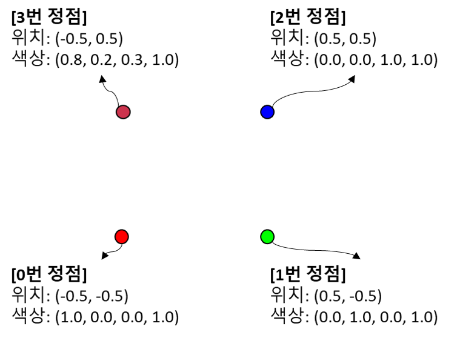
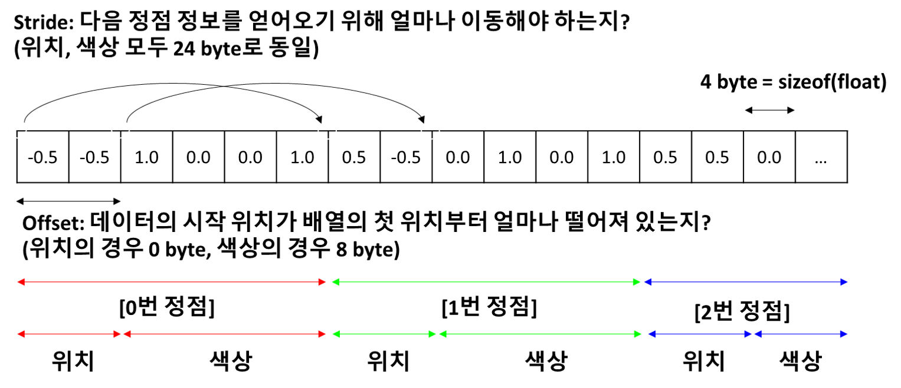
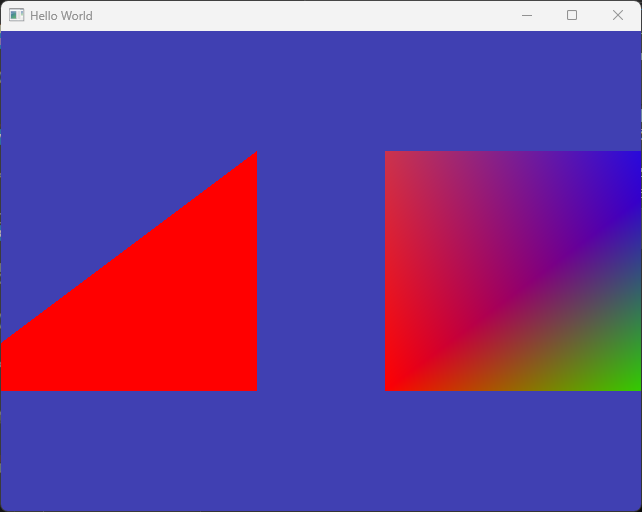

# Vertex Array and Buffer Layout Abstraction

이번 장에서는 정점 배열과 버퍼 레이아읏 추상화를 진행해 볼 것입니다.

현재 삼각형과 사각형을 그리는 코드를 보면 삼각형을 구성하는 정점 좌표들을 배열로 정의하고 GPU에 복사한 뒤에, 데이터를 정점별로 끊어 읽는 방법을 `glVertexAttribPointer()` 함수의 매개변수를 하드 코딩하여 전달해 주고 있습니다.

이러한 경우 실수를 할 확률이 높아지는 문제도 있지만, 실제 3D 모델 데이터를 사용하고 싶은 경우에는 더 고려해야 할 사항들이 많기 때문에 꼭 해결해야 하는 문제입니다.

색상 데이터를 포함하도록 정점 데이터와 셰이더를 확장하여 문제점을 살펴보고, 추상화를 통해 코드를 개선해 봅시다.

## 색상 어트리뷰트 확장

강의 시간에 추가적으로 설명 드렸겠지만 실제 정점 데이터는 보다 복잡합니다. "정점 데이터"는 각 정점의 위치 데이터 뿐만 아니라 색상, 법선, 텍스처 좌표 등 다양한 정보를 포함할 수 있습니다.

지금까지 우리는 정점 위치 데이터인 2개의 float 값만 각 정점에 나눠주면 됐었는데, 좀 더 복잡한 경우를 만들어 봅시다.

이번에는 아래 그림과 같이 네 개의 정점에 위치값과 함께 색상값을 할당해 줄 것입니다.



### 정점 데이터 확장

위 그림에 따라, 정점 데이터를 정의하는 배열은 아래와 같이 변경됩니다. 우리가 쉽게 알아보기위해 줄바꿈을 해 주었지만, 그냥 연속된 float값들의 나열일 뿐임을 잊지 마세요.

```cpp title="main.cpp"
//diff-remove
float positions[] = {
    //diff-remove
    -0.5, -0.5,
    //diff-remove
     0.5, -0.5,
        //diff-remove
     0.5,  0.5,
        //diff-remove
    -0.5,  0.5
    //diff-remove
};
//diff-add
float positions[] = {
    //diff-add
    //x     y    r    g    b    a
    //diff-add
    -0.5, -0.5, 1.0, 0.0, 0.0, 1.0, //0번 vertex
    //diff-add
     0.5, -0.5, 0.0, 1.0, 0.0, 1.0, //1번 vertex
        //diff-add
     0.5,  0.5, 0.0, 0.0, 1.0, 1.0, //2번 vertex
        //diff-add
    -0.5,  0.5, 0.8, 0.2, 0.3, 1.0  //3번 vertex
    //diff-add
};
```

:::note
물론 색상값을 위한 별도의 배열을 만들어서 처리하는 방법도 가능합니다. 다만 처리하기가 더 복잡해 질 수 있습니다. 궁금하신 분은 [이 글](https://stackoverflow.com/questions/14249634/opengl-vaos-and-multiple-buffers)의 내용과 이후 우리가 구현하는 내용을 비교해 보세요.
:::

### 셰이더 확장

이러한 색상 데이터를 셰이더에서는 어떻게 활용해야 할까요? 일단 기존 셰이더에는 각 정점이 `position` 데이터를 갖도록 어트리뷰트를 구성했고 이를 `location = 0`으로 지정했었습니다. 그리고 `glVertexAttribPointer()` 를 사용해 버퍼 데이터로부터 float 2개씩을 해당 어트리뷰트로 끊어서 넘기도록 했습니다.

이제는 셰이더에 `color` 라는 추가적인 변수가 필요하고, 이를 `location = 1`로 지정해 주겠습니다. `basic.shader`를 아래와 같이 수정합니다.

```glsl title="resources/shaders/basic.shader"
#shader vertex
#version 330 core

//diff-remove
layout(location = 0) in vec4 position; 
//diff-add
layout(location = 0) in vec4 a_position; 
//diff-add
layout(location = 1) in vec4 a_color; 

//diff-add
out vec4 v_color;

uniform vec4 u_offset;

void main()
{
    //diff-remove
    gl_Position = position + u_offset; 
    //diff-add
    gl_Position = a_position + u_offset; 
    //diff-add
    v_color = a_color;
};

#shader fragment
#version 330 core

//diff-remove
layout(location = 0) out vec4 color;
//diff-add
layout(location = 0) out vec4 out_color;

//diff-add
in vec4 v_color;

void main()
{
    //diff-remove
    color = vec4(1.0, 1.0 ,0.0, 1.0); 
    //diff-add
    out_color = v_color; 
};

```

바뀐 부분들을 말씀 드리자면 아래와 같습니다.

- 우선 기존 정점 셰이더의 `position`을 `a_position`으로, 프래그먼트 셰이더의 `color`를 `out_color`로 이름을 변경해줬습니다. 어트리뷰트는 어트리뷰트임을 알 수 있게 `a_` 접미어를 붙여 주었고, 프래그먼트의 출력은 `out_`을 붙여 준 것입니다.
- 정점 셰이더에 새 어트리뷰트로 `a_color`가 추가되었습니다. 앞서 본 것처럼 CPU에서 정의한 정점 배열에서 각 정점이 가지고 있는 4개 float으로 구성된 색상 데이터가 이 어트리뷰트로 전달 될 것입니다.
- 정점 셰이더의 `out vec4 v_color`와 프래그먼트 셰이더의 `in vec4 v_color`는 서로 한 쌍으로, 정점 셰이더에서 프래그먼트 셰이더로 전달되는 값입니다. 래스터라이저 강의에서 이 과정에 대해 자세히 배울 것입니다.
- 마지막으로 프래그먼트 셰이더의 출력 색상을 고정된 값(`(1.0, 1.0 ,0.0, 1.0)`)에서 `v_color`로 변경해 주었습니다. 흐름을 보면 정점 셰이더에서부터 전달한 값이 색상으로 활용될 것이라는 것을 예상하실 수 있을 겁니다.

### 어트리뷰트 설정

이제 의도한대로 셰이더 어트리뷰트가 전달될 수 있도록 코드를 수정해 보겠습니다.

```cpp title="main.cpp"
...
//diff-remove
VertexBuffer squareVB{ positions, 4 * 2 * sizeof(float) };
//diff-add
VertexBuffer squareVB{ positions, 4 * 6 * sizeof(float) };

//diff-add
// Position 어트리뷰트 설정
glEnableVertexAttribArray(0); 
//diff-remove
glVertexAttribPointer(0, 2, GL_FLOAT, GL_FALSE, sizeof(float) * 2, 0);
//diff-add
glVertexAttribPointer(0, 2, GL_FLOAT, GL_FALSE, sizeof(float) * 6, 0);

//diff-add
// Color 어트리뷰트 설정
//diff-add
glEnableVertexAttribArray(1);
//diff-add
unsigned int offset = 2 * sizeof(float);
//diff-add
glVertexAttribPointer(1, 4, GL_FLOAT, GL_FALSE, sizeof(float) * 6, (const void*)offset));

IndexBuffer squareIB{ indices, 6 };
...
```

우선 정점 데이터 배열의 크기가 늘어났으므로, VertexBuffer의 생성 부분을 그에 맞게 수정해 주었습니다.

뒤의 수정부분은 기존에는 간단히 넘어갔던 `glVertexAttribPointer()`를 좀 더 자세히 설명해야 이해가 되실 것 같습니다. 아래 그림을 보겠습니다. [문서](https://docs.gl/gl3/glVertexAttribPointer)도 같이 보시면 더 좋습니다.



`glVertexAttribPointer()`의 첫 번째 매개변수는 어떤 어트리뷰트 location을 위한 설정인지를 의미합니다. 따라서 `a_position`와 `a_color`에 대한 설정을 할때 각각 `0`, `1`이어야 하는 것이 자명합니다.

두 번째 매개변수는 각 어트리뷰트에 몇 개의 값을 전달할 것인지를 의미합니다. `a_position`을 위해서는 두개, `a_color`를 위해서는 네개 값을 준비해 두었고, 그 값의 타입은 세 번째 매개변수에서 `GL_FLOAT`라고 알려 주었죠.

중요한 것은 다섯 번째와 여섯 번째 매개변수인 stride와 offset이고, 이것이 위 그림에서 설명한 내용입니다. 

stride는 한 정점 데이터에서 다음 정점 데이터를 얻기 위해서 얼마나 바이트를 건너뛰어야(stride) 하는지를 의미하므로 `sizeof(float) * 6`만큼인 24 byte가 됩니다. 이는 `a_position`에 대해서나, `a_color`에 대해서나 동일하다는 것을 아실 수 있을겁니다.

반면 offset은 데이터의 시작 위치를 의미합니다. `a_position`에 넣어질 값들은 앞쪽에 위치하므로 `0` 바이트부터 시작하지만, `a_color`에 넣어질 값들은 위치값 이후에 위치하므로 `2 * sizeof(float)`에서부터 시작합니다. OpenGL API에서는 이 값을 `const void*`로 받게 설계되어 있으므로 해당 값을 캐스팅해서 넘겨준 것입니다.

실행해 보시면 아래와 같은 화면을 볼 수 있습니다. 왜 꼭지점에서부터  색상이 조금씩 변하는지는 래스터라이저 강의를 들으시면 알게 되실겁니다. 어쨌든 우리가 정의한대로 왼쪽 아래는 빨간색, 오른쪽 위는 파란색, 오른쪽 아래는 초록색 색상으로 표현된 것을 확인하실 수 있습니다.



이해하기 어렵지는 않으셨겠지만, 실제로 코드를 작성해 보라고 한다면 지금 상태로는 만만치 않으실 겁니다. 예를들어 기존의 `u_offset`을 어트리뷰트로 변경해서 각 정점마다 이동 위치를 다르게 해 본다고 상상해 보세요. 그러면 정점 배열이 더 커질것이고, `a_offset`을 위한 stride와 offset을 다시 계산해야 할 겁니다. 이 과정에서 하나라도 틀린 값이 들어간 순간, 내가 의도한 것과는 다른 화면이 나타납니다.

문제는 다른 화면이 나타난다는 겁니다. 컴파일 오류라도 발생한다면 컴파일러가 어디가 문제인지를 알려 줄텐데 그게 아니라 잘못 설정한 값 그대로 해석해서 의도하지 않은 화면이 보여진다는 겁니다. 이를 해결하려면 내가 코드를 들여다보고, 종이에 그려보면서 다시 점검해 보는 수밖에 없습니다. 이는 상당히 소모적인 일이고, 생산성이 떨어지는 방식입니다. 따라서 우리는 앞으로 다음과 같은 코드들을 사용해 이러한 작업에 실수가 없도록 할 것입니다.


## VertexBufferLayout Class

먼저 정의할 것은 `VertexBufferLayout` 클래스로, 각 정점을 구성하는 요소들의 타입과 개수를 저장하고, 이를기반으로 stride를 계산하는 기능을 하도록 설계되었습니다.

요소들의 타입과 개수, normalize 여부는 추가적으로 `VertexBufferElement` 구조체가 저장할 수 있도록 정의하였으며, `VertexBufferLayout` 클래스는 템플릿을 사용하기 때문에 편의를 위해 헤더 파일에 함수 본문까지 정의해 두었습니다.

```cpp title="VertexBufferLayout.h"
#pragma once

#include <vector>
#include <cassert>
#include <GL/glew.h>

struct VertexBufferElement
{
	unsigned int type; 
	unsigned int count;
	bool normalized;

	static unsigned int GetSizeOfType(unsigned int type)
	{
		switch (type)
		{
			case GL_FLOAT: return 4;
			case GL_UNSIGNED_INT: return 4;
			case GL_UNSIGNED_BYTE: return 1;
		}
		return 0;
	}
};

class VertexBufferLayout
{
private:
	//하나의 layout은 여러개의 element를 갖고 있음(ex, position, normal, color, etc...)
	std::vector<VertexBufferElement> elements; 
	unsigned int stride; 

public:
	VertexBufferLayout()
		: stride{ 0 }
	{}

	template<typename T>
	void Push(unsigned int count)
	{
		assert(false);
	}

	//template specializations
	template<>
	void Push<float>(unsigned int count)
	{
		elements.push_back(VertexBufferElement{ GL_FLOAT, count, GL_FALSE });
		stride += count * VertexBufferElement::GetSizeOfType(GL_FLOAT); //vertex 하나당 float 데이터가 count개 추가될수록, count * size(GL_FLOAT)씩 stride가 커져야 함
	}

	template<>
	void Push<unsigned int>(unsigned int count)
	{
		elements.push_back(VertexBufferElement{ GL_UNSIGNED_INT, count, GL_FALSE });
		stride += count * VertexBufferElement::GetSizeOfType(GL_UNSIGNED_INT); //위와 마찬가지
	}

	template<>
	void Push<unsigned char>(unsigned int count)
	{
		elements.push_back(VertexBufferElement{ GL_UNSIGNED_BYTE, count, GL_TRUE });
		stride += count * VertexBufferElement::GetSizeOfType(GL_UNSIGNED_BYTE);
	}

	inline const std::vector<VertexBufferElement>& GetElement() const { return elements; }
	inline unsigned int GetStride() const { return stride; }
};
```

핵심은 `Push<>()` 함수이고, 동일한 어트리뷰트를 구성하는 요소의 타입과 개수를 이 기능을 사용해 입력하면, `VertexBufferElement` 구조체의 벡터로 저장해 두는 방식입니다. `Push<>()` 호출하면 `stride` 필드의 값이 계속 증가하게 되는데 증가하는 값은 그 타입의 크기와 개수를 곱한 값입니다.

<details>
- 미리 정의되어 있는 `float`, `unsigned int`, `unsigned byte` 이외의 값들은 사용할 수 없도록 하기 위해 템플릿 특수화를 사용하고, 이외의 값들에 대해 함수가 호출될 경우 `assert` 하도록 되어 있습니다.

- `GL_FLOAT` 등은 타입이 아니라 타입을 정의하는 `GLenum`입니다. `glVertexAttribPointer()`의 세 번째 인자로 이 값을 넘겨줘야 하기 때문에 내부적으로 `GLenum`을 가지고 있고 바이트 크기를 따로 매핑해 주었습니다.

- `vector`는 동적 배열로 C#/Java와 같은 언어에서의 `ArrayList`와 비슷한 것으로 보시면 됩니다. `push_back`이 `add` 기능에 해당됩니다.
</details>

C++에 익숙하지 않으시면 대략적인 기능만 파악하고 사용하셔도 무방합니다. (마찬가지로 수정할 일이 없을 예정) `main.cpp`에서 어떻게 사용할 예정인지 볼까요?

```cpp title="main.cpp"
#include "VertexBuffer.h"
#include "IndexBuffer.h"
//diff-add
#include "VertexBufferLayout.h"

...

//diff-remove
// Position 어트리뷰트 설정
//diff-remove
glEnableVertexAttribArray(0); 
//diff-remove
glVertexAttribPointer(0, 2, GL_FLOAT, GL_FALSE, sizeof(float) * 6, 0);
//diff-remove
// Color 어트리뷰트 설정
//diff-remove
glEnableVertexAttribArray(1);
//diff-remove
unsigned int offset = 2 * sizeof(float);
//diff-remove
glVertexAttribPointer(1, 4, GL_FLOAT, GL_FALSE, sizeof(float) * 6, (const void*)offset);

//diff-add
VertexBufferLayout squareLayout;
//diff-add
squareLayout.Push<float>(2); // 0-th layout (position)
//diff-add
squareLayout.Push<float>(4); // 1-th layout (color)

...
```

위와 같이 기존에 우리가 열심히 계산해서 넣었던 `glVertexAttribPointer()`의 매개변수들을 그냥 float 2개 추가, float 4개 추가 등만 명시해서 사용할 수 있도록 할 겁니다. 물론 실제 `glVertexAttribPointer()`의 호출은 `VertexBufferLayout`에 들어있지 않기 때문에 위 코드대로 실행하면 아직 제대로 동작하지 않습니다. 이 부분은 VAO를 추상화한 `VertexArray`에서 담당하도록 할 겁니다.

## VertexArray Class

`VertexArray` 클래스는 다음과 같이 정의됩니다.

```cpp title="VertexArray.h"
#pragma once

#include "VertexBuffer.h"
#include "VertexBufferLayout.h"

class VertexArray
{
private:
	unsigned int vao;
public:
	VertexArray();
	~VertexArray();

	void AddBuffer(const VertexBuffer& vb, const VertexBufferLayout& layout);

	void Bind() const;
	void Unbind() const;
};
```

특별한 기능이라곤 `AddBuffer()` 밖엔 없죠? 구현까지 보고 설명드리겠습니다.

```cpp title="VertexArray.cpp"
#include "VertexArray.h"
#include <GL/glew.h>

VertexArray::VertexArray()
{
	glGenVertexArrays(1, &vao); 
}

VertexArray::~VertexArray()
{
	glDeleteVertexArrays(1, &vao);
}

void VertexArray::AddBuffer(const VertexBuffer& vb, const VertexBufferLayout& layout)
{
	Bind(); // vao 바인딩
	vb.Bind(); // vbo 바인딩

	// VAO와 VBO가 바인딩 된 상태에서 어트리뷰트 설정
	const auto& elements = layout.GetElement();
	unsigned int offset = 0;
	for (int i = 0; i < elements.size(); i++)
	{
		const auto& element = elements[i];
		glEnableVertexAttribArray(i); 
		glVertexAttribPointer(i, element.count, element.type, element.normalized, layout.GetStride(), (const void*)offset);
		offset += element.count * VertexBufferElement::GetSizeOfType(element.type);
	}
}

void VertexArray::Bind() const
{
	glBindVertexArray(vao);
}

void VertexArray::Unbind() const
{
	glBindVertexArray(0);
}
```

기존과 동일한 코드를 단순 호출하는 부분을 빼면 역시나 `AddBuffer()` 메소드만 보면 될 것 같습니다. 호출할 때는 데이터가 들어있는 `VertexBuffer` 객체와 어떻게 읽어야 하는지를 기술한 `VertexBufferLayout` 객체를 넘겨줍니다. 그리고 레이아웃에 들어있는 요소들을 순회하면서 구성하는 개수와 자료형을 기반으로 offset 값을 계산하여 적절한 매개변수들로 `glVertexAttribPointer()`를 호출해 줍니다. offset 이외의 나머지 값들은 이미 `VertexBufferLayout`들이 계산해 가지고 있도록 했기 때문에 접근해서 넘겨주기만 하면 되죠. 

그럼 이제 사용을 해 볼까요?

```cpp title="main.cpp"
...
//--- 사각형 VAO 설정
//diff-remove
unsigned int square_vao;
//diff-remove
glGenVertexArrays(1, &square_vao); 
//diff-remove
glBindVertexArray(square_vao); // <-- 기록 시작
//diff-add
VertexArray squareVA;

VertexBuffer squareVB{ positions, 4 * 6 * sizeof(float) };
    
VertexBufferLayout squareLayout;
squareLayout.Push<float>(2); // 0-th layout (position)
squareLayout.Push<float>(4); // 1-th layout (color)

//diff-add
squareVA.AddBuffer(squareVB, squareLayout);

IndexBuffer squareIB{ indices, 6 };

//diff-remove
glBindVertexArray(0);
//diff-add
squareVA.Unbind();
squareIB.Unbind();
squareVB.Unbind();

...

// Rendering Loop
while (!glfwWindowShouldClose(window)) 
{
    glClear(GL_COLOR_BUFFER_BIT);

    //--- 사각형 그리기
    // 1) 사각형을 위한 VAO 바인딩
    //diff-remove
    glBindVertexArray(square_vao);
    //diff-add
    squareVA.Bind();

    // 2) 사각형 그리기 프로그램 준비
    glUseProgram(shaderID);
    float square_offset = 0.7f;
    glUniform4f(square_offset_location, square_offset, 0.0f, 0.0f, 0.0f);

    // 3) 사각형 그리기
    glDrawElements(GL_TRIANGLES, 9,	GL_UNSIGNED_INT, nullptr);

    // 4) 사각형 VAO 정리
    //diff-remove
    glBindVertexArray(0);
    //diff-add
    squareVA.Unbind();

    //--- 삼각형 그리기
...
```

VAO를 직접 생성과 바인딩 했던 부분을 모두 `VertexArray`에 위임하였습니다. 특별히 대단할 것 없지만, 이렇게 하면 흐름이 좀 더 명확하게 보이실 겁니다.

:::note
용어들을 가급적 잘 구분해서 이해하시는 것이 좋습니다. VAO는 정확히 말하자면 `VertexArray` 객체가 멤버 변수로 가지고 있는 `vao` 입니다. (이것도 더 들어가자면 GPU 내에 VAO가 있고, 우리는 `vao`라는 핸들(ID)만 들고있는 것이지만 거기까지 꼭 명시하지는 않겠습니다.)

우리가 만든 `VertexArray`의 객체는 VAO를 멤버로 가지고 있는 무언가이기때문에 이름을 `squareVA`로 한 것입니다. `sqareVAO`가 아니라요. 코드의 동작에는 상관이 없지만, 개념을 확실히 하기 위해서입니다.
:::

이렇게 해서 두 번째 단계로 VAO까지 추상화를 해 보았습니다. 다음 문서에서 남은 셰이더와 렌더러(draw 함수 호출을 담당)까지 추상화를 해 보도록 합시다. 


## 연습 문제

1. 이전과 마찬가지로 삼각형에 대한 코드를 이번 장에서 구현한 `VertexArray`와 `VertexBufferLayout`을 사용하도록 스스로 수정해 보세요. 삼각형 셰이더는 아직 layout이 `a_position` 밖에 없다는 점에 유의하시고요.

2. 만일 동일한 정점 데이터가 아래와 같이 구성되어 있다고 해 봅시다. 이 경우에도 동일한 장면을 그리고 싶다면 어떻게 코드를 수정해 볼 수 있을까요? 기존 데이터 구성과 아래 데이터 구성을 모두 사용할 수 있는 최소한의 수정으로요.

```cpp
float positions[] = {
    //x     y    
    -0.5, -0.5, //0번 vertex
     0.5, -0.5, //1번 vertex
     0.5,  0.5, //2번 vertex
    -0.5,  0.5, //3번 vertex
    //r    g    b    a
    1.0, 0.0, 0.0, 1.0, //0번 vertex
    0.0, 1.0, 0.0, 1.0, //1번 vertex
    0.0, 0.0, 1.0, 1.0, //2번 vertex
    0.8, 0.2, 0.3, 1.0, //3번 vertex
};
```

---

## 관련 링크

- [Using Multiple Buffer](https://stackoverflow.com/questions/14249634/opengl-vaos-and-multiple-buffers)
- [glVertexAttribPointer](https://docs.gl/gl3/glVertexAttribPointer)
- [Abstraction 이전 main.cpp](./assets/09_vertex_array_and_layout/src/main_before_abstraction.cpp)
- [최종 코드(zip)](./assets/09_vertex_array_and_layout/src/src.zip)