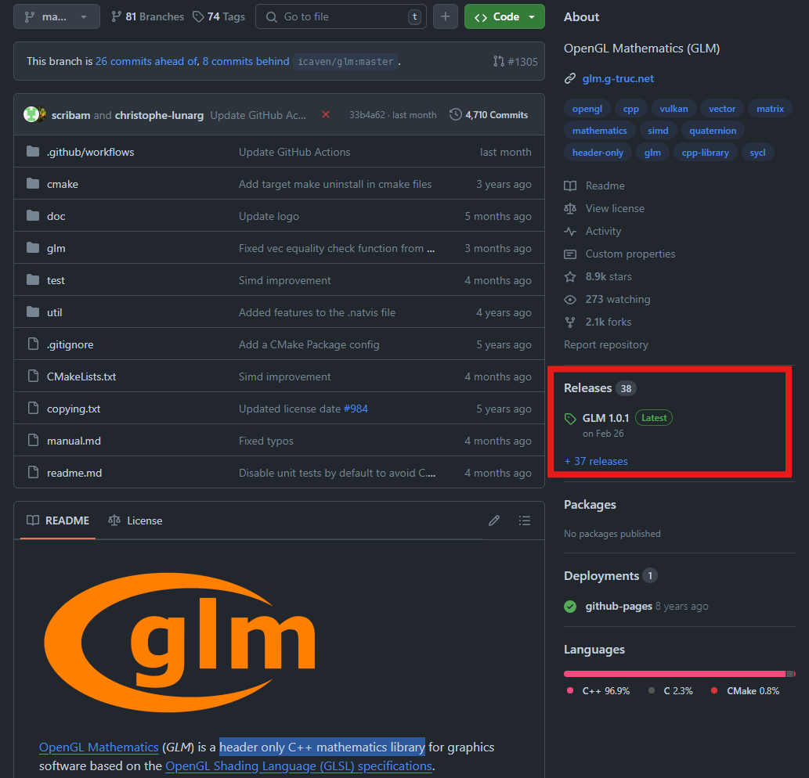
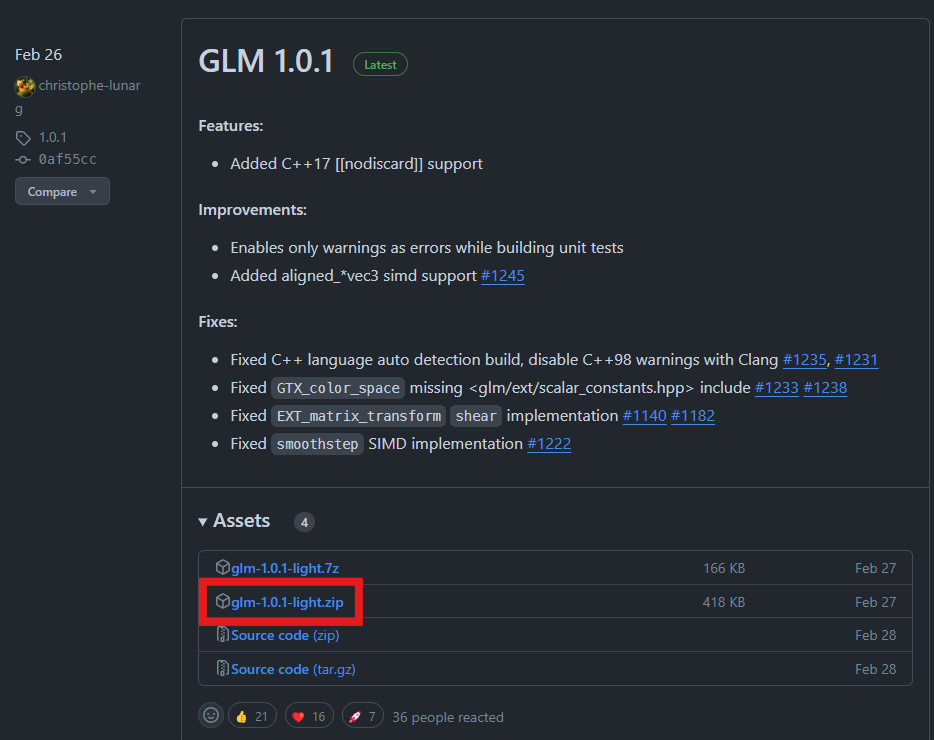
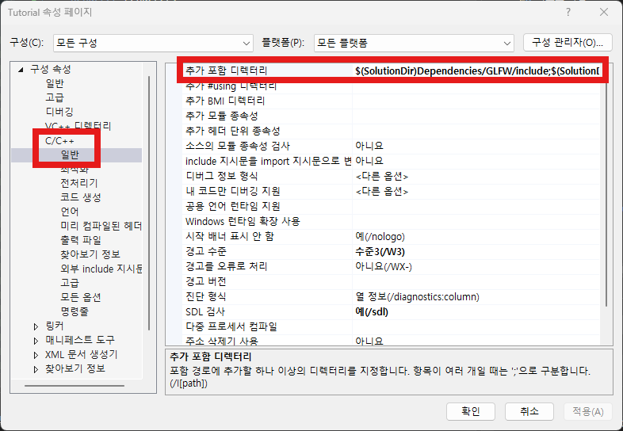

# Using Matrix with GLM

이번 문서에서는 GLM(OpenGL Mathematics) 라이브러리를 사용해서 행렬을 사용하는 방법에 대해서 배워보도록 하겠습니다.

지금 시점이라면 이제 여러분들은 강의를 통해 컴퓨터 그래픽스에서 행렬 연산이 왜 필요하고 변환 행렬을 얼마나 자주 사용하는지 알게 되셨을 겁니다. 

코드를 통해 행렬을 정의하고 연산하는 기능을 구현해 볼 수도 있겠지만, 이 실습에서는 간편하게 이러한 내용이 모두 잘 구현되어 있는 GLM 라이브러리를 사용하여 진행하도록 하겠습니다. 물론 라이브러리가 제공된다고 해도 이론적인 내용을 알지 못하면 제대로 활용할 수가 없기 때문에 강의 내용에 대한 이해가 바탕이 되어 있어야 합니다.

## Setting GLM

[GLM 레포지토리](https://github.com/g-truc/glm)에 가시면 GLM을 다운로드 할 수 있습니다. GLM에 대한 설명 첫 중에서 볼 수 있듯이 GLM은 "header only C++ mathematics library" 입니다. Header only라는 것은 헤더 파일들에 모든 기능이 구현되어 있다는 뜻이므로 우리는 이러한 방식으로 사용할겁니다. 물론 정적/동적 라이브러리로 컴파일해서 사용할 수도 있으니 관심이 있으신 분은 시도해 보세요.

이 강의에서는 Release된 최신 버전을 사용하겠습니다. 페이지 우측 중단의 Release 버튼을 클릭하면 릴리즈된 버전들을 확인할 수 있습니다. 이 중 가장 최신 버전(현재 기준 1.0.1 버전)의 light 버전을 다운로드 하겠습니다.





압축을 풀면 `glm` 폴더가 있고 그 안에 `glm.hpp` 파일 등이 있는 것을 보실 수 있을겁니다. 이제 이 파일들을 아래처럼 경로가 되도록 프로젝트 폴더에 추가해 줄 것입니다.

```
<솔루션 경로>
├── Dependencies
│   ├── GLFW
│   │   ├── include
|   │   ├── lib-vc2022
│   │   └── LICENSE.md
│   └── GLEW
│       ├── bin
|       ├── include
|       ├── lib
│       └── LICENSE.txt
├── <프로젝트이름>
|   ├── resources               
|   |   └── shaders             
|   ├── vendors                 // <- 폴더 생성
|   |   └── glm                 // <- 압축 해제 폴더 복사
|   |       └── glm.hpp 등등
|   └── main.cpp 등등
└── <프로젝트이름>.sln
```

그리고 경로를 단순화 하기 위해서 프로젝트 설정에서 `vendors` 폴더를 포함 경로에 추가 해줄 것입니다. 아래 그림의 추가 포함 디렉터리 부분의 마지막에 vendors 폴더를 추가할 것입니다.

```
$(SolutionDir)Dependencies/GLFW/include;$(SolutionDir)Dependencies/GLEW/include;$(ProjectDir)/vendors
```




제대로 설정되었는지 보려면 `main.cpp` 상단에서 우리가 사용하려는 헤더 파일들이 잘 찾아지는지 보면 됩니다.

```cpp title="main.cpp"
#include "Shader.h"
#include "Renderer.h"

//diff-add
#include "glm/glm.hpp"
//diff-add
#include "glm/ext.hpp"

int main(void)
...
```

이렇게 헤더를 추가하고 빌드했을 때 문제 없이 빌드가 된다면 제대로 설정이 된 것입니다.

GLM 기능에 관해서 궁금한 것이 있다면 [매뉴얼](https://github.com/g-truc/glm/blob/master/manual.md#section3_6)을 보시면 됩니다.

<details>
<summary>GLM 사용 최적화</summary>

문서를 읽어 보시면 아시겠지만 GLM의 기능 구현은 여러 헤더 파일에 분산되어 있고, 빌드 시간을 줄이려면 내가 현재 필요로 하는 특정 헤더파일만을 명시해서 include하는 것이 좋습니다. (또는 미리컴파일된 헤더 기능을 사용)

역시나 그래픽스 외적인 부분은 설명을 최소화하기위해 여기서는 그냥 `glm.hpp`와 전체 extension을 포함하는 `ext.hpp`를 추가해 주었습니다.
</details>

## Using GLM Matrix

간단한 예시로 GLM Matrix를 살펴 보겠습니다. 실제 사용할 코드는 아니고, GLM Matrix가 어떤 방식으로 정의되고 사용되는지를 살펴보기 위한 예제 코드입니다. 따라서 타이핑하여 실행해 보세요.

```cpp
	glm::mat4 myMatrix = glm::mat4(1.0, 0.0, 0.0, 0.0,
		                           0.0, 1.0, 0.0, 0.0,
		                           0.0, 0.0, 1.0, 0.0,
		                           10.0, 20.0, 30.0, 1.0);
	std::cout << myMatrix[0][0] << std::endl; // 1
	std::cout << myMatrix[3][0] << std::endl; // 10
	std::cout << myMatrix[3][2] << std::endl; // 30

	glm::vec4 firstCol = myMatrix[0];
	std::cout << firstCol.x << std::endl; // 1
	glm::vec4 fourthCol = myMatrix[3];
	std::cout << fourthCol.x << std::endl; // 10
	std::cout << fourthCol[2] << std::endl; // 30

	glm::mat4 myTanslation = glm::translate(glm::mat4(1.0), glm::vec3(10, 20, 30));
	std::cout << myTanslation[0][0] << std::endl; // 1
	std::cout << myTanslation[3][0] << std::endl; // 10
	std::cout << myTanslation[3][2] << std::endl; // 30

	glm::mat4 myTanslationAdd = glm::translate(myTanslation, glm::vec3(11, 22, 33));
	std::cout << myTanslationAdd[0][0] << std::endl; // 1
	std::cout << myTanslationAdd[3][0] << std::endl; // 21
	std::cout << myTanslationAdd[3][2] << std::endl; // 63

	glm::vec4 pos = glm::vec4(5.0, 6.0, 7.0, 1.0);
	glm::vec4 translatedPos = myTanslation * pos;
	std::cout << translatedPos[0] << std::endl; // 15
	std::cout << translatedPos[1] << std::endl; // 26
	std::cout << translatedPos[2] << std::endl; // 37
```

GLM에서 4x4 행렬은 `glm::mat4` 타입입니다. 4x4 행렬의 초기화는 당연히 16개의 요소를 명시해 줌으로써 가능합니다. **주의하실 것은 GLM은 Column-major 표현을 사용하기 때문에 열 순서로 요소를 정의한다는 것입니다.** 따라서 이동 변환 행렬은 열 순서로 `myMatrix`와 같이 값을 정의할 수 있습니다. 각 요소에 접근할 때는 2차원 배열처럼 행과 열의 인덱스를 통해 접근할 수 있습니다.

GLM은 행렬뿐만 아니라 벡터 타입도 제공합니다. 예를들어 4차원 벡터는 `glm::vec4` 타입을 사용하면 됩니다. 벡터의 경우 각 요소들은 인덱스를 사용하거나 `x,y,z,w` 등의 필드를 통해서도 접근할 수 있습니다.

한편, 자주 사용되는 변환 행렬들을 손쉽게 구성하기 위한 메소드들도 존재합니다. 이동 변환 행렬의 요소들을 일일히 입력하는 것이 아니고, `glm::translate()` 메소드를 이용하면 알아서 두 번째 인자로 명시한 벡터만큼의 이동 변환을 수행하는 변환 행렬을 반환해 줍니다. 첫 번째 인자로는 변환 행렬이 적용될 초기 행렬을 넘겨주어야 합니다. 이 경우 **초기 행렬로 단위 행렬(identity matrix)을 넘겨주기 위해 `glm::mat4(1.0)`을 사용하였습니다.**

변환 행렬의 적용은 알고 있는대로 행렬 x 벡터의 연산을 수행해 주면 됩니다.

## Using GLM Matrix for Shader

이제 셰이더에서 이러한 GLM Matrix를 사용하는 예제를 구현해 봅시다. 기존에 `basic.shader`에서 offset 유니폼으로 전달하여 정점의 위치를 조정하던 것을, 이번에는 이동 변환 행렬을 통한 구현으로 전환해 보겠습니다.

먼저 이동 변환 행렬을 사용해서 정점의 위치를 변환하는 셰이더를 아래와 같이 추가해 보겠습니다. 파일 이름은 `basic_translation.shader`로 하죠.

```glsl title="resources/shaders/basic_translation.shader"
#shader vertex
#version 330 core

layout(location = 0) in vec4 a_position;
layout(location = 1) in vec4 a_color;

out vec4 v_color;

uniform mat4 u_model;

void main()
{
	gl_Position = u_model * a_position;
	v_color = a_color;
};

#shader fragment
#version 330 core

layout(location = 0) out vec4 out_color;

in vec4 v_color;

void main()
{
	out_color = v_color;
};
```

기존 `basic.shader`와 거의 동일한데, 정점의 위치 변환을 벡터의 덧셈(`u_offset + a_position`) 대신 행렬곱 (`u_model * a_position`) 연산으로 바꾸어 주었습니다.

:::note
GLSL 셰이더 코드에서의 행렬 자료형과 행렬곱과 같은 연산은 GLSL 언어 자체에서 지원합니다. 우리가 GLM을 사용하는 이유는 셰이더에서 이러한 연산이 가능하게 하기 위해서가 아니라, CPU 쪽에서 쉽게 GLSL과 호환되는 행렬 데이터를 만들어서 GPU로 전달해주기 위함입니다.
:::

이 유니폼에 데이터를 전달할 수 있으려면 기존 `Shader` 클래스에 행렬 전달을 위한 `SetUniform()` 기능을 확장해 주어야 합니다. 헤더 파일과 cpp 파일에 아래와 같이 `SetUniformMat4f()` 함수의 정의와 구현을 추가해 줍니다.

```cpp title="Shader.h"
//diff-add
#include "glm/glm.hpp"

...

void SetUniform4f(const std::string& name, float v0, float v1, float v2, float v3);
void SetUniform1f(const std::string& name, float value);
//diff-add
void SetUniformMat4f(const std::string& name, const glm::mat4& matrix);
```

```cpp title="Shader.cpp"
//diff-add
void Shader::SetUniformMat4f(const std::string& name, const glm::mat4& matrix)
//diff-add
{
    //diff-add
	glUniformMatrix4fv(GetUniformLocation(name), 1, GL_FALSE, &matrix[0][0]); 
//diff-add
}
```

실제 호출하는 OpenGL API는 `glUniformMatrix4fv()`입니다. [문서](https://docs.gl/gl3/glUniform)에 보면 매개변수들은 아래와 같습니다.

1. location: 기존과 동일한 유니폼 변수의 위치입니다.
2. count: 행렬의 개수입니다. 배열(셰이더에서 mat4[]로 정의한)이 아니면 1을 사용하면 됩니다.
3. transpose: 행렬을 전치할 것인지 여부입니다.
4. value: 행렬 값을 담고 있는 메모리 주소를 넘겨주면 됩니다.

보시다시피 우리는 `glm::mat4` 타입인 `matrix`를 `SetUniformMat4f()`의 매개변수로 받아서 `&matrix[0][0]`로 그 주소값을 전달해 주고 있습니다. GLM 기본 타입들은 연속된 메모리 주소에 값들을 저장하기 때문에 16개 요소로 이루어진 배열에 대해 첫 주소를 전달하는 것과 같습니다.

이제 `main.cpp`에서 행렬을 만들어서, 셰이더에 전달해 봅시다.

```cpp title="main.cpp"
...
//diff-remove
Shader squareShader{ "resources/shaders/basic.shader" };
//diff-add
Shader squareShader{ "resources/shaders/basic_translation.shader" };
Shader triangleShader{ "resources/shaders/basic_red.shader" };
	
Renderer renderer;

// Rendering Loop
while (!glfwWindowShouldClose(window)) 
{
    renderer.Clear();

    //--- 사각형 그리기
    squareVA.Bind();

    squareShader.Bind();
    //diff-remove
    float square_offset = 0.7f;
    //diff-remove
    squareShader.SetUniform4f("u_offset", square_offset, 0.0f, 0.0f, 0.0f);
    //diff-add
    glm::mat4 squareModelMat = glm::translate(glm::mat4(1.0), glm::vec3(0.7, 0.0, 0.0));
    //diff-add
    squareShader.SetUniformMat4f("u_model", squareModelMat);
    
    renderer.Draw(squareVA, squareIB, squareShader);

    //diff-add
    squareShader.Unbind();
    squareVA.Unbind();
    ...
```

새로 생성한 `basic_translation.shader`를 `squareShader`로 생성하고, 사각형을 그리기 전에 바인딩 해줍니다.

위쪽에서 이동 변환 행렬을 만드는 예제처럼 `glm::translate()` 메소드를 사용해 기존과 동일하게 x방향으로 `0.7` 만큼 이동하는 변환 행렬인 `squareModelMat`을 정의한 뒤 셰이더의 `u_model` 유니폼에 이 행렬을 전달해 주었습니다.

:::note
`squareShader.Unbind()` 코드의 추가는 없어도 동일하게 동작하지만, 깜박하고 안 넣은 내용이라 지금 추가 했습니다 ^^;
:::

그러면 셰이더 내에서 각 정점 위치(`a_position`)값에 이 이동 변환 행렬이 곱해지게 되고, 기존처럼 오른쪽에 사각형이 위치하게 됩니다.


## 마치며

이제 드디어 변환 행렬의 사용까지 도달했기 때문에, 다음 장에서부터는 본격적으로 3차원 장면을 만들어내는 내용을 진행해 보도록 하겠습니다.

Model, View, Project 행렬을 사용할 것이고, 이를 위해 GLM 라이브러리의 힘을 많이 빌리긴 하겠지만 역시나 제가 강조하는 것은 이론적인 배경을 알아야 제대로 사용할 수 있다는 것입니다.

이론적인 배경을 모르면 운이 좋은 경우(?), 아니면 남이 만든 코드를 그대로 따라하는 경우엔 문제가 없지만 무언가 하나 삐끗하는 경우 왜 문제가 생기는지 파악이 어렵고 해결을 못하게 됩니다.

## 연습 문제

1. 삼각형 모델에 대해서도 `basic_translation.shader`를 사용해서, 기존과 동일한 결과가 나타나도록 코드를 수정해 보세요. 이를 위해서는 이번에 진행한 이동 변환 행렬의 전달도 해야 하지만, 위쪽에서 정의한 정점 버퍼 부분도 함께 수정을 해야 합니다.

2. 현재는 `squareModelMat` 값이 렌더링 루프에서 변하지 않기 때문에 행렬을 정의하고 유니폼 값을 집어넣는 코드는 렌더링 루프 밖으로 이동해도 무방합니다. 렌더링 루프 밖으로 코드를 이동해서 사각형을 그리는 코드가 아래 코드만 남도록 해 보세요.

```cpp
// Rendering Loop
while (!glfwWindowShouldClose(window)) 
{
    renderer.Clear();

    //--- 사각형 그리기
    squareVA.Bind();
    squareShader.Bind();
    renderer.Draw(squareVA, squareIB, squareShader);
    squareShader.Unbind();
    squareVA.Unbind();
    ...
```

3. 이동 변환 행렬에 더해서, 회전 변환 행렬을 적용해 보세요. `glm::rotate` 메소드를 사용하시면 됩니다.

---

## 관련 링크

- [최종 코드(zip)](./assets/11_using_matrix_with_GLM/src/src.zip)
- [GLM 매뉴얼](https://github.com/g-truc/glm/blob/master/manual.md#section3_6)


