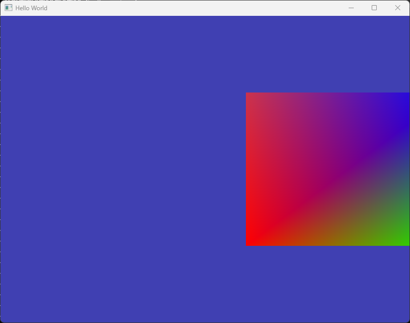
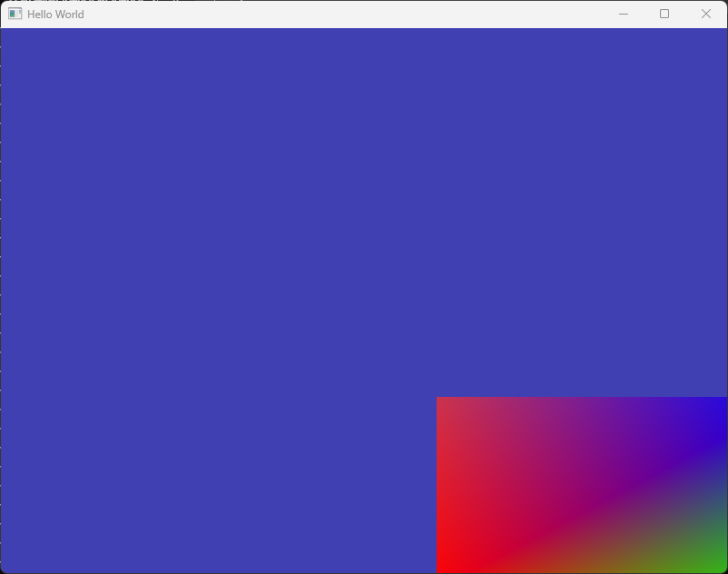
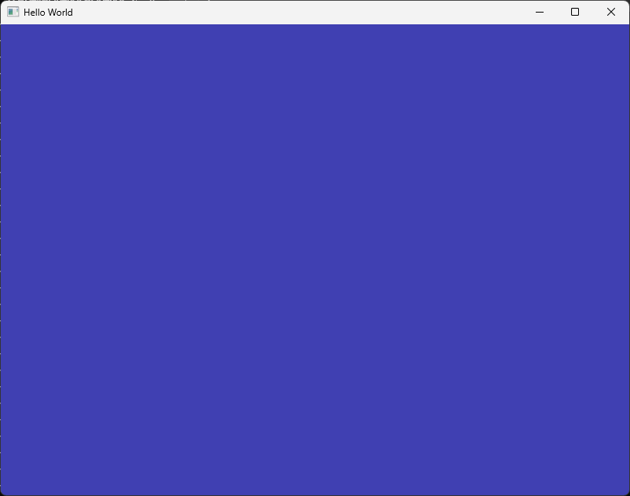
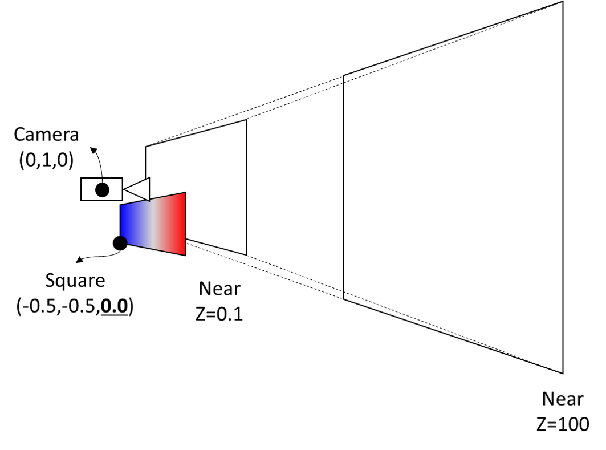
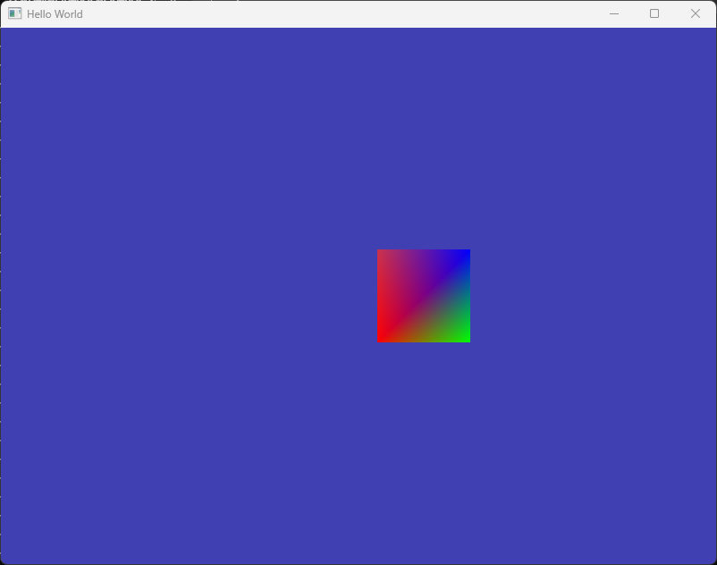
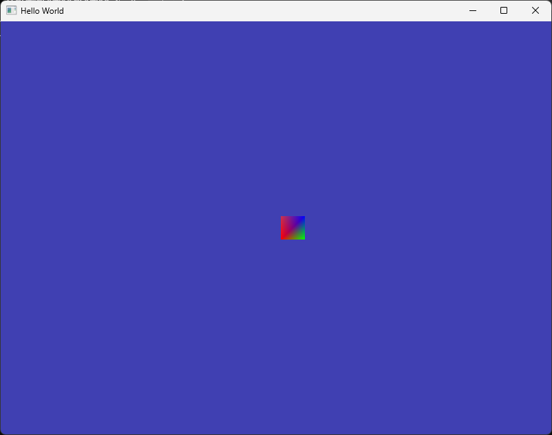

# 3D Rendering with MVP Transform

이번 문서에서는 본격적으로 3D 렌더링을 수행해 보도록 하겠습니다. 이를 위해 정점 셰이더도 일반적인 3차원 그래픽스 렌더링에 필요한 MVP(Model-View-Projection) 변환을 모두 수행하도록 확장할 것입니다. 

실습 결과물로 보이는 화면은 지금까지와 크게 다르지 않지만, 이제 사용자 입력을 통해 다른 시점의 이미지를 만들어 내는 과정이 전반적으로 어떤 연산들을 거쳐 이루어지는지 보다 확실히 이해하시게 될 겁니다. 결국 그것이 실시간 3차원 컴퓨터 그래픽스 기초 부분에서의 핵심 내용이기 때문에 잘 따라오시면 좋겠습니다.

## Vertex Shader for 3D Rendering

지난 문서까지 사용했던 `basic_translation.shader`를 확장해서 3D 렌더링을 위한 변환을 수행하는 정점 셰이더를 만들어 보도록 하겠습니다. 셰이더의 이름은 `basic_3d.shader`로 하겠습니다. 기존과 동일한 경로에 이러한 이름으로 셰이더를 만들고, 아래와 같이 내용을 작성합니다.

```glsl title="resources/shaders/basic_3d.shader"
#shader vertex
#version 330 core

layout(location = 0) in vec4 a_position;
layout(location = 1) in vec4 a_color;

out vec4 v_color;

uniform mat4 u_model;
//diff-add
uniform mat4 u_view;
//diff-add
uniform mat4 u_projection;

void main()
{
    //diff-remove
    gl_Position = u_model * a_position;
    //diff-add
    gl_Position = u_projection * u_view * u_model * a_position;
    v_color = a_color;
};

#shader fragment
#version 330 core

layout(location = 0) out vec4 out_color;

in vec4 v_color;

void main()
{
    out_color = v_color;
};
```

기존의 `basic_translation.shader`와 달라진 부분만을 표시해 두었습니다. 보시다시피 `u_view`와 `u_projection`이라는 두 행렬을 추가적으로 사용할 예정입니다. 이미 강의를 통해 뷰 (변환) 행렬과 투영 (변환) 행렬을 배우셨을 것이며, 이름을 보시면 예상할 수 있듯이 이 두 행렬이 그러한 변한을 표현하는 행렬입니다.

실제 변환 연산은 `u_projection * u_view * u_model * a_position`를 통해 이루어집니다. 왜 곱하기 순서가 이렇게 되는지는 모두들 알고 계실 것으로 생각합니다. 복습 차원에서 한 번 짚어 보자면 각의 행렬곱을 통해 얻어지는 값들은 아래와 같습니다.

1. `a_position`: 모델 공간에서의 정점 좌표
2. `u_model * a_position`: 모델 공간에서의 정점 좌표가 월드 공간에서의 정점 좌표로 변환
3. `u_view * u_model * a_position`: 월드 공간에서의 정점 좌표가 뷰 공간(카메라 공간)에서의 정점 좌표로 변환
4. `u_projection * u_view * u_model * a_position` 카메라 공간의 정점 좌표가 클립 공간에서의 정점 좌표로 변환

그리고 `gl_Position`은 원래 대입된 값을 클립 공간에서의 정점 좌표라고 인식하고 나머지 연산을 수행합니다. 즉, 수정 전에 우리가 사용했던 `gl_Position = u_model * a_position` 이 명령문은 `u_view`와 `u_projection`에 단위 행렬을 집어넣은 것과 동일한 결과라는 것도 이해가 되실겁니다. 

이제 `u_view`/`u_projection`은 단위 행렬이 아닌, 우리가 CPU에서부터 넘겨줄 의미있는 행렬을 활용하게 될 것이고, 그러면 그 행렬을 통한 변환은 정점을 카메라의 위치와 시야각 등이 적용된 클립 좌표로 변환해 주어 의도한 장면이 만들어지게 될 것입니다.

:::note
강의에서 사용한 용어와 이 실습에서 사용하는 용어간에 약간의 미스매치가 있을 수 있습니다. 이건 제 잘못이 아니라 실제로 사람들 사이에서 다양한 용어들이 사용되기 때문입니다. 그러니 여러분들도 다 알아 두시면 앞으로 다른 자료들을 봤을 때 도움이 될 것입니다.

- World Transform(월드 변환)/Model Transform(모델 변환)
    - 둘 다 오브젝트(모델) 공간의 정점 좌표를 월드 공간으로 변환하는 것을 말합니다.
- Camera Transform(카메라 변환)/View Transform(뷰 변환)
    - 둘 다 월드 공간의 정점 좌표를 카메라 공간으로 변환하는 것을 말합니다.

저는 가급적이면 실습에서는 "모델 변환"/"뷰 변환"이라는 용어로 계속 사용할 예정이니 헷갈리지 마시기 바랍니다. 

이 용어를 사용하는 이유는 일반적으로 클립 공간으로의 변환을 "MVP 변환"이라고 줄여 말하는 경우가 많아서 일관성을 유지하기 위함입니다.
:::


## Using Vertex Shader for 3D Rendering

이제 방금 만든 `basic_3d.shader`를 한 번 사용해서 화면을 그려보겠습니다. 그러려면 우선 해당 셰이더 프로그램을 만들고, 그리기 이전에 활성화를 해야 하며, `u_model`과 `u_projection`에 유니폼 값을 집어넣어줘야 하겠죠?

간단하게 아래와 같이 먼저 변경해 봅시다. 일단은 사각형에만 방금 만든 셰이더를 사용하고, 삼각형은 그리지 않도록 주석 처리해 두겠습니다. 그리고 기존과 동일한 결과가 나오도록 `u_model`과 `u_projection`에 단위 행렬을 넘겨 줍니다.

```cpp title="main.cpp"
...
//diff-remove
Shader squareShader{ "resources/shaders/basic_translation.shader" };
//diff-add
Shader squareShader{ "resources/shaders/basic_3d.shader" };
Shader triangleShader{ "resources/shaders/basic_red.shader" };

Renderer renderer;

// Rendering Loop
while (!mainWindow.GetShouldClose())
{
    renderer.Clear();

    //--- 사각형 그리기
    squareVA.Bind();
    squareShader.Bind();

    glm::mat4 squareModelMat = glm::translate(glm::mat4(1.0), glm::vec3(0.7, 0.0, 0.0));
    squareShader.SetUniformMat4f("u_model", squareModelMat);

    //diff-add
    glm::mat4 squareViewMat = glm::mat4(1.0);
    //diff-add
    squareShader.SetUniformMat4f("u_view", squareViewMat);

    //diff-add
    glm::mat4 squareProjMat = glm::mat4(1.0);
    //diff-add
    squareShader.SetUniformMat4f("u_projection", squareProjMat);
    
    renderer.Draw(squareVA, squareIB, squareShader);

    squareShader.Unbind();
    squareVA.Unbind();

    //--- 삼각형 그리기
    //diff-add
    //아래 삼각형 그리기 코드 주석 처리
    //triangleVA.Bind();
    //triangleShader.Bind();

    //float triangle_offset = -0.7f;
    //triangleShader.SetUniform4f("u_offset", triangle_offset, 0.0f, 0.0f, 0.0f);

    //renderer.Draw(triangleVA, triangleIB, triangleShader);

    //triangleShader.Unbind();
    //triangleVA.Unbind();

    mainWindow.SwapBuffers();
    glfwPollEvents(); 
}
```

현재 상태에서 실행해 보시면 아래와 같은 결과가 화면에 나타납니다. 예상대로죠?



그러면 이제 의미가 있는 뷰 행렬과 투영 행렬을 만들어서 넘겨줘 봅시다.


### Define View Matrix using GLM

사실 위 코드만 보고도 강의 시간에 배운대로 뷰 행렬을 정의해서 셰이더에 넘겨서 결과를 볼 수 있습니다. GLM 설명 초기에 16개의 값을 집어넣어서 행렬을 만드는 법을 이미 알아봤으니까요. 이것은 여러분들이 할 수 있다고 치고, 여기서는 좀 더 간편하게 뷰 행렬을 만들어주는 `glm::lookAt()` 함수를 사용해 보겠습니다.

`glm::lookAt()`은 강의 시간에 배운것처럼, `EYE`/`AT`/`UP` 벡터를 넘겨주면 `u`/`v`/`w` 벡터를 계산해서 그 결과인 뷰 변환 행렬을 반환해주는 함수입니다.

아래와 같이 한 번 사용해보죠.

```cpp title="main.cpp"
glm::mat4 squareModelMat = glm::translate(glm::mat4(1.0), glm::vec3(0.7, 0.0, 0.0));
squareShader.SetUniformMat4f("u_model", squareModelMat);

//diff-remove
glm::mat4 squareViewMat = glm::mat4(1.0);
//diff-add
glm::vec3 eyePos = glm::vec3(0.0, 0.0, 0.0);
//diff-add
glm::vec3 atPos = glm::vec3(0.0, 0.0, -1.0);
//diff-add
glm::vec3 upVec = glm::vec3(0.0, 1.0, 0.0);
//diff-add
glm::mat4 squareViewMat = glm::lookAt(eyePos, atPos, upVec);

squareShader.SetUniformMat4f("u_view", squareViewMat);

glm::mat4 squareProjMat = glm::mat4(1.0);
squareShader.SetUniformMat4f("u_projection", squareProjMat);
```

eye를 `(0,0,0)`, at을 `(0,0,-1)`, up을 `(0,1,0)`으로 정의하고 `glm::lookAt()`에 이 세 벡터를 넘겨주어 mat4를 반환받았습니다. 이러한 값들로 구성된 뷰 벡터가 어떻게 생겼는지는 스스로 계산해 보실 수 있겠죠? 그리고 그 결과는 예상대로 기존과 동일한 결과가 나타날겁니다.

그러면 이제 값을 바꿔서 제대로 적용되고 있는지 볼까요? 카메라의 위치를 y방향으로 1만큼 올려서 과연 좀 더 높은 곳에서 사각형을 바라보는 화면으로 나타날지 한 번 보죠.

```cpp title="main.cpp"
//diff-remove
glm::vec3 eyePos = glm::vec3(0.0, 0.0, 0.0);
//diff-add
glm::vec3 eyePos = glm::vec3(0.0, 1.0, 0.0);
glm::vec3 atPos = glm::vec3(0.0, 0.0, -1.0);
glm::vec3 upVec = glm::vec3(0.0, 1.0, 0.0);
```



좋습니다! 카메가 위로 올라갔으니, 사각형은 시야에서 아래쪽에 위치하게 되겠죠. 의도한 대로 결과가 잘 나왔습니다. 다른 값들도 바꾸어 가면서 결과가 어떻게 나오는지 보세요. 그리고 그 결과가 예상한 대로인지 한 번 확인해 보세요.

### Define Projection Matrix using GLM

다음은 투영 행렬입니다. 강의시간에 배운대로 투영 행렬은 `fovy`, `aspect ratio`, `near`, `far` 네 개의 값을 통해 정의됩니다. 다행히 이러한 값들을 바탕으로 투영 변환 행렬을 만들어 반환해주는 함수도 GLM에서 제공해 줍니다. 그 함수는 `glm::perspective()`입니다. 아래와 같이 사용할 수 있습니다.

```cpp title="main.cpp"
//diff-remove
glm::mat4 squareProjMat = glm::mat4(1.0);
//diff-add
float fovyDeg = 60.0f;
//diff-add
float aspect = (float)mainWindow.GetBufferWidth() / mainWindow.GetBufferHeight();
//diff-add
float near = 0.1f;
//diff-add
float far = 100.0f;
//diff-add
glm::mat4 squareProjMat = glm::perspective(glm::radians(fovyDeg), aspect, near, far);
squareShader.SetUniformMat4f("u_projection", squareProjMat);
```

변수 이름들을 보시면 무슨 의미인지 다 알 수 있으실 겁니다. aspect는 윈도우의 종횡비 값을 그대로 사용하였습니다. 그리고 `fovy` 값은 라디안으로 넘겨줘야 하기 때문에 `glm::radians()`를 사용해 변환해 주었습니다.

그럼 한 번 결과를 볼까요?



갑자기 화면에 아무것도 안나오네요! 왜 그럴까요? 이제부터 우리는 3D의 세상에 들어왔으니 3D에서 모든 것을 생각해야 합니다.

아래 그림이 현재 상태를 3D로 나타낸 것입니다. 강의 시간에 배웠던 것처럼 투영 변환은 정의된 뷰 절두체(View Frustum)를 2x2x2의 클립 공간으로 변환하는 (affine이 아닌) perspective 변환입니다. 그리고 래스터라이징 과정에서 이 클립 공간에서의 2x2x2 영역 외부에 존재하는 삼각형들은 보이지 않는 삼각형으로 간주하여 더 이상 연산을 수행하지 않게 됩니다.



이제 우리는 `0.1f`에서 `100.0f`로 정의된 near와 far plane을 가지고 있으니 화면에 그려질 물체는 이 절두체 안에 들어와야 합니다. 그런데 우리가 정의한 사각형의 정점들은 어디에 있죠? x,y 위치는 차치하고서라도, z 좌표가 0이라는 사실을 눈치 채셨나요?

처음에 정점 자체를 x,y값만 정의했기 때문에 [z좌표는 초기값인 0으로 정의되었고](./03_shader_and_vertex_attribute.md#마치며), 모델 변환 과정에서도 X방향으로 0.7만 이동했기 때문에 여전히 z 좌표값은 0입니다. 따라서 카메라가 그리는 최소 거리(`0.1f`) 보다도 카메라에 가까이에 있는 삼각형이므로 버려지고 있는 것입니다.

해결 방법은 간단하죠. 이미 모델 변환 행렬이 정의되어 있으니 물체를 카메라 앞쪽으로 옮겨 봅시다. 카메라 앞쪽은 현재 -z 방향입니다. (왜 그렇게 되는지 이해가 잘 안되시면 뷰 변환 부분 강의자료를 좀 더 살펴 보시기 바랍니다.) 따라서 코드를 아래와 같이 변경해줍니다.

```cpp title="main.cpp"
//diff-remove
glm::mat4 squareModelMat = glm::translate(glm::mat4(1.0), glm::vec3(0.7, 0.0, 0.0));
//diff-add
glm::mat4 squareModelMat = glm::translate(glm::mat4(1.0), glm::vec3(0.7, 0.0, -5.0));
squareShader.SetUniformMat4f("u_model", squareModelMat);
```

그러면 다시 사각형이 보이는 것을 보실 수 있습니다! 크기는 좀 달라졌는데, 이는 투영 변환에 의한 효과입니다. 이제는 **투영 변환 행렬을 사용하기 때문에 카메라에서 멀어질수록 사각형이 더 작아지는 효과**를 보실 수 있습니다. 첫 번째 그림은 `z = -5`로 설정했을 때의 렌더링 결과이고 두 번째 그림은 `z = -15`로 설정했을 때의 렌더링 결과입니다.






여기까지 해서 기초적인 3차원 렌더링을 수행해 봤습니다. MVP 변환을 통해서 정점의 위치가 클립 공간으로 변환되며, 투영 변환으로 인해 멀리 있는 물체는 작게, 가까이 있는 물체는 크게 그려지고 있습니다.

다음 문서에서는 지난 시간에 확장한 `Window`의 사용자 입력 탐지 기능을 활용해 움직일 수 있는 카메라를 구현해 보도록 하겠습니다.

## 마치며

- 투영 행렬을 단위 행렬로 사용하면, 원근(Perspective) 투영이 아닌 [직교(Orthographic) 투영](https://en.wikipedia.org/wiki/Orthographic_projection)을 한 셈입니다. 직교 투영은 나중에 그림자 만들기를 할 때에도 유용하게 활용됩니다.

- 내가 원하는 매개변수들로 직교 투영 행렬을 만들고 싶다면 `glm::ortho()` 함수를 사용하면 됩니다. 절두체의 left, right, top, bottom과 near, far 매개변수로 만들 수 있습니다.

- 현재 종횡비(aspect)는 윈도우의 너비와 높이값을 사용해서 계산하고 있는데, 꼭 그럴 필요는 없습니다. 값을 바꿔 보시면 다른 형태로 화면이 그려지시는 것을 볼 수 있고, 이는 뷰포트 변환과 관련이 있습니다. 예를들어 실행한 뒤에 윈도우의 크기를 바꿔 보세요. 그렇게 바꾼 윈도우의 크기에 화면이 제대로(?) 반응하지 않을 겁니다. 이런 사항들을 반영해 주려면 뷰포트를 인식하고 그에 맞게 그려주는 변환이 필요한데, 다음 기회에 진행해 보도록 하겠습니다.

- 삼각형 그리기 부분의 주석을 풀고, 카메라의 위치를 바꿔가면서 실행해 보면 삼각형은 계속 같은 위치에 그려집니다. 삼각형이 카메라에 반응하지 않는 이유는 알 수 있으시겠죠?


## 연습 문제

1. 투영 행렬이 단위 행렬인 상황에서, eye 위치를 앞뒤로 바꾸어 보세요. 그럼 사각형이 더 커지거나 작아 보이나요? 이렇게 결과가 나타나는 이유는 무엇일까요?

2. fov값을 늘리거나 줄였을 때 화면이 어떻게 바뀌는지 살펴 보세요. 그렇게 바뀌는 이유가 머리 속으로 상상이 되시나요? 절두체가 클립 공간으로 변환되면서 어떻게 왜곡되는지를 생각해 보세요.

---

## 관련 링크

- [최종 코드(zip)](./assets/13_3d_rendering_with_mvp_transform/src/src.zip)
- [직교 투영](https://en.wikipedia.org/wiki/Orthographic_projection)
