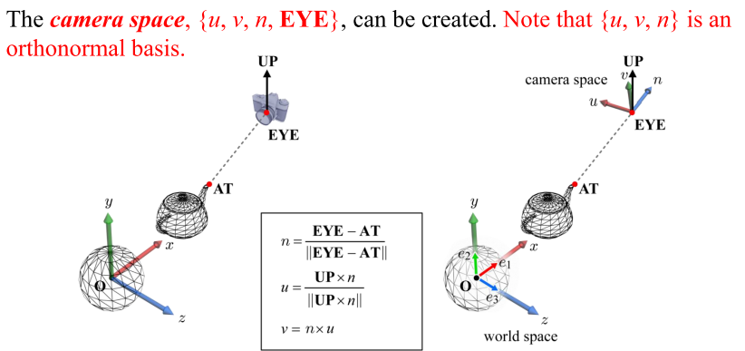

# Interactive Camera

이번 문서에서는 `Window` 클래스에서 구현한 사용자 입력 탐지와 지난 문서에서 진행한 MVP 변환을 연결해서, 사용자가 카메라를 움직일 수 있는 기능을 구현해 보도록 하겠습니다.

게임을 포함한 3D 응용 프로그램에서 카메라를 움직이는 메타포(metaphor)는 여러 방식이 있습니다. 예를 들어 키보드 입력으로 카메라를 앞뒤좌우로 움직일 수 있으며, 마우스로 주변을 둘러보는 FPS 게임에서의 카메라도 있고, 3D 모델링 툴에서처럼 물체를 항상 중심에 두고 관찰하는 Orbit 카메라의 방식도 있습니다.

이 튜토리얼에서는 기본적인 FPS 카메라 방식으로 구현해 볼 예정입니다. 하지만 내용을 배우고 나면 Orbit 카메라 또는 Third Person View 방식의 카메라도 구현하는 방법을 쉽게 떠올리실 수 있을 겁니다.


## Camera Class 정의

사용자 입력으로 제어할 수 있는 카메라 기능을 `Camera` 라는 이름의 클래스로 만들어 그 안에 필요한 기능들을 구현할 예정입니다. `Camera` 클래스의 설계는 아래와 같습니다.

```cpp title="Camera.h"
#pragma once

#include "glm/glm.hpp"
#include "glm/ext.hpp"

class Camera
{
public:
    Camera();
    Camera(glm::vec3 initEye, glm::vec3 initUp,
        float initYaw, float initPitch,
        float initMoveSpeed, float initTurnSpeed);
    ~Camera();

    void KeyControl(bool* keys, float deltaTime);
    void MouseControl(float xChange, float yChange);

    glm::mat4 CalculateViewMatrix();
private:
    glm::vec3 eye, front, up, right, worldUp;
    float yaw, pitch;
    float moveSpeed, turnSpeed;

    void Update();
};
```

기본적인 생성자와 소멸자가 있고, public 기능으로는 `KeyControl()`, `MouseControl()`, `CalculateViewMatrix()`가 있습니다. `KeyControl()`과 `MouseControl()`은 사용자 입력에 따라서 내부 데이터를 업데이트하는 기능을 수행하고, `CalculateViewMatrix()`는 최종적으로 셰이더에 사용할 뷰 행렬을 계산해서 반환하는 기능을 수행합니다.

private으로는 필요한 여러 데이터들과 `Update()` 기능을 가지고 있습니다. 우선 `yaw`,`pitch`라는 용어가 생소하실텐데 이는 플랫폼의 자세를 기술할 때 사용되는 표준적인 용어입니다. 내 머리의 자세를 기준으로 설명해 보면 `yaw`는 고개가 좌우로 얼마나 돌아갔는지에 대한 각도, `pitch`는 고개를 얼마나 들거나 내렸는지에 대한 각도입니다. (`roll`은 고개를 갸웃거리는 방향으로 얼마나 돌아갔는지에 대한 각도입니다) [그림](https://en.wikipedia.org/wiki/Aircraft_principal_axes)을 참고하시면 좋습니다.

이 각도들을 왜 사용하는지는 구현 부분을 보면서 설명 드리도록 하겠습니다.

## Camera Class 구현

`Camera` 클래스의 구현을 부분적으로 나누어 보겠습니다. 우선 생성자/소멸자 부분입니다.

```cpp title="Camera.cpp"
#include "Camera.h"
#include <GLFW/glfw3.h>

Camera::Camera()
{
}

Camera::Camera(glm::vec3 initEye, glm::vec3 initUp, 
                float initYaw, float initPitch, 
                float initMoveSpeed, float initTurnSpeed)
    : eye{ initEye }, front{ glm::vec3{0.0f,0.0f,-1.0f} }, worldUp{ initUp },
    yaw{ initYaw }, pitch{ initPitch },
    moveSpeed{ initMoveSpeed }, turnSpeed{ initTurnSpeed }
{
	Update();
}

Camera::~Camera()
{
}
```

초기 위치와 자세 관련 데이터를 받아서 멤버 변수에 저장하는 부분이고 특별할 것은 없습니다. `front`의 경우 `(0,0,-1)`을 기본값으로 하였는데, 어차피 `Update()` 내에서 `yaw, pitch`를 기반으로 다시 계산할 것입니다.

다음은 키보드와 마우스 입력을 처리하는 `KeyControl()`과 `MouseControl()`입니다.

```cpp title="Camera.cpp"
void Camera::KeyControl(bool* keys, float deltaTime)
{
    float velocity = moveSpeed * deltaTime;

    if (keys[GLFW_KEY_W])
    {
        eye += front * velocity;
    }
    if (keys[GLFW_KEY_S])
    {
        eye -= front * velocity;
    }
    if (keys[GLFW_KEY_D])
    {
        eye += right * velocity;
    }
    if (keys[GLFW_KEY_A])
    {
        eye -= right * velocity;
    }
}

void Camera::MouseControl(float xChange, float yChange)
{
    xChange *= turnSpeed;
    yChange *= turnSpeed;

    yaw += xChange;
    pitch += yChange;

    if (pitch > 89.0f)
        pitch = 89.0f;

    if (pitch < -89.0f)
        pitch = -89.0f;

    Update();
}
```

`Window` 클래스에서 사용자의 키보드 입력을 `keys: bool[1024]`에 저장해 두었던 것을 기억하시나요? `KeyControl()`에서 첫번째 매개변수로 그 배열을 받을 겁니다. 그러면 눌려있는 키의 인덱스에는 `true`, 그렇지 않은 키의 인덱스에는 `false`가 들어있을 것입니다. 여러 키 중에서 우리는 W,A,S,D의 입력 여부만을 확인합니다.

만일 해당 키가 입력이 되었으면 이제 `eye` 위치를 이동시킬 것입니다. W/S키는 `eye`를 `front` 벡터 방향으로 속도만큼 움직이고, A/D키는 `right` 벡터 방향으로 속도만큼 움직입니다. `front`와 `right`가 제대로 계산이 되어 있다고 하면, 직관적인 계산입니다. 

두 번째 인자로 `deltaTime`을 받는데 이것은 이전 렌더링 루프에서 현재 렌더링 루프까지의 시간입니다. 이따 `main.cpp`을 수정하면서 추가 설명 드리겠습니다.

`MouseControl()`도, `Window` 클래스에서 계산해 두었던 마우스의 x,y 방향 커서 위치 변화값인 `x/yChange`값을 사용할 것입니다. 사용자가 마우스를 오른쪽으로 움직이면, `(xChange, yChange) = (5,0)`와 같은 식으로 값이 들어있을 거고 그러면 `yaw`값을 증가시켜 줍니다. `yaw`는 고개를 돌리는 각도이니 오른쪽으로 고개를 돌렸다고 볼 수 있습니다. 같은 방식으로 `yChange` 값을 기반으로 `pitch`를 증가/감소 시킵니다.

마지막으로 `pitch`값을 -89도에서 89도 사이도 제한해 주는데 말하자면 고개를 90도 이상 들어올리거나 내리지 못하도록 하는 것입니다. 실제 사람은 고개를 90도 이상으로 들 수도 있지만, 카메라 제어에서 이를 허용하면 여러 부작용이 생길 수 있으므로 제한해 둡니다.

이제 마지막으로 `Update()`와 `CalculateViewMatrix()` 함수입니다. 핵심적인 부분이죠.

```cpp title="Camera.cpp"
void Camera::Update()
{
    front.x = cos(glm::radians(yaw)) * cos(glm::radians(pitch));
    front.y = sin(glm::radians(pitch));
    front.z = sin(glm::radians(yaw)) * cos(glm::radians(pitch));
    front = glm::normalize(front);

    right = glm::normalize(glm::cross(front, worldUp));
    up = glm::normalize(glm::cross(right, front));
}

glm::mat4 Camera::CalculateViewMatrix()
{
    glm::mat4 view = glm::lookAt(eye, eye + front, up);
    return view;
}
```

`Update()`에서는 앞(front), 오른쪽(right), 위(up) 방향 벡터를 계산합니다. 일단 처음 삼각함수로 `front` 벡터를 계산하는 부분은 아마 고등학교 때 다들 배우셨을 겁니다. [구면좌표](https://en.wikipedia.org/wiki/Spherical_coordinate_system)를 직교 좌표로 변환하는 공식이죠. (r=1로 두고) 즉, `yaw`, `pitch` 두 개의 값으로 내가 바라보는 방향 벡터인 `front`를 계산하는 것입니다.

이후에 `right`와 `up` 벡터를 계산하는데 이는 강의시간 뷰 변환에서 배운 내용과 유사합니다. 아래 그림을 기준으로 보면 현재 `-n`(=`front`) 방향 벡터가 얻어진 상태입니다.



이 상태에서 `right`(=`u`) 방향 벡터를 얻으려면 `front`와 `UP`을 외적하면 됩니다. (오른손 법칙에 따라 방향이 잘 맞는지 점검해 보세요.) 마지막으로 `up`(=`v`) 방향 벡터는 다시 `right`와 `front`를 외적하면 됩니다.

:::note
`worldUp`과 `up` 벡터가 따로 있는 이유가 이제 이해가 되시나요? 사용자에게는 `worldUp` 벡터만 입력으로 받는데, 이는 그림에서의 `UP`에 해당하는 벡터입니다. 그리고 내부적으로 `up`벡터를 계산하는데 이는 그림에서 `v`에 해당하는 벡터입니다.
:::

즉, 이 계산을 통해 우리는 카메라의 `u,v,n` 벡터를 모두 얻은 것입니다. 따라서 뷰 변환 행렬을 바로 구성할 수 있겠죠? 이로부터 직접 구현하는 것은 연습문제로 남겨두고 우리는 더 짧게 `glm::lookAt()`의 도움을 받아 뷰 변환 행렬을 만들었습니다. `AT`은 결국 절대 위치가 중요한 것이 아니라 방향이 중요하므로 `eye + front`를 `AT`으로 사용해 뷰 변환 행렬을 구했습니다.

:::note
애초에 `AT`의 존재 자체가 `n = EYE - AT` 계산을 위해 필요했던 것인데, 우리는 반대로 `n` (=`-front`)을 먼저 구했으므로, `AT = EYE - n = EYE + front`을 사용한 것입니다.
:::

## Camera Class 사용

이제 `main.cpp`를 수정하여 `Camera` 클래스를 사용해 봅시다.

```cpp title="main.cpp"
//diff-add
#include "Camera.h"

...
Shader squareShader{ "resources/shaders/basic_3d.shader" };
Shader triangleShader{ "resources/shaders/basic_red.shader" };

//diff-add
Camera camera { glm::vec3{0.0f,0.0f,5.0f}, glm::vec3{0.0f,1.0f,0.0f}, -90.0f, 0.0f, 5.0f, 0.5f };

Renderer renderer;

//diff-add
float deltaTime = 0.0f;
//diff-add
float lastTime = 0.0f;

// Rendering Loop
while (!mainWindow.GetShouldClose())
{
    //diff-add
    float now = glfwGetTime(); //현재 시간
    //diff-add
    deltaTime = now - lastTime; //deltaTime = 현재시간 - 이전시간 
    //diff-add
    lastTime = now;

    //diff-add
    camera.KeyControl(mainWindow.GetKeys(), deltaTime);
    //diff-add
    camera.MouseControl(mainWindow.GetXChange(), mainWindow.GetYChange());

    renderer.Clear();

    //--- 사각형 그리기
    squareVA.Bind();
    squareShader.Bind();

    glm::mat4 squareModelMat = glm::translate(glm::mat4(1.0), glm::vec3(0.7, 0.0, -5.0));
    squareShader.SetUniformMat4f("u_model", squareModelMat);

    //diff-remove
    glm::vec3 eyePos = glm::vec3(0.0, 0.0, 0.0);
    //diff-remove
    glm::vec3 atPos = glm::vec3(0.0, 0.0, -1.0);
    //diff-remove
    glm::vec3 upVec = glm::vec3(0.0, 1.0, 0.0);
    //diff-remove
    glm::mat4 squareViewMat = glm::lookAt(eyePos, atPos, upVec);
    //diff-remove
    squareShader.SetUniformMat4f("u_view", squareViewMat);
    //diff-add
    squareShader.SetUniformMat4f("u_view", camera.CalculateViewMatrix());

    ...
}

```

먼저 헤더를 추가해 두고 셰이더 생성 이후, 렌더러 생성 이전에 Camera를 추가로 정의해 줍니다. (사실 정의되는 위치는 크게 중요하진 않습니다.)

또한 아까 말씀드린 `deltaTime`을 구하는 코드가 추가되는데 `glfwGetTime()`을 사용하면 현재 시간을 얻을 수 있으므로, 현재 시간과 이전 시간을 빼주면 지난 렌더링 루프에서 이번 렌더링 루프까지의 시간을 얻을 수 있습니다.

이후 매 렌더링 루프마다 사용자 입력을 갱신할 수 있도록 `KeyControl()`과 `MouseControl()`을 호출해 주고 마지막으로 기존 뷰 변환 행렬 정의 부분을 이제 `Camera`가 계산한 뷰 변환 행렬을 사용하도록 변경해주면 됩니다.

이제 실행해 보면 아래와 같은 결과를 볼 수 있습니다. WASD키와 마우스로 카메라를 움직여 보세요!


이것이 기본적으로 우리가 게임에서 시점을 바꾸는 방법입니다. 장면을 구성하는 정점들을 변환할 때 사용하는 뷰 행렬을 통해 되면 정점 셰이더의 MVP 변환 과정에서 정점들의 클립 공간 좌표가 결정되고, 그 좌표가 최종적으로 스크린 공간 좌표로 변환되어 화면에 삼각형들이 위치하게 됩니다. 

그 과정에서 사용되는 뷰 행렬을 매 렌더링 루프마다 다른 행렬로 사용해 주기만 하면 결과적으로 내가 3D 공간상에서 움직이는 것과 같은 효과가 나타나는 것입니다.

언뜻 생각해도 굉장히 많은 연산이 필요할 것 같죠? 이것을 실시간으로 가능하게 해 주는 것이 바로 GPU라는 장치인 것입니다.

## 마치며

- 마우스로 카메라 시점을 움직일 때, 스크린 밖으로 커서가 나가는 바람에 원하는대로 못 움직여서 불편하실 겁니다. `Window.cpp`에서 옵션을 아래와 같이 바꿔주면 이제 커서가 화면 밖으로 나가지 않습니다.

```cpp title="Window.cpp"
int Window::Initialize()
{
    ...
    CreateCallback();
    //diff-remove
    glfwSetInputMode(mainWindow, GLFW_CURSOR, GLFW_CURSOR_HIDDEN);
    //diff-add
    glfwSetInputMode(mainWindow, GLFW_CURSOR, GLFW_CURSOR_DISABLED);
    glfwSetWindowUserPointer(mainWindow, this);
}
```

- 1에서 `deltaTime`을 나누면 대략적인 FPS를 계산할 수 있습니다.(왜일까요?) 한번 계산해서 출력해 보세요.

- `Camera::KeyControl()`에서 `velocity = moveSpeed * deltaTime`으로 계산하고 있습니다. 매 호출하다 `moveSpeed`만큼이 아니라 `moveSpeed`에 `deltaTime`을 곱한 만큼 값을 증가시키는 이유에 대해서는 주제에서 약간 벗어나기 때문에 [이 글](https://webgl2fundamentals.org/webgl/lessons/ko/webgl-animation.html)을 한 번 읽어보세요


## 연습 문제

1. `CalculateViewMatrix()`에서 `glm::lookAt()` 함수를 사용하지 않고, 직접 `front(-n)`, `right(u)`, `up(v)` 벡터 값으로 뷰 변환 행렬을 반환하도록 바꿔 보세요.

2. Q/E 키를 누르면 카메라가 상/하로 이동하도록 하는 기능을 추가적으로 구현해 보세요.

3. 카메라의 이동(키보드)에 비해 시점 변경(마우스)은 뭔가 부드럽지 못하게 느껴지지 않나요? 부드럽게 변환이 되도록 한 번 개선해 보세요.

---

## 관련 링크

- [최종 코드(zip)](./assets/14_interactive_camera/src/src.zip)
- [Yaw, Pitch, Roll](https://en.wikipedia.org/wiki/Aircraft_principal_axes)
- [구면 좌표계](https://en.wikipedia.org/wiki/Spherical_coordinate_system)
- [FPS independency](https://webgl2fundamentals.org/webgl/lessons/ko/webgl-animation.html)
