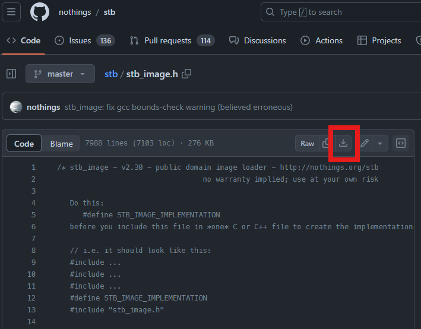
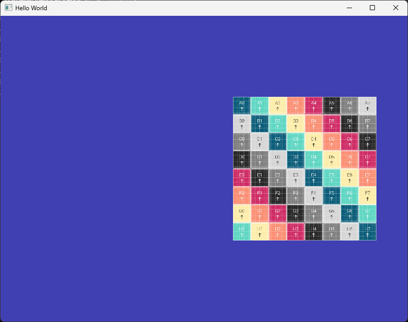

# Texture

이번 문서에서는 텍스처 파일을 읽어오는 기능을 추가해 보도록 하겠습니다. 강의 시간에 보다 상세히 설명 드렸겠지만 컴퓨터 그래픽스에서 텍스처, 또는 텍스처 맵이라는 것은 렌더링에 활용되는 데이터를 저장한 중요한 자원입니다. 추후 살펴보겠지만 물체의 색상을 표현하는 것 뿐만 아니라 법선 등 다양한 데이터를 저장하기도 합니다.

주로 이미지 파일의 형태로 저장되어 활용되기 때문에 우리는 프로젝트에 이미지 파일을 읽어오는 기능을 추가해야 하고, 읽어온 텍스처를 셰이더에서 활용할 수 있도록 GPU에 전달하는 방법이 필요합니다.

이미지 파일을 읽어오는 부분은 stb image라는 라이브러리를 활용한 예정이며, 텍스처를 셰이더에서 활용할 수 있는 인터페이스는 `Texture` 클래스를 통해 구현할 것입니다. 마지막에는 간단하게 셰이더를 확장하여 텍스처 이미지가 사각형에 입혀지도록 구현해 보겠습니다.

## stb image 라이브러리 추가

[stb](https://github.com/nothings/stb)는 헤더 파일 하나로 구현된 간단한 라이브러리입니다. 다양한 기능들이 있지만 우리는 여기서 이미지 파일을 읽어오는 기능이 구현되어 있는 `stb_image.h` 파일 하나만 사용할 것입니다. [이 링크](https://github.com/nothings/stb/blob/master/stb_image.h)를 클릭하면 해당 파일의 페이지가 열리는데, 아래 아이콘을 클릭하면 파일을 다운로드 할 수 있습니다.



다운로드한 파일을 아래와 같이 프로젝트 폴더에 위치시켜주세요. 그러면 끝입니다. 간단하죠?

```
<솔루션 경로>
├── Dependencies
│   ├── GLFW
│   │   ├── include
|   │   ├── lib-vc2022
│   │   └── LICENSE.md
│   ├── GLEW
│   │   ├── bin
|   │   ├── include
|   │   ├── lib
│   │   └── LICENSE.txt
│   └── Assimp
|       ├── include             
|       ├── lib                 
│       └── LICENSE             
├── <프로젝트이름>
|   ├── resources               
|   |   └── shaders             
|   ├── vendors                 
|   |   ├── glm                 
|   |   |   └── glm.hpp 등등
|   |   └── stb_image           // <- 폴더 생성           
|   |       └── stb_image.h     // <- 파일 복사
|   ├── main.cpp 등등
|   └── assimp-vc143-mt.dll     
└── <프로젝트이름>.sln
```


## stb image 라이브러리 테스트

라이브러리의 기능이 사용 가능한지 간단히 테스트 해보기 위해서 먼저 이미지 파일이 하나 필요합니다. 앞으로 종종 사용하기 위해 [이 사이트](https://uvchecker.vinzi.xyz/)를 사용해 그리드 텍스처를 하나 다운로드 하였습니다. 제가 만든 파일은 [이 링크](./assets/15_texture/img/uv_checker.png)를 통해서도 다운로드 하실 수 있습니다.

앞으로 텍스처 파일들은 `resources/textures` 경로에 위치시킬 예정입니다. 따라서 그리드 텍스처를 아래와 같은 경로에 위치시켜줍니다.

```
<솔루션 경로>
├── Dependencies
│   ├── GLFW
│   │   ├── include
|   │   ├── lib-vc2022
│   │   └── LICENSE.md
│   ├── GLEW
│   │   ├── bin
|   │   ├── include
|   │   ├── lib
│   │   └── LICENSE.txt
│   └── Assimp
|       ├── include             
|       ├── lib                 
│       └── LICENSE             
├── <프로젝트이름>
|   ├── resources               
|   |   ├── shaders             
|   |   └── textures            // <- 폴더 생성
|   |       └── uv_checker.png  // <- 파일 복사
|   ├── vendors                 
|   |   ├── glm                 
|   |   |   └── glm.hpp 등등
|   |   └── stb_image           
|   |       └── stb_image.h     
|   ├── main.cpp 등등
|   └── assimp-vc143-mt.dll     
└── <프로젝트이름>.sln
```

해당 파일을 stb_image를 통해 잘 읽어올 수 있는지 테스트 하기위해 아래와 같이 `main.cpp`에 테스트용 코드를 작성해 봅시다.

```cpp title="main.cpp"
#include "glm/glm.hpp"
#include "glm/ext.hpp"

//diff-add
#define STB_IMAGE_IMPLEMENTATION
//diff-add
#include "stb_image/stb_image.h"

int main(void)
{
    //diff-add
    int imgWidth;
    //diff-add
    int imgHeight;
    //diff-add
    int imgChannel;

    //diff-add
    auto imgPath = "resources/textures/uv_checker.png";
    //diff-add
    unsigned char* buffer = stbi_load(imgPath, &imgWidth, &imgHeight, &imgChannel, 4);
    //diff-add
    std::cout << "Image Size: " << imgWidth << ", " << imgHeight << std::endl;
    //diff-add
    std::cout << "Image Channel: " << imgChannel << std::endl;
    //diff-add
    stbi_image_free(buffer);

    Window mainWindow{ 800, 600 };
    mainWindow.Initialize();

```

정상적으로 세팅이 되었다면 빌드에 문제가 없고, 이미지의 크기(1024x1024) 및 채널(4)이 올바로 출력될 것입니다. 반환되는 `buffer`가 실제 이미지 데이터가 들어있는 배열의 주소입니다. 사용이 끝나면 `stbi_image_free()`로 메모리를 해제해 줍시다.


## Texture 클래스 정의

이제 테스트 코드는 삭제하고, 이러한 텍스처 자원을 관리하고 사용하기 위한 클래스를 작성해 보겠습니다. `Texture` 클래스를 정의할 것인데 텍스처를 읽어오고, 데이터를 GPU로 복사하고 바인딩/언바인딩 하는 기능들을 가지고 있도록 설계 하였습니다.

```cpp title="Texture.h"
#pragma once

#include <string>

class Texture
{
private:
    unsigned int texObject; 
    std::string filePath;    
    unsigned char* texBuffer; 
    int width, height, channel; 
public:
    Texture(const std::string& path);
    ~Texture();

    void Bind(unsigned int slot = 0) const; 
    void Unbind() const;

    inline int GetWidth() const { return width; }
    inline int GetHeight() const { return height; }
};
```

`vao`, `vbo`처럼 적절한 약어가 있으면 좋을텐데 우선은 `texObject`로 이름을 지어 두었습니다. 이 변수가 GPU에 저장된 텍스처의 핸들(id)을 가지고 있을 것입니다. 나머지는 특별히 설명 드릴 부분은 없을 것 같고, 텍스처 또한 바인딩/언바인딩이 필요하다는 것만 봐 두십시오.

## Texture 클래스 구현

`Texture` 클래스의 구현은 아래와 같습니다.

```cpp title="Texture.cpp"
#include "Texture.h"
#include <GL/glew.h>

#define STB_IMAGE_IMPLEMENTATION
#include "stb_image/stb_image.h"

Texture::Texture(const std::string& path)
    :texObject{ 0 }, filePath{ path }, texBuffer{ nullptr }, 
    width{ 0 }, height{ 0 }, channel{ 0 }
{
    texBuffer = stbi_load(path.c_str(), &width, &height, &channel, 4);

    glGenTextures(1, &texObject);
    glBindTexture(GL_TEXTURE_2D, texObject);

    glTexParameteri(GL_TEXTURE_2D, GL_TEXTURE_MIN_FILTER, GL_LINEAR);
    glTexParameteri(GL_TEXTURE_2D, GL_TEXTURE_MAG_FILTER, GL_LINEAR);
    glTexParameteri(GL_TEXTURE_2D, GL_TEXTURE_WRAP_S, GL_CLAMP_TO_EDGE);
    glTexParameteri(GL_TEXTURE_2D, GL_TEXTURE_WRAP_T, GL_CLAMP_TO_EDGE);

    //텍스처 데이터 전달
    glTexImage2D(GL_TEXTURE_2D, 0, GL_RGBA8, width, height, 0, GL_RGBA, GL_UNSIGNED_BYTE, texBuffer);
    glBindTexture(GL_TEXTURE_2D, 0); // 언바인딩

    if (texBuffer)
    {
        stbi_image_free(texBuffer); //버퍼 free
    }
}

Texture::~Texture()
{
    glDeleteTextures(1, &texObject);
}

void Texture::Bind(unsigned int slot) const
{
    glActiveTexture(GL_TEXTURE0 + slot); 
    glBindTexture(GL_TEXTURE_2D, texObject);
}

void Texture::Unbind() const
{
    glBindTexture(GL_TEXTURE_2D, 0);
}
```

생성자 부분에서 이미지를 로딩하고 GPU에 텍스처 데이터를 복사하는 것 까지 한꺼번에 수행합니다.

OpenGL API는 `glGenTextures()`를 사용해 GPU에 텍스처 객체를 생성하고, `glBindTexture()`를 사용해 `GL_TEXTURE_2D` 바인딩 포인트에 바인딩 한 뒤에 `glTexImage2D()`를 통해 이미지 데이터를 GPU로 복사합니다.

실제로 텍스처 데이터를 복사하는 API인 `glTexImage2D()`에서 여러 가지 파라메터를 입력해 주어야 하는데 여러분이 크게 수정할 일은 없으므로 모두 설명하지는 않겠습니다. 역시나 [문서](https://docs.gl/gl3/glTexImage2D)를 한 번 잘 읽어보시면 좋습니다.

생소한 부분은 `glTexParameteri()` 부분인데 이 부분은 강의에서 설명 드렸거나 곧 설명드릴 예정이므로 강의 내용을 참고 하시기 바랍니다.

또한 약간 다른 부분은 `Bind()` 함수입니다. 단순히 바인딩만을 수행하는 것이 아니라 그 전에 `glActiveTexture(GL_TEXTURE0 + slot)`와 같은 방식으로 API를 호출하고 있습니다.

텍스처 데이터는 셰이더 프로그램에서 직접 접근하는 것이 아니라 샘플러(sampler)라는 객체를 통해 필터링을 거쳐 접근해야 합니다. 따라서 slot이라는(아래 그림에서는 Texture Image Units의 번호를 의미)곳에 텍스처를 바인딩하는 과정이 필요하며 이것이 `glActiveTexture()`의 역할입니다. [그림 출처](https://paroj.github.io/gltut/Texturing/Tutorial%2014.html)


아직은 잘 이해가 안되실 수도 있는데 셰이더 프로그램과 `main.cpp`에서의 활용까지 보시고 나면 좀 더 감이 오실 것 같습니다. 마저 진행해 보겠습니다.


## Texture Mapping 셰이더

이제 이러한 텍스처를 색상 데이터로 활용하는 셰이더를 만들어 보겠습니다. 기존의 `basic_3d.shader`를 약간 확장한 `basic_3d_texture.shader`를 아래와 같이 추가합니다.

```glsl title="basic_3d_texture.shader"
#shader vertex
#version 330 core

layout(location = 0) in vec4 a_position;
//diff-remove
layout(location = 1) in vec4 a_color;
//diff-add
layout(location = 1) in vec2 a_texcoord;

//diff-remove
out vec4 v_color;
//diff-add
out vec2 v_texcoord;

uniform mat4 u_model;
uniform mat4 u_view;
uniform mat4 u_projection;

void main()
{
    gl_Position = u_projection * u_view * u_model * a_position;
    //diff-remove
    v_color = a_color;
    //diff-add
    v_texcoord = a_texcoord;
};

#shader fragment
#version 330 core

layout(location = 0) out vec4 out_color;

//diff-remove
in vec4 v_color;
//diff-add
in vec2 v_texcoord;

//diff-add
uniform sampler2D u_texture;

void main()
{
    //diff-remove
    out_color = v_color;
    //diff-add
    vec4 tex_color = texture(u_texture, v_texcoord);
    //diff-add
    out_color = tex_color;
};
```

이제 color값은 정점 버퍼에서부터 어트리뷰트로 가져올 것이 아니기 때문에 관련 변수들은 삭제를 해줍니다. 대신, 각 정점이 텍스처의 어떤 부분에서 색상값을 가져올 것인지를 정의하는 텍스처 좌표를 어트리뷰트로 받아올 것입니다. 따라서 `positions` 배열이 변경될 것임을 예상하실 수 있을겁니다.

이렇게 받아온 `a_texcoord` 어트리뷰트는 그대로 프래그먼트 셰이더로 넘어가서 텍스처로부터 색상값을 가져오는데 활용됩니다. 텍스처 데이터는 프래그먼트 셰이더에 유니폼으로 선언해 두었고 변수 이름은 `u_texture`입니다. 그런데 이 유니폼의 타입이 `texture2D` 같은 것이 아니라 `sampler2D`임에 유의하세요.

다시 한 번 설명하자면 "텍스처"는 원본 데이터 자체이고, 그 데이터로부터 값을 뽑아올때는 필터링 알고리즘이 필요하며 이러한 필터링 알고리즘을 사용해 값을 뽑아오는 것은 "샘플러"가 담당합니다. 따라서 셰이더에 필요한, 최종적으로 색상을 가져오기 위해서는 샘플러가 필요합니다.

샘플러에서부터 값을 가져오기 위해 사용하는 함수가 GLSL 내장 함수인 `texture()` 함수입니다. 첫 번째 인자로는 샘플러를, 두 번째 인자로는 텍스처 좌표를 입력하면 색상 값을 필터링 연산을 통해 도출해 줍니다. 필터링 연산의 동작 방식에 대해서는 강의 내용을 참고하십시오.

## Texture Mapping을 통한 사각형 그리기

이제 지금까지 준비된 것들을 활용해 텍스처가 입혀진 사각형을 그려 봅시다.

```cpp title="main.cpp"
...
//diff-add
#include "Texture.h"

...

int main(void)
{
    ...

    float positions[] = {
        //diff-remove
        //x     y    r    g    b    a
        //diff-remove
        -0.5, -0.5, 1.0, 0.0, 0.0, 1.0, //0번 vertex
        //diff-remove
         0.5, -0.5, 0.0, 1.0, 0.0, 1.0, //1번 vertex
         //diff-remove
         0.5,  0.5, 0.0, 0.0, 1.0, 1.0, //2번 vertex
         //diff-remove
        -0.5,  0.5, 0.8, 0.2, 0.3, 1.0, //3번 vertex
        //diff-add
        //x     y    u    v
        //diff-add
        -0.5, -0.5, 0.0, 0.0, // 좌하단 정점
        //diff-add
         0.5, -0.5, 1.0, 0.0, // 우하단 정점
         //diff-add
         0.5,  0.5, 1.0, 1.0, // 우상단 정점
         //diff-add
        -0.5,  0.5, 0.0, 1.0  // 좌상단 정점
    };
    
    ...
    //diff-remove
    VertexBuffer squareVB{ positions, 4 * 6 * sizeof(float) };
    //diff-add
    VertexBuffer squareVB{ positions, 4 * 4 * sizeof(float) };
        
    VertexBufferLayout squareLayout;
    squareLayout.Push<float>(2); // 0-th layout (position)
    //diff-remove
    squareLayout.Push<float>(4); // 1-th layout (color)
    //diff-add
    squareLayout.Push<float>(2); // 1-th layout (texture coord)

    squareVA.AddBuffer(squareVB, squareLayout);
    ...
```

우선 `Texture.h`를 include하고, 기존 `positions` 배열을 바꿔줍니다. 색상 데이터 대신 uv 좌표(강의자료 기준 st좌표)를 각 정점의 어트리뷰트로 추가해줍니다. uv 좌표는 float 2개 값이기 때문에 버퍼 크기와 레이아웃도 그에 맞게 수정해 주었습니다.

다음으로는 텍스처 객체를 생성하는 부분과, 셰이더를 새로 만든 셰이더로 수정하는 부분입니다.

```cpp title="main.cpp"
...
    triangleVB.Unbind();

    //diff-remove
    Shader squareShader{ "resources/shaders/basic_3d.shader" };
    //diff-add
    Shader squareShader{ "resources/shaders/basic_3d_texture.shader" };
    Shader triangleShader{ "resources/shaders/basic_red.shader" };

    //diff-add
    Texture checkerTexture{ "resources/textures/uv_checker.png" };

    Camera camera{ glm::vec3{0.0f,0.0f,5.0f}, glm::vec3{0.0f,1.0f,0.0f}, 
...
```

이제 실제로 그리기를 수행하기 전에, 셰이더에 텍스처(&샘플러)를 바인딩하도록 추가해 줍니다.

```cpp title="main.cpp"
// Rendering Loop
while (!mainWindow.GetShouldClose())
{
    ...
    //--- 사각형 그리기
    squareVA.Bind();
    squareShader.Bind();

    //diff-add
    checkerTexture.Bind(0); //텍스처를 0번 슬롯에 바인딩
    //diff-add
    squareShader.SetUniform1i("u_texture", 0); // 셰이더의 샘플러에 0번 슬롯을 바인딩

    glm::mat4 squareModelMat = glm::translate(glm::mat4(1.0), glm::vec3(0.7, 0.0, -5.0));
    squareShader.SetUniformMat4f("u_model", squareModelMat);
    ...
```

`u_texture`를 바인딩 자체는 위 두 줄로 끝납니다. 그런데 이 작업을 하기위해서는 텍스처 유닛(슬롯) 숫자를 셰이더 프로그램에 알려주어야 합니다. 이를 위해서 `SetUniform1i`를 `Shader` 클래스에 추가 구현하는 것이 필요합니다.

특별할 것은 없고 기존 패턴대로 `glUniform1i()`를 호출하는 기능만 래핑해서 만들어 주면 됩니다. `1i`는 짐작할 수 있는대로 정수 하나를 전달하는 것이고, 그 정수는 이 경우엔 텍스처 유닛(슬롯)의 번호입니다.

```cpp title="Shader.h"
...
void SetUniform1f(const std::string& name, float value);
void SetUniformMat4f(const std::string& name, const glm::mat4& matrix);
//diff-add
void SetUniform1i(const std::string& name, int value);
...
```

```cpp title="Shader.cpp"
...
//diff-add
void Shader::SetUniform1i(const std::string& name, int value)
//diff-add
{
    //diff-add
	glUniform1i(GetUniformLocation(name), value);
    //diff-add
}
...
```

수정할 부분이 많았는데 여기까지 완료하고 나면 아래와 같은 결과를 보실 수 있습니다.



텍스처 파일로부터 읽은 색상 데이터가 GPU에 올라가 있고, 각 프래그먼트가 가지고 있는 (래스터라이저를 통해) 보간된 텍스처 좌표를 `texture` 셰이더 함수를 통해 샘플러에 질의하면 해당하는 색상 값이 각 픽셀별로 계산되어 화면에 나타나게 됩니다. 그러면 결과적으로 텍스처 이미지가 물체에 "입혀진" 것과 같은 장면으로 나타나게 되는 것입니다.

## 마치며

- OpenGL에서 지원하는 텍스처는 일반적인 2D 이미지 뿐만 아니라 1D, 3D 이미지와 큐브맵 이미지 등이 있습니다. 큐브맵 이미지는 환경 매핑을 수행할 때 활용할 수 있고, 장면의 현실감을 높이는데 아주 유용하게 활용됩니다.

- [텍스처 유닛에 관한 그림](https://paroj.github.io/gltut/Texturing/SamplerBindingDiagram.svg)에서 "Sampler Object"와 관련된 `glBindSampler()`를 우리는 사용하지 않고 있습니다. 샘플러를 만들지도 않았고, 바인딩 하는 과정도 없었습니다. 이는 간단히 말하자면 텍스처를 만들면 기본 샘플러가 같이 생성되기 때문입니다. 이를 분리하여 텍스처와 샘플러를 서로 믹스하거나 재사용 하는 것도 가능하고 그를 위해 `glBindSampler()`가 존재하는 것입니다. 하지만 기초적인 부분에서는 여기까지 들어갈 필요가 없을 것 같습니다. [이 글](https://stackoverflow.com/questions/30960403/multitexturing-theory-with-texture-objects-and-samplers)을 한번 읽어 보시면 도움이 될 것입니다.

- `stb_image.h`를 include 하기 전에 정의한 `STB_IMAGE_IMPLEMENTATION` 키워드는 프로그램 전체에서 한 번만 정의해야 합니다. 다른 위치에서 `stb_image.h`를 다시 include해야하는 경우가 있다면 유의하세요.


## 연습 문제

1. 정점의 텍스처 좌표값을 바꾸어 의도한대로 결과가 나오는지 확인해 보세요. 텍스처 좌표값을 음수값이나 1 이상의 값을 사용하는 경우도 강의에서 배운 바 있습니다. `Texture.cpp`의 `glTexParameteri()` 함수와 함께 의도한 결과가 나오는지 살펴보세요.

2. 렌더링 루프에서 매 루프마다 바뀔 가능성이 있는 유니폼은 `u_view`밖에 없습니다. 나머지 유니폼들은 계속 함수를 호출하지 않도록 루프 밖으로 옮겨 보세요.

3. 사실 텍스처를 사용한다고 꼭 정점의 색상값을 사용하지 못할 이유는 없습니다. 예를들어 최종 프래그먼트의 색상을 계산할때 두 색상값(정점에 할당되어 프래그먼트에 보간된 색상과 텍스처로부터 얻어진 색상값)을 적절히 혼합한 결과를 얻을 수도 있습니다. 정점 어트리뷰트로 주어진 색상과 텍스처 색상을 곱해서 두 색상 결과를 혼합한 장면을 만들어 보세요. 예를 들자면 아래 링크와 같습니다.


---

## 관련 링크

- [최종 코드(zip)](./assets/15_texture/src/src.zip)
- [stb](https://github.com/nothings/stb)
- [UV Checker](https://uvchecker.vinzi.xyz/)
- [OpenGL TexImage2D](https://docs.gl/gl3/glTexImage2D)
- [텍스처/샘플러 관련 부가 설명 1](https://paroj.github.io/gltut/Texturing/Tutorial%2014.html)
- [텍스처/샘플러 관련 부가 설명 2](https://stackoverflow.com/questions/30960403/multitexturing-theory-with-texture-objects-and-samplers)