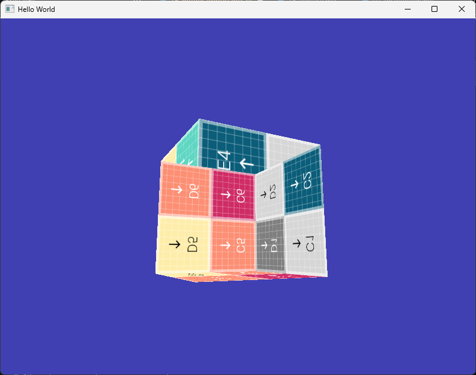
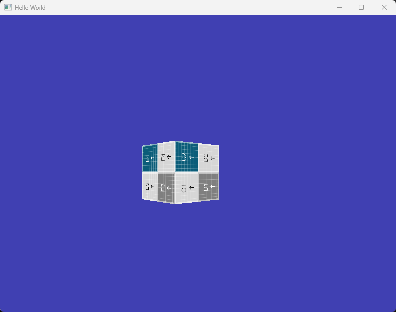
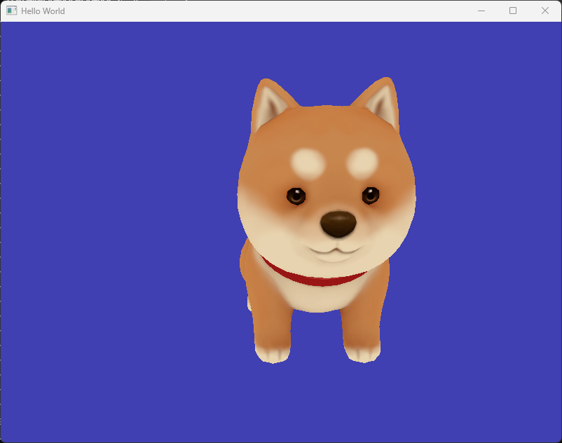
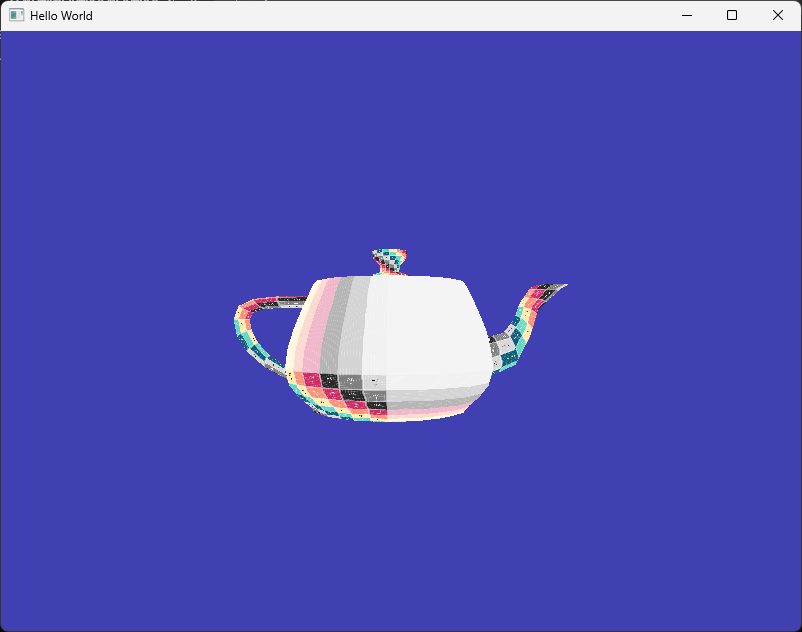
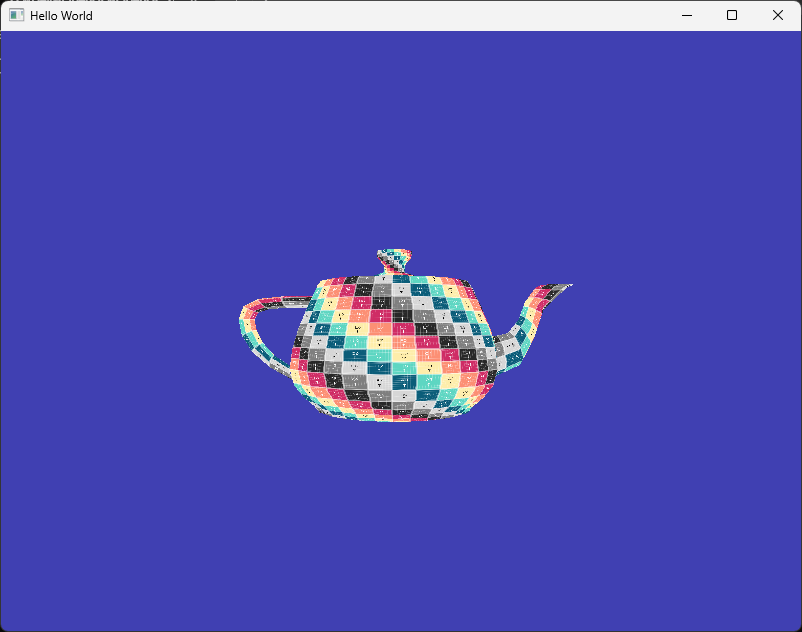
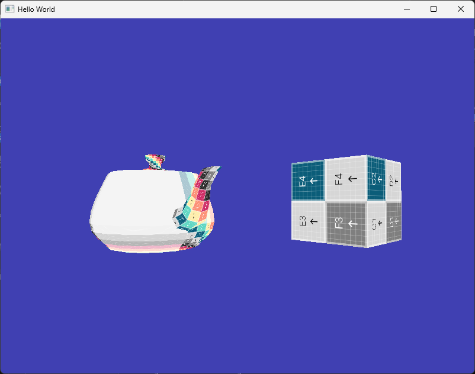

# Model Import

이번 문서에서는 파일로부터 3D 모델을 로드하는 기능을 추가해 보도록 하겠습니다. 앞으로는 프래그먼트 셰이더를 작성하여 텍스처, 조명 효과, 그림자 등을 추가할 예정인데 단순한 모델을 그려보는 것으로는 장면이 좀 심심해 보이기 때문에 복잡한 모델을 사용할 수 있도록 하려고 합니다.

지금까지는 `positions`, `indices`와 같이 우리가 직접 배열을 정의하고 이를 VBO와 VAO를 통해 GPU로 전달하고 활용하는 방식이었습니다. 하지만 이러한 방식으로는 복잡한 모델을 생성하는 것이 불가능하기 때문에, 이미 누군가가 만들어놓은 멋진 모델로부터 `positions`, `indices`를 포함한 다양한 정보들을 불러와서 활용하는 방법이 필요합니다.

이러한 작업을 위해서 우리는 외부 라이브러리의 도움을 받을 것이고,  오픈소스 에셋 임포트 라이브러리인 assimp를 사용할 예정입니다.

:::note
당연히 외부 라이브러리를 사용하지 않고 파일 포맷을 파악하고, 직접 파서를 구현해서 할 수도 있습니다. OBJ 같은 경우는 꽤 단순한 편이어서 직접 시도해 보시는 것도 좋습니다.
:::

## Assimp

[Assimp](https://github.com/assimp/assimp)는 오픈소스 에셋 임포트 라이브러리로, 다양한 3D 모델 파일을 파싱해서 내부 데이터에 접근할 수 있도록 해 줍니다. [다양한 포맷](https://github.com/assimp/assimp/blob/master/doc/Fileformats.md)의 파일들을 지원하기 때문에 편리하게 활용이 가능합니다.

### Assimp 설치

레포지토리에 방문해 보시면 소스코드가 존재하며, 직접 컴파일해서 라이브러리를 사용해도 됩니다. 하지만 여기서는 복잡한 과정은 제외하고 가장 빠르게 우리 프로젝트에 포함해서 사용할 수 있도록 pre-built binary를 사용하겠습니다. [여기](https://kimkulling.itch.io/the-asset-importer-lib)에 방문하셔서 exe 설치 파일을 다운로드 하시고 설치하세요.

:::warning
설치 후 컴퓨터가 재부팅됩니다. 필요한 것들은 미리 저장해 두시고 설치하세요.
:::

윈도우 기준으로 기본 설치 경로는 `C:\Program Files\Assimp`입니다. 들어가 보시면 이제는 익숙한 `include`/`lib`와 같은 폴더들이 보일겁니다. 아래와 같이 폴더 구조가 되도록 프로젝트 폴더 쪽으로 복사해 줍니다.

```
<솔루션 경로>
├── Dependencies
│   ├── GLFW
│   │   ├── include
|   │   ├── lib-vc2022
│   │   └── LICENSE.md
│   ├── GLEW
│   │   ├── bin
|   │   ├── include
|   │   ├── lib
│   │   └── LICENSE.txt
│   └── Assimp
|       ├── include             // <- 폴더 복사
|       ├── lib                 // <- 폴더 복사
│       └── LICENSE             // <- 파일 복사
├── <프로젝트이름>
|   ├── resources               
|   |   ├── shaders       
|   |   └── textures            
|   ├── vendors                 
|   |   └── glm                 
|   |       └── glm.hpp 등등
|   ├── main.cpp 등등
|   └── assimp-vc143-mt.dll     // <- 파일 복사 (bin/x64 폴더 내 dll 파일)
└── <프로젝트이름>.sln
```

그리고 프로젝트 설정에서 "C/C++▶일반"의 추가 포함 디렉터리를 아래와 같이 설정해 줍니다.

```
$(SolutionDir)Dependencies/GLFW/include;$(SolutionDir)Dependencies/GLEW/include;$(ProjectDir)/vendors;$(SolutionDir)Dependencies/Assimp/include
```

"구성 속성▶링커▶일반"의 "추가 라이브러리 디렉터리"에는 아래와 같이 lib 폴더를 추가해 줍니다.

```
$(SolutionDir)Dependencies/GLFW/lib-vc2022;$(SolutionDir)Dependencies/GLEW/lib/Release/$(Platform);$(SolutionDir)Dependencies/Assimp/lib/$(Platform)
```

마지막으로 "구성 속성▶링커▶입력"의 추가 종속성에 assimp 라이브러리 파일을 추가해 줍니다.

```
assimp-vc143-mt.lib;glew32s.lib;glfw3.lib;opengl32.lib;User32.lib;Gdi32.lib;Shell32.lib
```

### Assimp 설치 테스트

이렇게 하면 준비는 다 된 것인데, 문제가 없는지 확인하기 위해 테스트 모델을 준비해서 확인해 보겠습니다.

[모델을 다운로드](./assets/16_model_import/src/models.zip)해서 압축을 풀어 보시면 테스트 용으로 준비한 obj 파일 두 개가 있을 것입니다. 이 파일들을 아래와 같은 경로에 위치시켜줍니다. 앞으로 우리가 사용할 모델 파일들은 이렇게 `resources/models` 경로에 위치시켜 줄 것입니다.

```
<솔루션 경로>
├── Dependencies
│   ├── GLFW
│   │   ├── include
|   │   ├── lib-vc2022
│   │   └── LICENSE.md
│   ├── GLEW
│   │   ├── bin
|   │   ├── include
|   │   ├── lib
│   │   └── LICENSE.txt
│   └── Assimp
|       ├── include             
|       ├── lib                 
│       └── LICENSE             
├── <프로젝트이름>
|   ├── resources               
|   |   ├── shaders             
|   |   ├── textures            
|   |   └── models              // <- 폴더 생성             
|   |       ├── cube.obj        // <- 파일 복사
|   |       └── teapot.obj      // <- 파일 복사
|   ├── vendors                 
|   |   └── glm                 
|   |       └── glm.hpp 등등
|   ├── main.cpp 등등
|   └── assimp-vc143-mt.dll     
└── <프로젝트이름>.sln
```

그리고 `main.cpp`에서는 아래와 같이 짧은 코드로 라이브러리 링크가 제대로 되었는지 확인해 봅니다.

```cpp title="main.cpp"
...
#include "glm/glm.hpp"
#include "glm/ext.hpp"

//diff-add
#include <assimp/Importer.hpp>
//diff-add
#include <assimp/postprocess.h>
//diff-add
#include <assimp/scene.h>

int main(void)
{
    //diff-add
    Assimp::Importer importer;
    //diff-add
    const aiScene* scene = importer.ReadFile("resources/models/cube.obj", aiProcess_Triangulate);

    Window mainWindow{ 800, 600 };
    mainWindow.Initialize();
    ...
```

이렇게 코드를 작성하고 실행했을 때, 빌드에 문제가 생기지 않고, 기존과 동일한 화면이 보인다면 문제 없는 것입니다. 


### Assimp를 통한 모델 데이터 접근

이제 간단한 예제 코드로 Assimp를 사용해서 모델 데이터에 접근하는 법을 알아보도록 하겠습니다. 아래 코드를 위 테스트 코드에 이어 메인함수 최상단에 작성합니다.

```cpp title="main.cpp"
Assimp::Importer importer;
const aiScene* scene = importer.ReadFile("resources/models/cube.obj", aiProcess_Triangulate);

auto rootNode = scene->mRootNode;
std::cout << rootNode->mNumMeshes << std::endl;
std::cout << rootNode->mNumChildren << std::endl;
std::cout << rootNode->mChildren[0]->mNumMeshes << std::endl;

auto childNode = rootNode->mChildren[0];
auto mesh = scene->mMeshes[childNode->mMeshes[0]];
std::cout << mesh->mNumVertices << std::endl;
std::cout << mesh->mNumFaces << std::endl;

std::cout << "---Vertices---" << std::endl;
for (int i = 0; i < mesh->mNumVertices; i++)
{
    std::cout << mesh->mVertices[i].x << ", " << mesh->mVertices[i].y << ", " << mesh->mVertices[i].z << std::endl;
}

std::cout << "---UV---" << std::endl;
auto uv = mesh->mTextureCoords[0];
for (int i = 0; i < mesh->mNumVertices; i++)
{
    std::cout << uv[i].x << ", " << uv[i].y << std::endl;
}

std::cout << "---Faces(Index)---" << std::endl;
for (int i = 0; i < mesh->mNumFaces; i++)
{
    auto face = mesh->mFaces[i];
    std::cout << face.mIndices[0] << ", " << face.mIndices[1] << ", " << face.mIndices[2] << std::endl;
}
```

위 예제 코드는 `cube.obj` 파일로부터 정점의 위치와 텍스처 좌표(UV), 그리고 Face(index) 정보를 얻어와 출력하는 코드입니다.

구조에 대한 설명은 아래 그림과 함께 보시면 좋습니다. 우선 우리가 불러온 `aiScene`은 모델 전체의 데이터를 가지고 있습니다. 모델은 한 덩어리가 아니라, 여러 서브모델들의 집합으로 이루어져 있을 수 있습니다. 서브모델들은 `Node`로 표현되며 그 계층구조는 `Root Node`에서부터 탐색할 수 있습니다. 한편, 그 서브모델들의 실제 형상을 표현하는 정점과 인덱스 정보들은 따로 `Mesh` 배열로 저장되어 있으며, 각 `Node`는 몇 번째 `Mesh`가 자신의 형상인지를 인덱스로 가지고 있습니다.


<center>
[Image from learnopengl.com](https://learnopengl.com/Model-Loading/Assimp)
</center>

예제 코드를 실행해서 나온 출력에 대해 각 부분의 의미는 아래와 같습니다.

- `rootNode->mNumMeshes = 0`: 루트 노드 자체는 메쉬를 가지고 있지 않음
- `rootNode->mNumChildren = 1`: 루트 노드는 하나의 자식만 가지고 있음
- `rootNode->mChildren[0]->mNumMeshes = 1`: 루트 노드의 첫 번째(유일한) 자식은 메쉬를 가지고 있음
- `auto mesh = scene->mMeshes[childNode->mMeshes[0]]`: Scene의 메쉬 배열로부터 자식 노드 메쉬의 인덱스를 사용하여 메쉬 정보를 얻어옴
- `mesh->mNumVertices = 24`: 자식 노드 메쉬의 정점 개수는 24개
- `mesh->mNumFaces = 12`: 자식 노드 삼각형 개수는 12개

그 아래에는 반복문을 사용해서 실제 정점 위치와 텍스처 좌표, 삼각형을 구성하는 인덱스들을 출력해 본 것입니다.

:::note
`auto uv = mesh->mTextureCoords[0]`를 보시면 아시겠지만 정점에는 여러 개의 텍스처 좌표가 있을 수도 있습니다. 이러한 값을 활용하는 방안에 대해서는 나중에 기회가 있을 때 설명 드리겠습니다. 일반적으로는 그냥 가장 첫 번째 텍스처 좌표만 사용한다고 생각하십시오.
:::

이제 이 정보들을 활용해서 실제로 화면에 육면체를 그려보려면 아래와 같이 해 볼 수 있을 겁니다.

```cpp title="main.cpp"
//diff-add
std::vector<float> positionsVec;
//diff-add
for (int i = 0; i < mesh->mNumVertices; i++)
//diff-add
{
    //diff-add
    positionsVec.push_back(mesh->mVertices[i].x);
    //diff-add
    positionsVec.push_back(mesh->mVertices[i].y);
    //diff-add
    positionsVec.push_back(mesh->mVertices[i].z);
    //diff-add
    positionsVec.push_back(uv[i].x);
    //diff-add
    positionsVec.push_back(uv[i].y);
    //diff-add
}

//diff-add
std::vector<unsigned int> indicesVec;
//diff-add
for (int i = 0; i < mesh->mNumFaces; i++)
//diff-add
{
    //diff-add
    auto face = mesh->mFaces[i];
    //diff-add
    indicesVec.push_back(face.mIndices[0]);
    //diff-add
    indicesVec.push_back(face.mIndices[1]);
    //diff-add
    indicesVec.push_back(face.mIndices[2]);
    //diff-add
}

//diff-remove
float positions[] = { ... }

//diff-remove
unsigned int indices[] = { ... }

//diff-add
float* positions = &positionsVec[0];
//diff-add
unsigned int* indices = &indicesVec[0];

...

//diff-remove
VertexBuffer squareVB{ positions, 4 * 4 * sizeof(float) };
//diff-add
VertexBuffer squareVB{ positions, mesh->mNumVertices * (3+2) * sizeof(float)};
    
VertexBufferLayout squareLayout;
//diff-remove
squareLayout.Push<float>(2); // 0-th layout (position)
//diff-add
squareLayout.Push<float>(3); // 0-th layout (position)
squareLayout.Push<float>(2); // 1-th layout (texture coord)

squareVA.AddBuffer(squareVB, squareLayout);

//diff-remove
IndexBuffer squareIB{ indices, 6 };
//diff-add
IndexBuffer squareIB{ indices, mesh->mNumFaces * 3 };

```

기존에 우리가 한땀한땀 숫자를 적어서 작성한 `positions`/`indices` 배열을 파일에서 읽어온 데이터로 바꿔줍니다. 그리고 VB와 레이아웃, IB를 정점 구성과 삼각형 숫자에 맞게 변경해주면 됩니다.

이 상태에서 실행해 보면 아래와 같은 육면체를 보실 수 있습니다.



:::note
육면체는 육면체인데 뭔가 이상해 보일겁니다. 이 문제에 대해서는 추후에 해결해 보도록 하겠습니다.
:::


## Model 클래스

모델로부터 정점 좌표와 인덱스, 텍스처 좌표 등을 얻어오고 사용하는 법은 알아봤습니다. 좀 더 편리하게 사용할 수 있도록 Model 클래스를 구성해서 파일로부터 모델 정보를 불러오고 VAO를 구성하는 것 까지 `Model` 클래스가 담당하도록 하여 코드를 정리해 보겠습니다.

### Model 클래스 정의

`Model` 클래스는 아래와 같이 정의합니다. VAO를 구성하는 것 까지 모두 `Model` 클래스가 책임질 것이므로, `VertexArray`, `VertexBuffer`, `IndexBuffer`, `Texture`까지 모두 포함합니다. 위 예시에서는 생략하였지만 일반적으로 3D 모델이라고 하면 모델에 입혀질 텍스처용 이미지 파일까지 모두 포함하고 있습니다. 따라서 그러한 텍스처들까지 여기서 모두 관리할 예정입니다.

```cpp title="Model.h"
#pragma once

#include <string>
#include <vector>

#include <assimp/Importer.hpp>
#include <assimp/scene.h>
#include <assimp/postprocess.h>

#include "VertexBuffer.h"
#include "VertexBufferLayout.h"
#include "IndexBuffer.h"
#include "VertexArray.h"
#include "Texture.h"
#include "Renderer.h"

class Model
{
public:
	Model();
	~Model();

	void LoadModel(const std::string& fileName);

	void RenderModel(Shader shader);

private:
	void LoadNode(aiNode* node, const aiScene* scene);
	void LoadMesh(aiMesh* mesh, const aiScene* scene);
	void LoadMaterials(const aiScene* scene);

	std::vector<VertexArray*> VAOs;
	std::vector<VertexBuffer*> VBOs;
	std::vector<IndexBuffer*> IBOs;
	std::vector<Texture*> textureList;
	std::vector<unsigned int> meshToTex;

	std::string modelDir;
};
```

### Model 클래스 구현

`Model` 클래스의 구현은 아래와 같습니다.

```cpp title="Model.cpp"
#include "Model.h"

#include <iostream>

Model::Model()
{
}

Model::~Model()
{
    for (int i = 0; i < VAOs.size(); i++)
    {
        delete VAOs[i];
    }
    for (int i = 0; i < VBOs.size(); i++)
    {
        delete VBOs[i];
    }
    for (int i = 0; i < IBOs.size(); i++)
    {
        delete IBOs[i];
    }
    for (int i = 0; i < textureList.size(); i++)
    {
        delete textureList[i];
    }
}

void Model::LoadModel(const std::string& fileName)
{
	const size_t last_slash_idx = fileName.rfind('\\/');
	if (std::string::npos != last_slash_idx)
	{
		modelDir = fileName.substr(0, last_slash_idx);
	}

	Assimp::Importer importer;
	const aiScene* scene = importer.ReadFile(fileName,
		aiProcess_Triangulate | aiProcess_FlipUVs | aiProcess_GenSmoothNormals);

	if (!scene)
	{
		std::cout << "모델 로드 실패 ( " << fileName << " ) " << importer.GetErrorString() << std::endl;
		return;
	}

	LoadNode(scene->mRootNode, scene);
	LoadMaterials(scene);
}

void Model::RenderModel(Shader shader)
{
	for (int i = 0; i < VAOs.size(); i++)
	{
		Renderer r;

		unsigned int materialIndex = meshToTex[i];
		if (materialIndex < textureList.size() && textureList[materialIndex])
		{
			textureList[materialIndex]->Bind(materialIndex);
		}

		r.Draw(*VAOs[i], *IBOs[i], shader);
	}
}

void Model::LoadNode(aiNode* node, const aiScene* scene)
{
    for (int i = 0; i < node->mNumMeshes; i++)
    {
        LoadMesh(scene->mMeshes[node->mMeshes[i]], scene);
    }

    for (int i = 0; i < node->mNumChildren; i++)
    {
        LoadNode(node->mChildren[i], scene);
    }
}

void Model::LoadMesh(aiMesh* mesh, const aiScene* scene)
{
    std::vector<float> vertices;
    std::vector<unsigned int> indices;

    //vertex 정보 parse
    for (int i = 0; i < mesh->mNumVertices; i++)
    {
        //vertex position
        vertices.insert(vertices.end(), { mesh->mVertices[i].x, mesh->mVertices[i].y, mesh->mVertices[i].z });

        //vertex uv
        if (mesh->mTextureCoords[0]) //0번째 texture
        {
            vertices.insert(vertices.end(), { mesh->mTextureCoords[0][i].x, mesh->mTextureCoords[0][i].y });
        }
        else
        {
            vertices.insert(vertices.end(), { 0.0f, 0.0f });
        }

        //vertex normal
        vertices.insert(vertices.end(), { mesh->mNormals[i].x, mesh->mNormals[i].y, mesh->mNormals[i].z });
    }

    //index 정보 parse
    for (int i = 0; i < mesh->mNumFaces; i++)
    {
        aiFace face = mesh->mFaces[i];
        for (int j = 0; j < face.mNumIndices; j++)
        {
            indices.push_back(face.mIndices[j]);
        }
    }

    //vao 생성 VertexArray가 담당
    VertexArray* VA = new VertexArray;
    VertexBuffer* VB = new VertexBuffer{ &vertices[0], mesh->mNumVertices * 8 * sizeof(float) };
    VertexBufferLayout layout;
    layout.Push<float>(3); //vertex당 3개의 위치를 표현하는 float 데이터
    layout.Push<float>(2); //vertex당 2개의 텍스처 좌표를 표현하는 float 데이터
    layout.Push<float>(3); //vertex당 3개의 법선 벡터를 표현하는 float 데이터
    VA->AddBuffer(*VB, layout);
    VAOs.push_back(VA);
    VBOs.push_back(VB);

    IndexBuffer* IB = new IndexBuffer{ &indices[0], mesh->mNumFaces * 3 };
    IBOs.push_back(IB);

    meshToTex.push_back(mesh->mMaterialIndex);
}

void Model::LoadMaterials(const aiScene* scene)
{
    textureList.resize(scene->mNumMaterials);

    for (size_t i = 0; i < scene->mNumMaterials; i++)
    {
        aiMaterial* material = scene->mMaterials[i];

        textureList[i] = nullptr;

        //if there is diffuse texture,
        if (material->GetTextureCount(aiTextureType_DIFFUSE))
        {
            //texture 파일 경로
            aiString path;
            if (material->GetTexture(aiTextureType_DIFFUSE, 0, &path) == AI_SUCCESS)
            {
                int idx = std::string(path.data).rfind("\\");
                std::string filename = std::string(path.data).substr(idx + 1);

                std::string texPath = modelDir + "/" + filename;

                textureList[i] = new Texture(texPath.c_str());

                if (!textureList[i])
                {
                    std::cout << "텍스처 로딩 실패 : " << texPath << std::endl;
                    delete textureList[i];
                    textureList[i] = nullptr;
                }
            }
        }

        if (!textureList[i])
        {
            //텍스처가 없을 경우
            textureList[i] = new Texture("resources/textures/uv_checker.png");
        }
    }
}
```

많은 기능을 구현해서 내용이 좀 깁니다. 하지만 여러분이 수정할 필요가 없으니 몇 가지 주요 부분만 설명 드리겠습니다.

먼저 `LoadMesh()`의 마지막 부분입니다.

```cpp
//vao 생성 VertexArray가 담당
VertexArray* VA = new VertexArray;
VertexBuffer* VB = new VertexBuffer{ &vertices[0], mesh->mNumVertices * 8 * sizeof(float) };
VertexBufferLayout layout;
layout.Push<float>(3); //vertex당 3개의 위치를 표현하는 float 데이터
layout.Push<float>(2); //vertex당 2개의 텍스처 좌표를 표현하는 float 데이터
layout.Push<float>(3); //vertex당 3개의 법선 벡터를 표현하는 float 데이터
VA->AddBuffer(*VB, layout);
VAOs.push_back(VA);
VBOs.push_back(VB);

IndexBuffer* IB = new IndexBuffer{ &indices[0], mesh->mNumFaces * 3 };
IBOs.push_back(IB);

meshToTex.push_back(mesh->mMaterialIndex);
```

`LoadMesh()`를 호출할 때마다 VAO가 하나씩 생성되고 그에 따라 VB와 레이아웃, IB도 생성됩니다. 각 정점이 가지는 데이터는 position(float 3), uv(float 2), normal(float 3)으로 레이아웃을 고정해 두었습니다.

<details>
`meshToTex`는 하나의 모델에 여러 텍스처를 사용하는 경우를 고려한 구현입니다. 하나의 메쉬가 세 개의 서브메쉬로 이루어져 있다고 해 봅시다. 그러면 이러한 서브메쉬가 각각 텍스처를 따로 가지고 있을 수도 있고, 하나의 텍스처를 공유해 사용할 수도 있고, 예를 들어 1,2번 서브메쉬는 첫 번째 텍스처를 사용하고 3번 서브메쉬는 두 번째 텍스처를 사용할 수도 있습니다.

이러한 정보들을 `meshToTex` 테이블에 저장해 두고 사용합니다. 위에서 설명한 마지막 케이스에 대해 `meshToTex`는 아래와 같은 맵핑 정보를 저장한다고 보시면 됩니다.

```
meshToTex[0] = 0 // 0번 서브메쉬는 0번 텍스처 사용
meshToTex[1] = 0 // 1번 서브메쉬는 0번 텍스처 사용
meshToTex[2] = 1 // 2번 서브메쉬는 1번 텍스처 사용
```
</details>

다음은 `RenderModel()` 부분입니다. 이제 `RenderModel()` 기능이 `Renderer`를 활용해 그리기 까지 담당합니다. 그리기를 위해 필요한 정보 중, 셰이더 정보는 `Model`이 가지고 있지 않으므로 매개변수로 받습니다. (유니폼은 Model 외부에서 설정하는 것이 보다 적합)

```cpp
void Model::RenderModel(Shader shader)
{
    for (int i = 0; i < VAOs.size(); i++)
    {
        Renderer r;

        unsigned int materialIndex = meshToTex[i];
        if (materialIndex < textureList.size() && textureList[materialIndex])
        {
            textureList[materialIndex]->Bind(materialIndex);
        }

        r.Draw(*VAOs[i], *IBOs[i], shader);
    }
}
```

<details>
중간의 코드가 위에서 설명한 `meshToTex` 맵핑 테이블에서 텍스처를 얻어와 텍스처 슬롯에 바인딩하는 부분입니다.
</details>

### Model 클래스 사용

이제 `main.cpp`에서 `Model` 클래스를 사용해서 `cube` 모델을 한 번 그려보겠습니다.

```cpp title="main.cpp"
//diff-remove
#include "VertexBuffer.h"
//diff-remove
#include "IndexBuffer.h"
//diff-remove
#include "VertexBufferLayout.h"
//diff-remove
#include "VertexArray.h"
//diff-remove
#include "Shader.h"
//diff-remove
#include "Renderer.h"
#include "Window.h"
#include "Camera.h"
//diff-remove
#include "Texture.h"
//diff-add
#include "Model.h"

#include "glm/glm.hpp"
#include "glm/ext.hpp"

//diff-remove
#include <assimp/Importer.hpp>
//diff-remove
#include <assimp/postprocess.h>
//diff-remove
#include <assimp/scene.h>

//diff-remove
#include <vector>
...

// !!!위에서 작성한 테스트 코드 삭제!!!

//diff-remove
//--- 사각형 VAO 설정
//diff-remove
VertexArray squareVA;

//diff-remove
VertexBuffer squareVB{ positions, mesh->mNumVertices * (3+2) * sizeof(float)};

//diff-remove    
VertexBufferLayout squareLayout;
//diff-remove
squareLayout.Push<float>(3); // 0-th layout (position)
//diff-remove
squareLayout.Push<float>(2); // 1-th layout (texture coord)

//diff-remove
squareVA.AddBuffer(squareVB, squareLayout);

//diff-remove
IndexBuffer squareIB{ indices, mesh->mNumFaces * 3 };

//diff-remove
squareVA.Unbind();
//diff-remove
squareIB.Unbind();
//diff-remove
squareVB.Unbind();

//diff-add
Model cube;
//diff-add
cube.LoadModel("resources/models/cube.obj");

...

Shader squareShader{ "resources/shaders/basic_3d_texture.shader" };
//diff-remove
Texture checkerTexture{ "resources/textures/uv_checker.png" };

...

// Rendering Loop
while (!mainWindow.GetShouldClose())
{
    ...

    //--- 사각형 그리기
    //diff-remove
    squareVA.Bind();
    //diff-remove
    squareShader.Bind();

    //diff-remove
    checkerTexture.Bind(0);
    //diff-remove
    squareShader.SetUniform1i("u_texture", 0);

    glm::mat4 squareModelMat = glm::translate(glm::mat4(1.0), glm::vec3(0.7, 0.0, -5.0));
    squareShader.SetUniformMat4f("u_model", squareModelMat);
    
    squareShader.SetUniformMat4f("u_view", camera.CalculateViewMatrix());

    float fovyDeg = 60.0f;
    float aspect = (float)mainWindow.GetBufferWidth() / mainWindow.GetBufferHeight();
    float near = 0.1f;
    float far = 100.0f;
    glm::mat4 squareProjMat = glm::perspective(glm::radians(fovyDeg), aspect, near, far);
    squareShader.SetUniformMat4f("u_projection", squareProjMat);

    //diff-remove
    renderer.Draw(squareVA, squareIB, squareShader);

    //diff-add
    cube.RenderModel(squareShader);

    //diff-remove
    squareShader.Unbind();
    //diff-remove
    squareVA.Unbind();

```

아주 많은 부분이 사라졌습니다. 정리해 보자면,

1. 이제 VAO, VBO 등은 모두 `Model` 클래스에서 관리하므로 `main.cpp`에서 헤더를 include할 필요가 없습니다. 카메라, 윈도우, 그리고 유니폼 설정을 위한 GLM 관련 헤더만 있으면 됩니다.

2. 데이터 설정 및 VAO, VBO 관련 코드가 모두 사라졌습니다. 아래 두 줄로 전부 대체되었습니다.

```
Model cube;
cube.LoadModel("resources/models/cube.obj");
```

3. 렌더링 시점에서는 이제 유니폼만 설정해 준 상태에서, 셰이더를 `Model::Rendermodel()`에 넘겨주기만 하면 됩니다.

이 외에도 최종 소스 코드에서는 이제 사용하지 않을 삼각형 관련 코드와, 렌더링 루프에서는 값을 변경하지 않을 부분을 모두 루프 밖으로 꺼내 정리해 주었습니다. 이로써 `main.cpp`가 대략 60줄 정도로 줄었습니다. 

지금 시점에 이르러서 `main.cpp`만 보면 별게 없는 것 같지만, 뒤에서 어떤 작업들이 이루어지고 있는지를 머리속에서 떠올리실 수 있는지 한번 스스로 되뇌어 보세요.

실행해 보면 물론 결과는 이전과 동일합니다.


<details>
아래 두 줄의 코드가 없어도, uv_checker 텍스처가 입혀져서 보이는 것을 보실 수 있습니다. `cube.obj` 파일에는 텍스처가 없는데 텍스처 좌표는 있기 때문에, 그러한 경우에는 `Model::LoadMaterials()` 부분에서 자동으로 uv_checker를 로드합니다. 그리고 렌더링 시점(`Model::RenderModel()` 호출)에서는 그 텍스처를 바인딩한 후에 렌더링하기 때문에 uv_checker가 입혀진 모델이 화면에 보이는 것입니다.

```
checkerTexture.Bind(0);
squareShader.SetUniform1i("u_texture", 0);
```
</details>

## Backface Culling & Depth Test

마지막으로 육면체가 이상하게 보이는 문제를 해결하도록 하겠습니다. 아마 여러분이 저와 동일하게 코드를 작성했다면 위의 결과 그림에서 보실 수 있는것처럼 뭔가 이상해 보일겁니다. 문제는 두 가지인데 1) 보이지 않아야 할 육면체의 뒷면이 화면에 표시되고 있는 것, 2) 뒤에 있는 면이 앞의 면을 덮어씌워 그리고 있는 것입니다.

둘 중의 하나만 해결해 주어도 이 문제는 해결될 수 있지만, 여기에서 둘 다 발생하지 않도록 해 주도록 하겠습니다.

<details>
3차원 세상에서 육면체는 최대 세 개 면만을 동시에 관찰 가능하기 때문에, 뒷면을 그리지 않는다면(Bckface Culling) 앞면만 보이게 됩니다. 또는 앞에 보이는 세 개의 면이 뒤의 면을 덮어 그리게 되더라도(Depth Test) 결과는 동일하게 앞면만 보이게 됩니다.
</details>

`1)` 문제는 강의 시간에 배운 Backface Culling을 적용해 주면 되고 `2)` 문제는 배운(울) Z-buffering을 통한 깊이 테스트를 적용해 주면 됩니다. 둘 다 기본적으로 GPU 내부에 구현이 이미 되어있는 연산이므로 우리는 이 계산을 수행하라고 활성화 해주기만 하면 됩니다.

수정하는 코드는 아래 두 부분입니다.

```cpp title="Window.cpp"
int Window::Initialize()
{
    ...

    // 배경색 설정
    glClearColor(0.25, 0.25, 0.7, 1);

    //diff-add
    glEnable(GL_CULL_FACE);
    //diff-add
    glCullFace(GL_BACK);

    //diff-add
    glEnable(GL_DEPTH_TEST);

    CreateCallback();
    ...
}
```

```cpp title="Renderer.cpp"
void Renderer::Clear() const
{
    //diff-remove
    glClear(GL_COLOR_BUFFER_BIT);
    //diff-add
    glClear(GL_COLOR_BUFFER_BIT | GL_DEPTH_BUFFER_BIT);
}
```

`glEnable()` API를 호출해 backface culling과 depth test를 수행하도록 옵션을 활성화 하였으며 `glClear()`시에 매 프레임마다 프레임버퍼의 깊이값을 초기화 하도록 하였습니다.

실행해보면 이제 아래 그림과 같이 정상적으로 렌더링이 되는 것을 보실 수 있습니다. 육면체의 뒷면은 보이지 않고 앞면만 화면에 렌더링됩니다.




## 마치며

- 이제 다양한 모델들을 화면에 그려볼 수 있습니다. 저의 경우 [Sketchfab](https://sketchfab.com/feed)에서 시바견 모델을 다운로드하여 방금 작성한 코드를 사용해 한 번 화면에 그려 보았습니다. 결과는 아래와 같습니다. 아래 관련 링크에 제가 같은 파일을 다운받으실 수 있게 해 두었으니 여러분도 한 번 시도해 보세요.



- 실제로 모든 종류의 모델을 렌더링 가능하도록 하는 것에는 다양한 문제들이 발생할 수 있습니다. 어떤 문제들은 지금 시점에서는 해결이 어려울 수도 있고, 문제가 무엇인지 파악 조차 어려운 경우도 있을 겁니다. 그래도 욕심이 있으시다면 스스로 모델을 다운로드하여 화면에 보일 수 있도록 해결을 시도해 보세요. 결국 그러한 경험이 쌓여서 실력이 되는 것입니다.

- 모델이 화면에 보이기는 하는데, 뭔가 투박해 보인다면 그것은 조명 효과가 아직 반영되어 있지 않아서일 확률이 있습니다. 이제 다음 문서부터는 조명 효과 구현을 본격적으로 시작할 것이니 기대해 주십시오.


## 연습 문제

1. 주전자(`teapot.obj`) 모델을 렌더링 해 보세요. 결과는 아래 그림과 같이 나타날 겁니다. 



2. 주전자 모델 렌더링 결과를 보면 주전자의 옆 면에 uv_checker가 균일하게 입혀져 있지 않고 부분부분 늘어나 있는 모습을 볼 수 있습니다. 왜 이런 결과가 나오게 되었는지 유추해 보시고, 수정해 보세요. 수정하면 아래 그림과 같은 결과를 볼 수 있게 됩니다.



3. 주전자 모델과 육면체 모델이 동시에 나타나도록 렌더링 해 보세요. 단, 아래 그림과 같이 주전자 모델과 육면체 모델이 비슷한 크기로 보여야 합니다.



---

## 관련 링크

- [최종 코드(zip)](./assets/16_model_import/src/src.zip)
- [샘플 모델(cube, teapot)](./assets/16_model_import/src/models.zip)
- [샘플 모델(shiba)](./assets/16_model_import/src/shiba_model.zip)