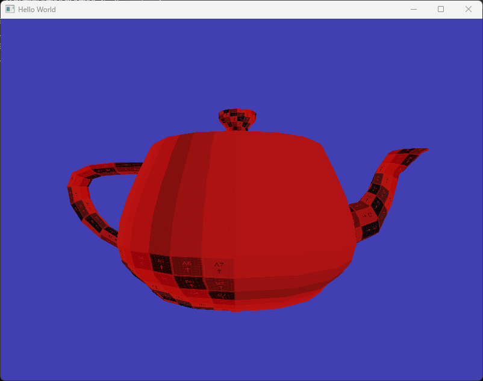
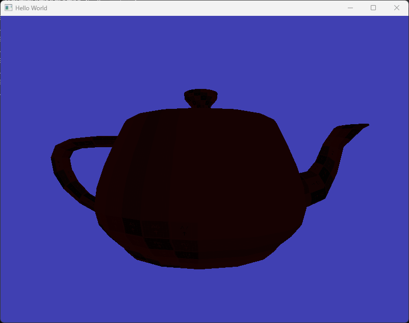
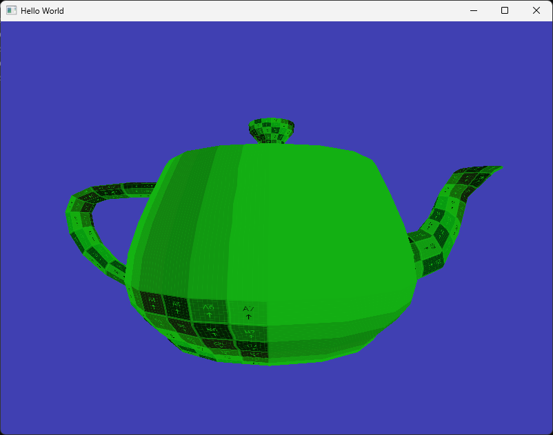
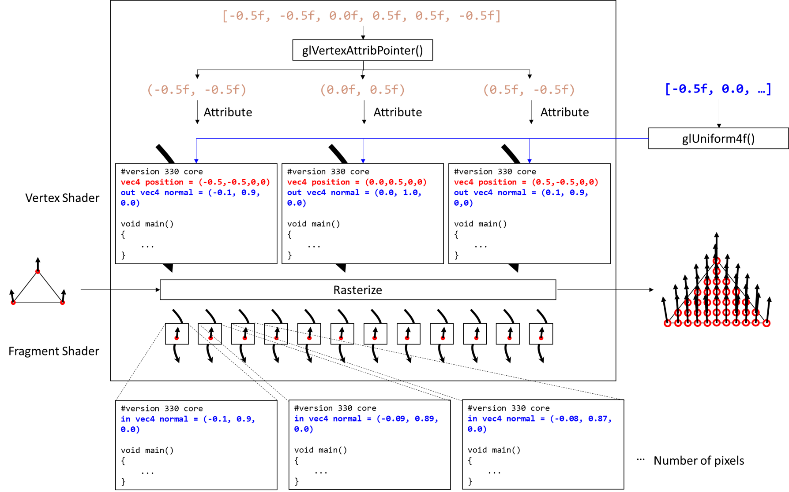

# Lighting - Ambient

앞으로 몇 개의 문서에서 라이팅(lighting), 즉 조명 효과를 구현해 보도록 하겠습니다. 여기서는 강의 시간에 배운 Phong Lighting Model을 바탕으로 Ambient/Diffusion/Specular/(Emmisive) 네 개의 텀을 각각 확장해 나가면서 장면이 어떻게 달라 보이는지를 확인해 보도록 할 것입니다.

라이팅의 구현은 프래그먼트 셰이더를 통해 이루어지기 때문에 본격적인 내용은 프래그먼트 셰이더 프로그래밍이 주를 이룰 것입니다. 하지만 지금까지와 마찬가지로 추상화를 통해 조명 클래스를 만들어두면 관리하기가 편리하므로 이 문서에서는 조명 클래스 구현부터 시작해 보도록 하겠습니다. 또한 그 과정에서 구조체(struct)를 셰이더에서 사용하는 법도 알게 되실 겁니다.

참고로 이번 학기 강의 마지막 부분에서는 최근 표준적으로 활용되는 PBR(Physically-based rendering) 모델도 구현을 해 볼 것인데, Phong Lighting Model에 사용되는 수식들의 기본적인 원리를 잘 알고 있으면 훨씬 수월하게 이해하실 수 있게 됩니다. 

## Light 클래스 정의

먼저 `Light` 클래스를 정의하는 것으로 시작해 보겠습니다. `Light` 클래스는 말 그대로 장면에 존재하는 빛을 기술하기 위한 클래스로 기본적으로는 조명의 색상과 밝기 값을 데이터로 가지고 있습니다. 또한 조명을 "사용"한다는 것은 프래그먼트 셰이더에 조명 계산을 위한 "데이터를 전달"한다는 것과 동일한 의미입니다. 따라서 이러한 기능을 수행하는 `UseLight()` 함수를 가지고 있도록 설계하였습니다.

```cpp title="Light.h"
#pragma once

#include "glm/glm.hpp"
#include "Shader.h"

class Light
{
public:
    Light();
    Light(glm::vec3 aColor, float aIntensity);
    ~Light();

    void UseLight(Shader& shader);
private:
    glm::vec3 lightColor; //color of s_a & s_d &s_s
    float ambientIntensity;
};
```

`Light` 클래스는 위 설명대로 정의되어 있습니다. `lightColor`는 조명의 색상값을, `ambientIntensity`는 Ambient 조명 강도 데이터를 의미합니다. 향후 Diffuse/Specular로 확장해 나갈 것입니다.

## Light 클래스 구현

`Light` 클래스 구현은 아래와 같습니다.

```cpp title="Light.cpp"
#include "Light.h"

Light::Light()
	:lightColor{ glm::vec3{1.0f,1.0f,1.0f} },
	ambientIntensity{ 1.0f }
{
}

Light::Light(glm::vec3 aColor, float aIntensity)
	: lightColor{ aColor }, ambientIntensity{ aIntensity }
{
}

Light::~Light()
{
}

void Light::UseLight(Shader& shader)
{
	shader.SetUniform3f("u_directionalLight.lightColor", lightColor.r, lightColor.g, lightColor.b);
	shader.SetUniform1f("u_directionalLight.ambientIntensity", ambientIntensity);
}
```

생성자 부분은 기본적인 내용이니 따로 설명이 필요 없을 것 같습니다. 앞서 이야기했듯이 조명의 "사용"은 `UseLight()`가 담당하며, 매개변수로 주어진 셰이더의 유니폼 변수를 정의하는 기능을 수행합니다. 우리는 아직 `Shader` 클래스에 `SetUniform3f()` 기능을 구현하지 않았으므로 추가할 것입니다. 또한 셰이더의 유니폼 이름이 좀 길어 보일텐데, 왜 그런지는 셰이더 코드를 보면서 설명 드리겠습니다.

`SetUniform3f()`의 추가는 아래와 같습니다.

```cpp title="Shader.h"
...
    //Set Uniforms
    void SetUniform4f(const std::string& name, float v0, float v1, float v2, float v3);
    //diff-add
    void SetUniform3f(const std::string& name, float v0, float v1, float v2);
    void SetUniform1f(const std::string& name, float value);
    void SetUniformMat4f(const std::string& name, const glm::mat4& matrix);
    void SetUniform1i(const std::string& name, int value);
...
```

```cpp title="Shader.cpp"
...

//diff-add
void Shader::SetUniform3f(const std::string& name, float v0, float v1, float v2)
//diff-add
{
    //diff-add
    glUniform3f(GetUniformLocation(name), v0, v1, v2);
    //diff-add
}

...
```

## Ambient 조명을 포함하는 셰이더 구현

이제 Ambient 조명 효과를 포함하는 셰이더를 구현해 보겠습니다. 조명 효과를 포함하는 셰이더는 `basic_lighting.shader` 이름의 새 파일에 구현할 것이고, 앞으로 몇 개 문서에서 추가적인 텀을 덧붙이면서 확장할 예정입니다. 이번 문서에서 준비한 Ambient 조명만을 포함하는 셰이더는 아래와 같이 구현하였습니다. 기존 `basic_3d_texture.shader`로부터 확장 되었습니다.

```glsl title="resources/shaders/basic_lighting.shader"
#shader vertex
#version 330 core

layout(location = 0) in vec4 a_position;
layout(location = 1) in vec2 a_texcoord;
//diff-add
layout(location = 2) in vec3 a_normal;

out vec2 v_texcoord;
//diff-add
out vec3 v_normal;

uniform mat4 u_model;
uniform mat4 u_view;
uniform mat4 u_projection;

void main()
{
    gl_Position = u_projection * u_view * u_model * a_position;
    v_texcoord = a_texcoord;
};

#shader fragment
#version 330 core

//diff-add
struct DirectionalLight
//diff-add
{
    //diff-add
    vec3 lightColor;
    //diff-add
    float ambientIntensity;
    //diff-add
};

layout(location = 0) out vec4 out_color;

in vec2 v_texcoord;
//diff-add
in vec3 v_normal;

uniform sampler2D u_texture;
//diff-add
uniform DirectionalLight u_directionalLight;

void main()
{
	vec4 texColor = texture(u_texture, v_texcoord);
    //diff-add
	vec3 lightAmbient = u_directionalLight.lightColor * u_directionalLight.ambientIntensity;
	out_color = texColor * vec4(lightAmbient, 1.0);
};
```

[지난 문서](./16_model_import.md)에서 `Model` 클래스를 구현하여 파일로부터 정점의 법선 정보까지 읽어오도록 확장하였는데 이를 아직 사용하지 않고 있었습니다. 조명 계산에서 법선은 아주 중요한 역할을 하기 때문에 이 데이터를 셰이더에서 활용할 수 있도록 어트리뷰트를 추가적으로 정의해 주었습니다.

:::note
이 `a_normal` 어트리뷰트에 데이터를 집어넣는 부분은 이미 `Model` 클래스에 모두 구현되어 있는 상태입니다.
:::

또한 이 어트리뷰트는 래스터라이저를 거쳐 보간을 통해 각 프래그먼트가 값을 가질 수 있도록 정점 셰이더에서는 out으로, 프래그먼트 셰이더에서는 in으로 varying으로 설정해 두었습니다. varying 변수에 대해서는 강의 시간에 설명 드렸을 것인데, 뒤쪽에서 다시 한 번 개념을 복습해 보도록 하겠습니다.

프래그먼트 셰이더에서는 먼저 `DirectionalLight` 구조체를 정의해 두었습니다. GLSL은 C와 유사한 언어로, 클래스는 없지만 구조체는 정의할 수 있습니다. 이 구조체의 인스턴스는 `vec3 lightColor`와 `float ambientIntensity`를 멤버로 갖습니다. 현재 `Light` 클래스가 가지고 있는 두 가지의 데이터죠.

아래에서는 이 구조체 타입의 인스턴스인 `u_directionalLight`를 유니폼으로 정의해 주었습니다. 따라서 우리가 `SetUniform`을 통해 이 조명의 데이터를 설정해주게 될 겁니다.

마지막으로 프래그먼트 셰이더의 본문에서는 `lightColor`와 `ambientIntensity`를 곱해서 Ambient 조명으로 인한 색상인 `lightAmbient`를 계산하고 이를 최종적으로 텍스처 색상에 곱해 주었습니다. 벡터끼리의 곱은 element-wise 곱이고, 색상과 조명의 곱이 어떻게 조명 효과가 될 수 있는지는 강의를 통해 설명 드렸습니다.

## Ambient 조명 효과 구현

이제 모든 준비가 되었으니 이를 활용한 결과를 보도록 합시다. `main.cpp`에서 아래와 같이 조명을 정의하고 새로 만든 셰이더를 사용하도록 코드를 수정해 주면 됩니다.

```cpp title="main.cpp"
#include "Window.h"
#include "Camera.h"
#include "Model.h"
//diff-add
#include "Light.h"
...

int main(void)
{
    ...
    //diff-remove
    Shader squareShader{ "resources/shaders/basic_3d_texture.shader" };
    //diff-add
    Shader lightShader{ "resources/shaders/basic_lighting.shader" };

    //diff-add
    Light ambientLight{ glm::vec3(0.9, 0.1, 0.1), 0.8 };

    Camera camera{ glm::vec3{0.0f,0.0f,5.0f}, glm::vec3{0.0f,1.0f,0.0f}, -90.0f, 0.0f, 5.0f, 0.5f };

    Renderer renderer;

    //diff-remove
    squareShader.Bind();
    //diff-add
    lightShader.Bind();
    {
        glm::mat4 squareModelMat = glm::translate(glm::mat4(1.0), glm::vec3(0.7, 0.0, -5.0));
        //diff-remove
		squareShader.SetUniformMat4f("u_model", squareModelMat);
        //diff-add
        lightShader.SetUniformMat4f("u_model", squareModelMat);

		float fovyDeg = 60.0f;
		float aspect = (float)mainWindow.GetBufferWidth() / mainWindow.GetBufferHeight();
		float near = 0.1f;
		float far = 100.0f;
		glm::mat4 squareProjMat = glm::perspective(glm::radians(fovyDeg), aspect, near, far);
        //diff-remove
		squareShader.SetUniformMat4f("u_projection", squareProjMat);
        //diff-add
        lightShader.SetUniformMat4f("u_projection", squareProjMat);

        //diff-add
        ambientLight.UseLight(lightShader);
    }
    //diff-remove
    squareShader.Unbind();
    //diff-add
    lightShader.Unbind();

    ...

    // Rendering Loop
    while (!mainWindow.GetShouldClose())
    {
        ...
        //diff-remove
        squareShader.SetUniformMat4f("u_view", camera.CalculateViewMatrix());
        //diff-add
        lightShader.SetUniformMat4f("u_view", camera.CalculateViewMatrix());

        //diff-remove
        cube.RenderModel(squareShader);
        //diff-add
        cube.RenderModel(lightShader);

        mainWindow.SwapBuffers();
        glfwPollEvents(); 
    }

    ...
```

새로 구현한 `basic_light.shader` 프로그램을 `lightShader`라는 이름으로 정의하였고, 그에 따라 이후 사용되는 셰이더 이름을 모두 `squareShader`에서 `lightShader`로 바꿔주었습니다. 그 외에 의미있는 코드는 단 두 줄입니다.

```cpp
Light ambientLight{ glm::vec3(0.9, 0.1, 0.1), 0.8 };
ambientLight.UseLight(lightShader);
```

첫 번째 줄의 코드를 통해 Ambient 조명을 정의했습니다. `(0.9, 0.1, 0.1)` 색상의 `0.8` 강도를 갖는 조명입니다. 그리고 이 조명의 색상과 강도를 두 번째 줄의 코드를 통해 셰이더 유니폼으로 전달해 주었습니다. `Light::UseLight()` 함수의 본문을 다시 가서 보면 아래와 같습니다.

```glsl
shader.SetUniform3f("u_directionalLight.lightColor", lightColor.r, lightColor.g, lightColor.b);
shader.SetUniform1f("u_directionalLight.ambientIntensity", ambientIntensity);
```

즉, 셰이더에 있는 `u_directionalLight`의 `lightColor` 멤버를 `(0.9, 0.1, 0.1)`로, `ambientIntensity` 멤버를 `0.8`로 정의한 것입니다. 셰이더에서 구조체 정의를 통해 `DirectionalLight` 타입인 `u_directionalLight`는 `lightColor`와 `ambientIntensity` 멤버를 가지고 있도록 정의하였으므로 문제없이 동작합니다.

주전자 모델을 가지고 결과를 그려보면 아래와 같습니다. 두 번째는 조명의 강도를 `0.1`로 낮춘 경우, 세 번째는 조명의 색상을 초록색(`(0.1, 0.9, 0.1)`)으로 바꾼 경우의 결과입니다. 예상한 대로의 결과죠?







Ambient 텀은 주변광을 모사하는 것이고, 그에 따라 모델 전체에 동일한 색상과 강도의 조명을 적용합니다. 이 조명 색상은 모델의 고유 색상(현재의 경우 텍스처 샘플링으로 계산된 `texColor`)과 element-wise 곱을 통해 상호작용하여 최종 색상을 계산하는 데 사용됩니다. 

Ambient 조명은 물체의 음영을 표현하는 데 도움이 되진 않지만 가장 구현이 간단하기도 하고, 조명 적용의 개념을 이해하는 데 도움이 되므로 첫 단계로 구현해 보았습니다.

## Fragment Shader and Varying

이번 문서에서부터 본격적으로 프래그먼트 셰이더에 대해서 다루기 때문에 개념과 사용 방법에 대해서 짧게 살펴 보도록 하겠습니다.

강의를 통해 설명 드렸듯이, 래스터라이저의 주요 역할은 각 정점에만 존재하는 데이터들을 각 픽셀(프래그먼트)에 대해 보간을 통해 생성해 주는 것입니다. 우리가 최초로 입력하는 정점 어트리뷰트에는 각 **정점별** 위치와 법선, 그리고 텍스처 좌표가 있습니다. 하지만 화면에 삼각형을 그리기 위해서는 각 픽셀별로 이러한 데이터가 있어야 하기 때문에 래스터라이저를 통해 보간을 하는 것입니다.

셰이더 프로그램에서 이렇게 **보간의 대상이 되는 데이터를 Varying 변수**라고 하고, 정점 셰이더에서 `out`, 프래그먼트 셰이더에서 `in` 키워드로 명시합니다. 정점 셰이더에서 `out` 명시된 법선과 텍스처 좌표가 보간되어 이제 각 픽셀별로 존재하게 됩니다.

아래 그림에서 보시는 것처럼 **프래그먼트 셰이더는 화면에 그려야 하는 픽셀의 개수만큼 병렬적으로 실행**되고, 각 프래그먼트 셰이더 프로그램의 `in` varying에는 래스터라이저를 통해 보간된 값이 들어있게 됩니다. 그러면 우리는 그 값을 사용해서 픽셀의 색상을 결정하게 되는 것입니다. 굳이 이번 장의 내용이 아니더라도 이미 텍스처 맵핑 과정에서 사용해 봤습니다. 각 픽셀별로 다른 텍스처 좌표값이 보간되어 들어있지 않았더라면, 서로 다른 색상으로 표현될 수 없었겠죠.



그림에는 표시하지 않았지만 유니폼 변수는 정점 셰이더에도 있을 수 있고, 프래그먼트 셰이더에 있을 수도 있습니다. 유니폼은 varying이 아니므로 보간되지 않고, 그냥 사용자가 입력한 그대로 모든 정점/프래그먼트 셰이더 프로그램에서 동일한 값을 사용한다는 사실을 기억 하세요.


이렇게 해서 기본적인 Ambient 조명을 적용해 보았습니다. 다음 문서에서는 극적인(?) 조명 효과를 볼 수 있는 Diffuse 텀을 구현해서 보다 사실적인 장면을 만들어 보도록 하겠습니다.

## 마치며

- 프래그먼트 셰이더의 "프래그먼트"는 일반적으로 픽셀 색상을 결정하기 위한 데이터들을 의미합니다. 따라서 프래그먼트 셰이더는 프래그먼트를 사용해서 색상을 결정하는 역할을 수행합니다. 하지만 "프래그먼트"라는 용어가 익숙하지 않으므로 위 몇몇 구간에서 직관적으로 알 수 있도록 "픽셀"이라는 용어를 사용했습니다. 그리고 DirectX에서는 동일한 역할을 하는 셰이더 이름을 "프래그먼트 셰이더"가 아니라 그냥 "픽셀 셰이더"라고 합니다. 어쨌든 이 셰이더 프로그램의 역할은 각 픽셀별로 존재하는 데이터를 사용해서 최종 화면에 나타나는 색상을 결정한다는 것만 기억하시면 됩니다.

- 강의 자료에서 ambient 텀은 `s_a * m_a`로 표현됩니다. 우리의 셰이더 프로그램에서 `texColor`가 `m_a`이고, `lightAmbient`가 `s_a`입니다.


## 연습 문제

1. 조명이 붉은색인데 배경이 푸른색이라 이질감이 느껴지는 것 같습니다. 배경색을 검은색으로 변경하여 조금이라도 이질감을 줄여 보세요. (특히 다음 Diffuse 구현까지 추가하면 이러한 이질감이 더 크게 느껴질 수 있기 때문에 미리 수정해 봅시다.) 

2. 키보드 버튼 두 개를 사용해서 조명의 강도(intensity)를 높이거나 낮출 수 있도록 프로그램을 수정해 보세요. 결과적으로 다른 유니폼 값을 넘겨주기만 하면 되는 것이므로, 기존의 카메라 이동과 동일한 방식으로 구현하면 됩니다.

## 관련 링크

- [최종 코드(zip)](./assets/17_lighting_ambient/src/src.zip)
