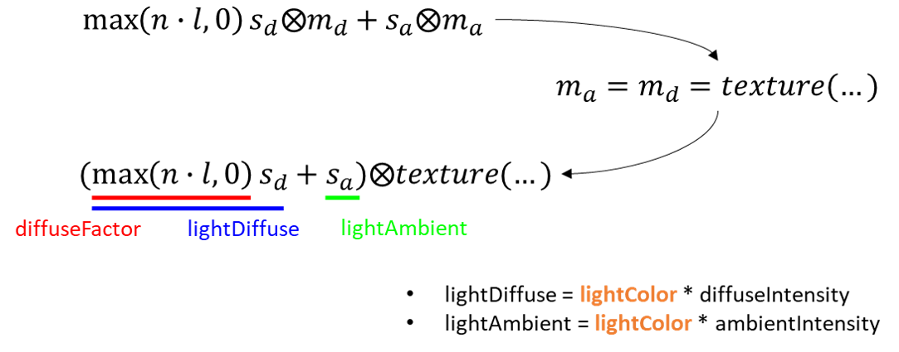

# Lighting - Diffuse

이번 문서에서는 두 번째로 Diffuse를 셰이더에 확장 적용해 보겠습니다. Diffuse 근사는 이상적인 확산 표면에서 같은 양의 빛 에너지가 표면에 입사되는 각도에 따라 단위 면적당 받는 에너지의 양이 줄어드는 양이 cos에 비례한다는 Lambert의 코사인 법칙에 기반한 근사식입니다.


이론적으로 더 깊이 들어가는 것은 나중에 PBR 파트에서 다시 한 번 살펴보기로 하고, 여기서는 표면의 법선벡터 방향과 광원이 빛을 비추는 방향이 정렬되면 더 밝은 빛이 반사된다는 정도로만 기억하셔도 됩니다. 강의 자료에서는 아래 그림으로 표현됩니다.


## Directional Light 확장

우리는 지난 문서들을 통해 [모델로부터 법선 벡터를 읽어와서](./16_model_import.md) [varying을 통해 각 프래그먼트에 보간](./17_lighting_ambient.md)하는 것까지 이미 구현을 마쳤습니다. Diffuse 구현을 위해 아직 준비되지 않은 정보는 광원의 방향(l 벡터) 정보입니다. 따라서 기존의 `Light` 클래스가 방향 정보까지 갖도록 확장해야 합니다.

확장하는 코드는 아래와 같습니다. 특별한 건 없고, 빛의 방향을 정의하는 `lightDirection`과 `diffuseIntensity`를 추가하였습니다. 

```cpp title="Light.h"
...
class Light
{
public:
    Light();
    //diff-remove
    Light(glm::vec3 aColor, float aIntensity);
    //diff-add
    Light(glm::vec3 aColor, float aIntensity, glm::vec3 lightDir, float dIntensity);
    ~Light();

    void UseLight(Shader& shader);
private:
    glm::vec3 lightColor; //color of s_a & s_d &s_s
    //diff-add
    glm::vec3 lightDirection;
    float ambientIntensity;
    //diff-add
    float diffuseIntensity;
};
```

이에 따른 구현 코드는 아래와 같습니다. 추가적인 두 개의 빛 속성을 생성자에서 초기화 할 수 있도록 해 주고, `UseLight()`에서는 추가된 속성들을 유니폼으로 넘겨줄 수 있도록 해 주었습니다. 셰이더에서 이러한 속성을 받을 수 있도록 추가해 주어야한다는 사실을 예상하실 수 있을겁니다.

```cpp title="Light.cpp"
...
//diff-remove
Light::Light(glm::vec3 aColor, float aIntensity)
//diff-remove
    : lightColor{ aColor }, ambientIntensity{ aIntensity }
//diff-add
Light::Light(glm::vec3 aColor, float aIntensity, glm::vec3 lightDir, float dIntensity)
//diff-add
    : lightColor{ aColor },ambientIntensity{ aIntensity },
    //diff-add
    lightDirection{ lightDir }, diffuseIntensity{ dIntensity }
{
}

Light::~Light()
{
}

void Light::UseLight(Shader& shader)
{
    shader.SetUniform3f("u_directionalLight.lightColor", lightColor.r, lightColor.g, lightColor.b);
    shader.SetUniform1f("u_directionalLight.ambientIntensity", ambientIntensity);
    //diff-add
    shader.SetUniform3f("u_directionalLight.lightDirection", lightDirection.x, lightDirection.y, lightDirection.z);
    //diff-add
    shader.SetUniform1f("u_directionalLight.diffuseIntensity", diffuseIntensity);
}
```

## 셰이더 확장

셰이더 확장 코드는 아래와 같습니다.

```glsl title="resources/shaders/basic_lighting.shader"
#shader vertex
...
void main()
{
	gl_Position = u_projection * u_view * u_model * a_position;
	v_texcoord = a_texcoord;
    v_normal = mat3(transpose(inverse(u_model))) * a_normal;
};

#shader fragment
...
struct DirectionalLight
{
    vec3 lightColor;
    //diff-add
    vec3 lightDirection;
    float ambientIntensity;
    //diff-add
    float diffuseIntensity;
};

...

void main()
{
    vec4 texColor = texture(u_texture, v_texcoord);
    vec3 lightAmbient = u_directionalLight.lightColor * u_directionalLight.ambientIntensity;

    //diff-add
    vec3 lightDir = -u_directionalLight.lightDirection;
    //diff-add
    float diffuseFactor = max(dot(normalize(v_normal), normalize(lightDir)), 0.0);
    //diff-add
    vec3 lightDiffuse = u_directionalLight.lightColor * u_directionalLight.diffuseIntensity * diffuseFactor;

    //diff-remove
    out_color = texColor * vec4(lightAmbient, 1.0);
    //diff-add
    out_color = texColor * vec4(lightAmbient + lightDiffuse, 1.0);
};
```

우선 정점 셰이더에서는 지난 번에 설명만 하고 실제로는 값을 할당하지 않았던 법선 varying에 값을 할당해 주었습니다. 코드에서 보실 수 있듯이 정점 어트리뷰트인 법선 값(`a_normal`)에 모델 행렬의 역행렬을 전치(transpose)한 값을 곱해주는 것을 볼 수 있습니다. 예전 강의에서 설명드렸듯이 법선 각도는 모델의 (크기) 변환 과정에서 왜곡될 수 있기 때문에 이러한 변환에 상관없이 올바른 법선 값을 유지해 주기 위해서는 이러한 변환 과정을 따로 거쳐줘야 합니다.

프래그먼트 셰이더에서는 셰이더 내의 `DirectionalLight` 구조체를 우리가 확장한 `Light` 클래스에 대응되도록 확장시켜 주었습니다.

마지막으로 실제 Diffuse 계산은 아래 라인들이 담당합니다.

```glsl
vec3 lightDir = -u_directionalLight.lightDirection;
float diffuseFactor = max(dot(normalize(v_normal), normalize(lightDir)), 0.0);
vec3 lightDiffuse = u_directionalLight.lightColor * u_directionalLight.diffuseIntensity * diffuseFactor;
out_color = texColor * vec4(lightAmbient + lightDiffuse, 1.0);
```

첫 번째 줄은 단지 코드 길이를 줄여주기 위해 변수를 따로 설정한 것입니다. 특이한 것은 방향을 `-`를 취해서 뒤집어 주었는데, 우리가 `Light` 객체를 정의할 때는 직관적으로 이해하기 쉽도록 빛을 "비추는" 방향으로 설정할 것이지만, 셰이더에서의 `l` 벡터는 표면에서 빛을 "향하는"벡터이기 때문에 방향이 반대가 되어야 합니다.

두 번째 `diffuseFactor`가 법선 벡터(`n`)와 조명 방향 벡터(`l`)을 내적하고 `max()`를 취해 diffuse 반사 양을 계산하는 부분입니다. 법선 벡터와 조명 방향 벡터의 방향이 차이가 많이 날수록 조명을 덜 받는다는 이야기이며, 이는 [앞 부분](#lighting---diffuse)에서 설명한 것처럼 코사인에 비례하고, 내적을 통해 코사인 값을 계산할 수 있습니다. 그리고 내적으로 코사인 값을 계산하기 위해 각 벡터를 정규화 해 주었습니다.

:::warning
varying인 법선 벡터가 래스터라이저를 통해 보간되는 과정에서 길이가 바뀔 수 있습니다. 예를 들어 A 정점에서의 법선 벡터가 `(1,0,0)`이고, B 정점에서의 법선 벡터가 `(0,1,0)` 이라면 그 중간 지점에서의 법선 벡터는 보간을 통해 `(0.5, 0.5, 0)`이 될 것입니다. 그러면 길이가 1이 아니게 되죠. 따라서 올바른 계산을 위해서는 반드시 `v_normal`값을 다시 정규화 해 주어야만 합니다.
:::

최종적인 `lightDiffuse` 계산은 조명 색상에 `diffuseIntensity`와 위에서 계산한 `diffuseFactor`를 곱함으로써 이루어집니다. 그리고 최종 색상은 텍스처 샘플링 색상에 두 조명(anbient, diffuse) 텀을 더한 벡터를 element-wise 곱을 함으로써 얻어집니다.

이러한 수식이 강의 자료의 내용과 잘 대응이 되지 않을 수 있는데, 아래 그림을 통해 조금 더 설명 드리겠습니다.



강의 자료에서는 `s_a`와 `s_d`, 즉 diffuse와 ambient의 소스 조명이 완전히 별개인 것처럼 다루어 졌는데 우리는 실제로는 이 두 값의 계산에 공통된 `lightColor`값을 사용하고 있습니다. 단지 그 색상이 diffuse와 ambient에 적용되는 정도를 `XXIntensity` 변수로 제어하고 있는 것입니다. 

이렇게 구현하는 것은 편의성 측면에서도 좋지만, 방향성 조명(directional light)은 일반적으로 전역적인 조명으로 사용되기 때문에 ambient와 다른 색상값을 가지고 있는 것이 이질감을 줄 수도 있어서 이를 줄이는 차원에서도 효과가 있습니다.

`m_a`와 `m_d` 또한 별개인 것이 아니라 텍스처 샘플링을 통해 얻어진 색상인 `texColor`를 사용하고 있습니다. 

## Diffuse 확장 결과

이제 `main.cpp`에서 확장한 조명을 정의해서 결과를 살펴보도록 하겠습니다.

저의 경우 diffuse 효과만을 확실히 보기 위해 ambient intensity를 0으로 바꾸고 조명 색상도 흰색으로 변경 하였습니다. 조명 방향은 `(2, -1, 2)`로 설정하였습니다. 추가적으로 조명의 이름도 이제는 다양한 텀을 포함하므로 좀 더 일반적인 `directionalLight`로 이름을 변경하였습니다.

```cpp title="main.cpp"
...
    //diff-remove
    Light ambientLight{ glm::vec3(0.1, 0.9, 0.1), 0.8 };
    //diff-add
    Light directionalLight{ glm::vec3(1.0, 1.0, 1.0), 0.0 , glm::vec3(2.0,-1.0,-2.0), 1.0f};

    ...

    lightShader.Bind();
    {
        ...
        //diff-remove
        light.UseLight(lightShader);
        //diff-add
        directionalLight.UseLight(lightShader);
    }
    lightShader.Unbind();
```

결과는 아래와 같습니다.


드디어 뭔가 진짜 3D 같은 장면이 되었네요. 음영을 통해 조명이 왼쪽 위에서 비추고 있다는 것을 한 눈에 파악할 수 있고, 주전자의 오른쪽 아래 부분은 어둡게 표시되고 있는 것을 볼 수 있습니다.

이러한 장면은 우리가 실제 물리적인 세계에서 볼 수 있는 현상과 보다 가깝기 때문에, 주전자가 실제로 존재하는 물체인 것처럼 느껴지도록 하는 데 한 발짝 더 다가선 것입니다. 

물론 진짜로 사람을 속이려면(?) 보다 다양한 기법들을 적용해야 하지만 diffuse의 적용이 아주 효과가 큰 기술이라는 것을 여러분들도 한 눈에 알아보실 수 있을 겁니다.

다음 문서에서는 마지막 텀인 specular(정반사) 텀을 구현하도록 하겠습니다. Emissive는 빠졌는데 Emissive는 대개 특수한 경우에만 사용하고 그 경우에도 이미지 이펙트를 함께 활용해야만 그럴싸한 장면이 보이기 때문에 여기서는 생략할 예정입니다.

## 연습 문제

1. 키보드 버튼 몇 개를 사용해서 조명의 방향을 바꿀 수 있도록 프로그램을 수정해 보세요.

2. 우리가 구현한 것은 모든 프래그먼트 셰이더가 각각 조명에 따르는 픽셀 색상을 결정하는 per-pixel lighting입니다. 컴퓨팅 자원이 부족한 옛날에는 정점별로 조명 효과를 계산하고 프래그먼트 셰이더에서는 보간된 값을 활용하는 방법이 사용되었었습니다. 이러한 per-vertex lighting 방식으로 한 번 바꾸어 구현해 보세요.

## 관련 링크

- [최종 코드(zip)](./assets/18_lighting_diffuse/src/src.zip)