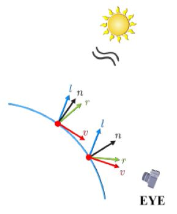
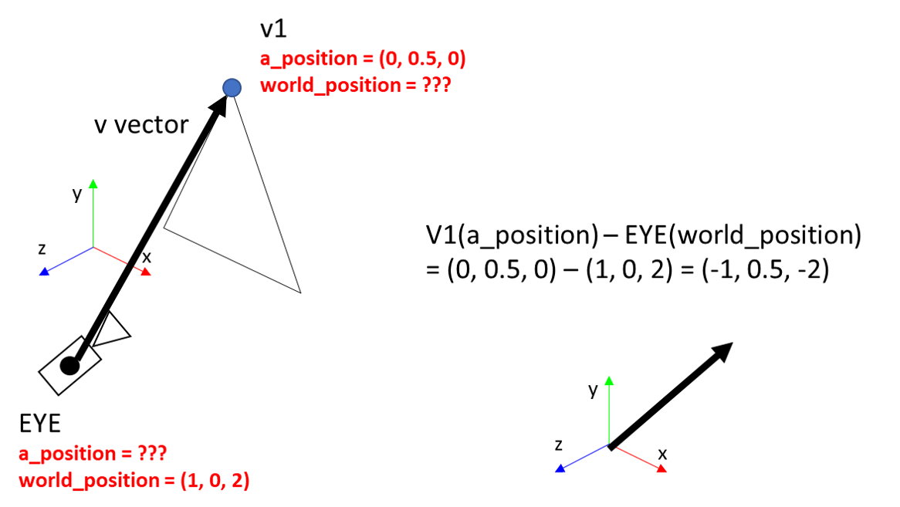
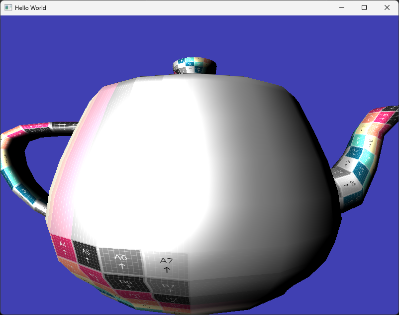
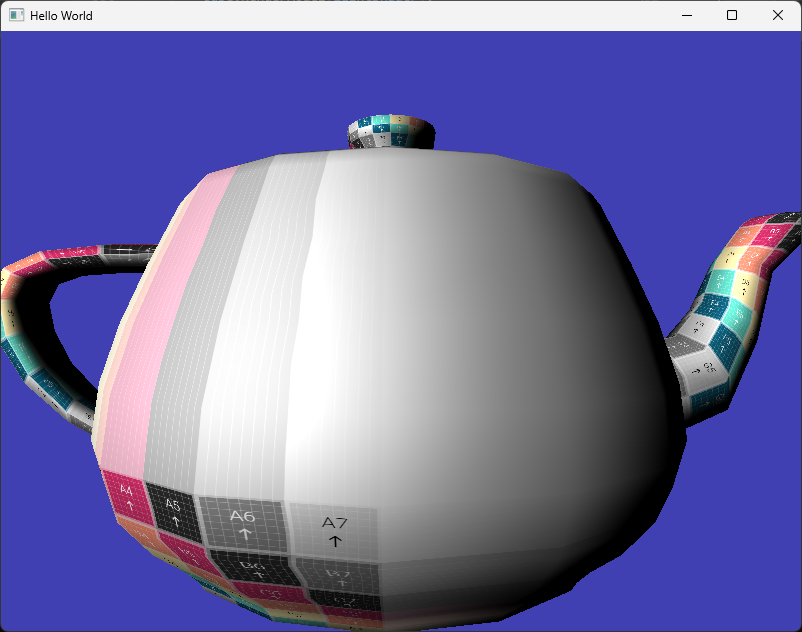
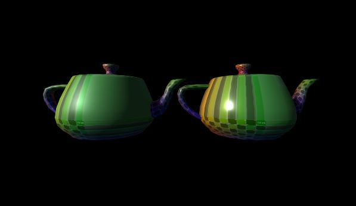

# Lighting - Specular

이번 문서에서는 마지막으로 Specular 텀을 셰이더에 적용해 보겠습니다. Specualr 는 반사광을 모사한 텀으로, 아래 그림에서는 mirror + glossy 반사를 포함합니다. BRDF가 무엇인지는 나중에 PBR 파트에서 보다 자세히 살펴보도록 하겠습니다.


어쨌든, 우리가 물체를 볼 수 있는 이유는 물체에서 반사된 빛이 우리 눈에 들어오기 때문입니다. 이를 물체의 입장에서 보면, 어떤 한 지점에 들어오는 빛은 위 그림처럼 확산(diffuse)되는 빛과 반사되는 빛이 있는 것입니다. 그 중에 우리 눈(또는 카메라)에 들어오는 빛이 최종적으로 보여지는 물체의 (특정 지점의) 색상을 결정하게 되는 것입니다. 확산에 따르는 계산은 [이전 문서](./18_lighting_diffuse.md)에서 진행했고 이번 장에서는 specular를 구현해 보겠습니다.

Specular 텀은 내가 물체를 어디서 보고 있냐에 따라 달라집니다. 내가 빛이 강하게 반사되는 지점에서 보고 있다면 더 많은 빛이 내 눈에 전달될 것이고, 반대로 약하게 반사되는 지점에서 보고 있다면 반사되는 양이 줄어들겠죠. 따라서 spacular 계산에서는 어디에서 물체를 보고 있는지에 대한 정보가 추가로 필요하며 이는 그림에서는 `v` 벡터로 표현했습니다.



따라서 셰이더에 `v` 벡터를 어떻게 전달할 것인지가 핵심이 될 것이며, 이 부분을 중점적으로 이해해 보시길 바라겠습니다.

## Material 클래스

`Material` 클래스는 어떤 물체의 재질 특성을 기술하기 위해 만든 클래스 입니다. 여러분이 지금 있는 공간 주변을 살펴보면 어떤 물체는 표면이 매끈해서 빛을 보다 강하게 반사하고, 어떤 물체는 표면이 거칠어서 그렇지 않은 경우를 쉽게 관찰할 수 있을 것입니다. 


이는 두 물체에 닿는 조명(위의 경우 태양)이 달라서가 아니죠. 물체 자체가 가지고 있는 반사의 특성이 다르기 때문입니다. 따라서 우리는 어떤 물체가 매끈한 물체인지, 거친 물체인지에 대한 정보를 기술해야 합니다. 그래야 나중에 셰이더에서 카메라를 향하는 빛이 specular가 강할 것인지 아닌지를 계산할 수 있습니다. 이러한 물체 자체의 특성을 이제 Material이라는 클래스에서 관리하도록 할 것입니다.

### Material 클래스 정의

`Material` 클래스의 정의는 아래와 같습니다.

```cpp title="Material.h"
#pragma once

#include "Shader.h"

class Material
{
public:
	Material();
	Material(float sIntensity, float shine);
	~Material();

	void UseMaterial(Shader& shader);

private:
	float specularIntensity;
	float shininess;
};
```

`UseMaterial()` 외에 다른 기능은 특별이 없으며, 데이터로는 `specularIntensity`와 `shininess`를 가지고 있습니다. 강의 자료에서 `sh`로 표현된, `dot(r,v)`에 제곱하는 항이 `shininess`이며 `specularIntensity`는 기존과 같이 `s_s`를 구하기 위해 조명 색과 곱해질 예정입니다.

### Material 클래스 구현

`Material` 클래스의 구현은 아래와 같습니다.

```cpp title="Material.cpp"
#include "Material.h"

Material::Material()
	:specularIntensity{ 0.0f }, shininess{ 0.0f }
{
}

Material::Material(float sIntensity, float shine)
	: specularIntensity{ sIntensity }, shininess{ shine }
{
}

Material::~Material()
{
}

void Material::UseMaterial(Shader& shader)
{
	shader.SetUniform1f("u_material.specularIntensity", specularIntensity);
	shader.SetUniform1f("u_material.shininess", shininess);
}
```

이제는 다들 익숙하시리라 믿습니다. 셰이더에는 아직 `u_material` 구조체가 없죠? 추가해 줄 것이라는 것을 예상하실 수 있을겁니다. `Light` 클래스의 확장과 사용 과정과 거의 동일합니다.

### 셰이더에서의 Material 클래스 정의

위의 `UseMaterial()` 구현에 맞춰서 일차적으로 셰이더를 확장해 주도록 하겠습니다. `u_material` 유니폼 구조체가 있어야 하고, 그 구조체는 `specularIntensity`와 `shininess`를 가지고 있어야 합니다.

```glsl title="resources/shaders/basic_lighting.shader"
...
#shader fragment
#version 330 core

struct DirectionalLight
{
	vec3 lightColor;
	vec3 lightDirection;
	float ambientIntensity;
	float diffuseIntensity;
};

//diff-add
struct Material
//diff-add
{
    //diff-add
	float specularIntensity;
    //diff-add
	float shininess;
    //diff-add
};

...

uniform sampler2D u_texture;
uniform DirectionalLight u_directionalLight;
//diff-add
uniform Material u_material;

...
```

Specular 계산 관련 알고리즘은 우선 미뤄두고, 먼저 `Material` 구조체와 해당 구조체 타입의 유니폼 `u_material`을 정의해 주었습니다. 이전과 동일한 과정이니 따로 설명드릴 내용은 없을 것 같습니다.

## 셰이더 확장 - view 벡터 `v`

다음 단계로, 셰이더를 확장해 볼 것인데, 목적은 view 벡터인 `v`를 프래그먼트 셰이더에서 사용할 수 있도록 하는 것입니다. 위에서도 살펴 보았듯이 `v`는 물체의 표면에서 시야(카메라)를 향하는 벡터입니다. 여기서 헷갈리시면 안되는 부분은, 좌표계의 통일입니다.

`v`벡터를 구하는 방법은 뭘까요? 당연히 카메라의 위치(`EYE`)에서 자신의 위치(`p`)를 빼는 것입니다. 여기서 "자신"이란 프래그먼트의 위치를 의미합니다. 우선 현재 프래그먼트 셰이더에서는 자신의 위치 값이 없습니다. 따라서 추가를 해 주는 것이 필요할 것인데, 예를 들어 아래와 같이 생각해 보겠습니다.

```glsl title="예시"
#shader vertex
#version 330 core

layout(location = 0) in vec4 a_position;
layout(location = 1) in vec2 a_texcoord;
layout(location = 2) in vec3 a_normal;

out vec2 v_texcoord;
out vec3 v_normal;
//diff-add
out vec3 v_position;

uniform mat4 u_model;
uniform mat4 u_view;
uniform mat4 u_projection;

void main()
{
	gl_Position = u_projection * u_view * u_model * a_position;
	v_texcoord = a_texcoord;
	v_normal = mat3(transpose(inverse(u_model))) * a_normal;
    //diff-add
    v_position = a_position.xyz;
};

#shader fragment

...

in vec2 v_texcoord;
in vec3 v_normal;
//diff-add
in vec3 v_position

...
```

위 코드를 보시면 어트리뷰트로 주어진 정점의 위치(`a_position`)를 varying으로 프래그먼트 셰이더로 넘기고 있습니다. 그러면 래스터라이저 단계에서 알아서 위치값들을 보간해서 각 프래그먼트의 위치를 만들어 낼 것입니다. 그런데 이 위치는 **모델 공간에서의 정점의 위치입니다**. 만일 모델 공간에서의 정점의 위치에서 `EYE` 위치를 빼면 어떻게 될까요? 엉뚱한 벡터가 얻어지게 됩니다.

아래 그림에서 보시는 것처럼 원래 어떤 모델의 정점 어트리뷰트는 모델 공간에서 정의된 위치값입니다. 그 값은 **월드 공간이 아닌 모델 공간에서 정점의 위치이므로** 만일 월드 공간에서의 위치인 `EYE`값과 빼서 `v`벡터를 구하게 되면 무의미한 값이 도출됩니다.



의미있는 값을 도출해내려면 `v`벡터를 구할 때, 좌표계를 통일해 주어야 하며 그 방안은 아래 두 가지가 있습니다. 1번은 월드 공간 좌표 기준으로 통일시키는 방안이고, 2번은 모델 공간 좌표 기준으로 통일시키는 방안입니다.

1. 프래그먼트의 월드 공간 좌표를 구한 뒤 `EYE`를 빼 준다
2. `EYE`를 모델 공간 좌표로 변환한 뒤 `v_position`에서 빼 준다

우리는 1번 접근법을 취할 것이며 이를 위해 셰이더를 아래와 같이 확장할 것입니다.

```glsl title="resources/shaders/basic_lighting.shader"
#shader vertex
...
out vec2 v_texcoord;
out vec3 v_normal;
//diff-add
out vec3 v_worldPosition;

...

void main()
{
    gl_Position = u_projection * u_view * u_model * a_position;
    v_texcoord = a_texcoord;
    v_normal = mat3(transpose(inverse(u_model))) * a_normal;
    //diff-add
    v_worldPosition = (u_model * a_position).xyz;
};

#shader fragment

...

in vec2 v_texcoord;
in vec3 v_normal;
//diff-add
in vec3 v_worldPosition;

//diff-add
uniform vec3 u_eyePosition; //world coordinate
uniform sampler2D u_texture;
uniform DirectionalLight u_directionalLight;
uniform Material u_material;

void main()
{
    ...
    //diff-add
    vec3 viewDir = normalize(u_eyePosition - v_worldPosition);

    ...
}

```

보시는 것처럼 프래그먼트 셰이더에서 varying으로 `v_worldPosition`을 추가해 주었고 여기에는 `u_model` 행렬을 곱해서 모델 공간 정점을 월드 공간 정점으로 변환한 값이 들어갑니다. 그러면 `v_worldPosition`은 varying이므로 래스터라이저에서 보간되어 각 프래그먼트가 `v_worldPosition`을 갖게 되고, 이 값을 이제 `u_eyePosition`와 빼 주어서 **월드 공간 기준으로** `v`벡터가 올바로 계산됩니다. (`main.cpp`에서 `u_eyePosition`을 추가로 설정해 주어야 하겠다는 것도 예상하실 수 있을겁니다.)

별거 아닌 것 같은 내용은 심각하게 설명했지만 컴퓨터 그래픽스에서 무언가 계산을 수행할 때 서로 다른 좌표계의 값들을 가지고 계산하는 바람에 제대로 된 결과가 나오지 않는 것은 매우 흔히 발생하는 오류입니다. 꼭 주의해 주셔야 합니다.

## 셰이더 확장 - `lightSpecular` 계산

이제 모든 필요한 데이터를 프래그먼트 셰이더에 넘겨줄 수 있게 되었으므로 실제 specular 텀을 계산하도록 확장 하겠습니다.

```glsl title="resources/shaders/basic_lighting.shader"
...

#shader fragment

...

void main()
{
    vec4 texColor = texture(u_texture, v_texcoord);

    //diff-add
    vec3 normal = normalize(v_normal);
    vec3 lightAmbient = u_directionalLight.lightColor * u_directionalLight.ambientIntensity;

    //diff-remove
    vec3 lightDir = -u_directionalLight.lightDirection;
    //diff-add
    vec3 lightDir = -normalize(u_directionalLight.lightDirection);
    //diff-remove
    float diffuseFactor = max(dot(normalize(v_normal), normalize(lightDir)), 0.0);
    //diff-add
    float diffuseFactor = max(dot(normal, lightDir), 0.0);
    vec3 lightDiffuse = u_directionalLight.lightColor * u_directionalLight.diffuseIntensity * diffuseFactor;

    vec3 viewDir = normalize(u_eyePosition - v_worldPosition);
    //diff-add
    vec3 reflDir = 2.0 * normal * dot(normal, lightDir) - lightDir;
    //diff-add
    vec3 lightSpecular = pow(max(dot(reflDir, viewDir), 0.0), u_material.shininess) * u_directionalLight.lightColor * u_material.specularIntensity;

    //diff-remove
    out_color = texColor * vec4(lightAmbient + lightDiffuse, 1.0);
    //diff-add
    out_color = texColor * vec4(lightAmbient + lightDiffuse + lightSpecular, 1.0);
};
```

diffuse 부분에도 일부 수정을 해 주었습니다. `normalize(v_normal)` 값과 `normalize(lightDir)`을 diffuse와 specular 텀에 모두 사용하기 때문에 연산량을 줄이기 위해 미리 정규화하고 변수에 저장해 두었습니다.

specular 텀 자체는 강의 자료에 있는 그대로 수식을 적용하여 계산해 주었습니다. `reflDir`이 `r` 벡터를 의미하며 계산 방식은 강의 시간에 설명드린 바 있습니다. 최종적인 `lightSpecular` 값은 `dot(r,v)`를 shininess만큼 제곱하고 색상과 intensity를 곱하면 됩니다.

이렇계 계산된 `lightSpecular`를 기존 ambient와 diffuse에 더하여 텍스처 색상과 믹스해 주면 specular가 적용된 결과를 볼 수 있을 겁니다.

## Specualr 확장 결과

이제 `main.cpp`에서 지금까지 확장한 결과들을 조합하여 사용해 보겠습니다. 그 전에 `u_eyePosition`값을 전달해 주어야 하니 카메라의 위치를 받아올 수 있는 인터페이스가 필요하겠네요.

```cpp title="Camera.h"
class Camera
{
public:
    ...

    glm::mat4 CalculateViewMatrix();
    //diff-add
    glm::vec3 GetEyePosition();
private:
	...
};
```

```cpp title="Camera.cpp"
//diff-add
glm::vec3 Camera::GetEyePosition()
//diff-add
{
    //diff-add
    return eye;
    //diff-add
}
```

이후에 `main.cpp`를 아래와 같이 수정합니다.


```cpp title="main.cpp"
#include "Window.h"
#include "Camera.h"
#include "Model.h"
#include "Light.h"
//diff-add
#include "Material.h"

...

int main(void)
{
    Window mainWindow{ 800, 600 };
    mainWindow.Initialize();

    //diff-remove
    Model cube;
    //diff-remove
    cube.LoadModel("resources/models/teapot.obj");
    //diff-add
    Model teapot;
    //diff-add
    teapot.LoadModel("resources/models/teapot.obj");

    //diff-add
    Material teapotMaterial{ 1.0, 32.0f };

    Shader lightShader{ "resources/shaders/basic_lighting.shader" };

    ...

    // Rendering Loop
    while (!mainWindow.GetShouldClose())
    {
        ...

        renderer.Clear();
        
        lightShader.SetUniformMat4f("u_view", camera.CalculateViewMatrix());
        //diff-add
        glm::vec3 eyePosition = camera.GetEyePosition();
        //diff-add
        lightShader.SetUniform3f("u_eyePosition", eyePosition.x, eyePosition.y, eyePosition.z);
        //diff-add
        teapotMaterial.UseMaterial(lightShader);

        //diff-remove
        cube.RenderModel(lightShader);
        //diff-add
        teapot.RenderModel(lightShader);

        mainWindow.SwapBuffers();
        glfwPollEvents(); 
    }

...
```

`Material`을 추가하고, 렌더링 전에 `u_eyePosition` 유니폼 값을 전달해 주는 부분과 `Material` 유니폼을 전달해주는 `UseMaterial()` 호출을 수행하였습니다.

렌더링 해 보면 결과는 아래와 같습니다.


보시는 것처럼 카메라 시점을 변경하는 것에 따라서 반사량이 달라져 하이라이트 되는 위치가 바뀌는 것을 보실 수 있습니다. 이런 장면을 보게 되면 이제 물체 표면이 얼마나 매끈한지를 알 수 있게 됩니다.

예를 들어 `shininess`값을 `32.0`에서 `2.0`으로 낮춰 보면 아래와 같은 결과가 나타납니다. `shininess`값이 작아졌으므로 반사각도와 멀어져도 값의 감쇄가 더 적으니, 더 넓은 영역이 하이라이트 됩니다.



이 때 `specularIntensity` 값도 `0.3`으로 줄여보면 아래와 같은 결과가 나타납니다. 하이라이트가 희미하게 표현되므로 시점에 따른 변화가 크지 않아 이전보다는 거친 표면을 가진 물체처럼 보입니다.



마지막 두 그림을 비교해 보면 상대적으로 아래 그림이 더 그럴싸하게 보일 겁니다. 이러한 현상에 관해서는 빛 에너지의 보존과 관련한 논의가 필요한데, PBR 강의를 위해 남겨두도록 하겠습니다.

이로써 Lighting 관련 구현이 끝났습니다. 현실적인 3D 장면을 그려내기 위한 가장 중요하면서도 기초적인 내용을 이해하시게 된 겁니다. 

## 마치며

- GLSL에는 swizzling 이라는 특이한 문법이 있습니다. 정점 셰이더에서 사용한 아래 `.xyz`와 같은 문법입니다.

```glsl
v_worldPosition = (u_model * a_position).xyz;
```

만일 `vec4 v = (1.0, 2.0, 3.0, 4.0)`이라면, swizzling 문법을 통해 아래와 같은 조작을 수행할 수 있습니다.

```glsl
vec3 a = v.xyz; // a = (1.0, 2.0, 3.0)
vec3 b = v.yyy; // b = (2.0, 2.0, 2.0)
vec4 c = v.wzyx; // c = (4.0, 3.0, 2.0, 1.0)
```


- 반사 벡터와 관련해서 강의자료에 나온 것과는 달리 [halfway vector](https://en.wikipedia.org/wiki/Blinn%E2%80%93Phong_reflection_model)를 사용해서 계산하는 것이 좀 더 일반적입니다. halfway vector는 `l`과 `v` 벡터의 사이 벡터입니다. 그리고 이 벡터가 `n` 벡터와 이루는 각도에 따라 시점이 반사 벡터와 가까운지 아닌지를 계산할 수 있습니다.

- Unity3D와 같은 게임 엔진의 기본 셰이더(PBR 기반)에서 smoothness를 조정하면 물체가 얼마나 부드러운지가 조절됩니다. 우리가 만든 첫 번째와 세 번째 결과와 비슷해 보이죠?



## 연습 문제

1. 화면에 두 개의 주전자를 그려서, 한쪽 주전자는 좀 더 매끈한 표면을, 반대쪽 주전자는 거친 표면을 가진 것처럼 표현해 보세요.

2. 좌표계 일치 문제와 관련해서 월드 공간 좌표를 기준으로 활용하여 계산하는 방식을 구현해 봤습니다. 오브젝트 공간 좌표를 사용하여 계산하는 방식으로도 한 번 구현해 보세요.

3. "마치며"에서 언급한 halfway vector를 사용한 구현 방식으로 코드를 바꿔 보세요. [참고 문서](https://webgl2fundamentals.org/webgl/lessons/ko/webgl-3d-lighting-point.html)를 살펴 보시면 좋습니다.

## 관련 링크

- [최종 코드(zip)](./assets/19_lighting_specular/src/src.zip
- [halfway vector](https://en.wikipedia.org/wiki/Blinn%E2%80%93Phong_reflection_model)
- [GLSL 문법](https://webgl2fundamentals.org/webgl/lessons/ko/webgl-shaders-and-glsl.html)