# Installation

이 장에서는 본격적으로 개발 환경 설정을 진행해 보도록 하겠습니다.

앞서 [Introduction](./introduction.md)에서 소개드린 GLFW와 GLEW 라이브러리를 포함한 프로젝트를 구성해서 제대로 동작하는지까지 확인해 볼 것입니다.

:::note
이 튜토리얼의 모든 내용은 **Windows**에서 **Visual Studio (Community) 2022**를 기준으로 작성되었습니다. 본론으로 빠르게 들어가기 위해서 CMake 등을 활용한 크로스 플랫폼 빌드는 고려하지 않았습니다. 

다른 환경에서 개발을 진행하시는 분들은 아래 내용을 참고해서 스스로 자료를 찾아서 진행하세요. 가능하다면 그렇게 알게 된 내용을 [사이트 레포지토리](https://github.com/diskhkme/GL_Practice_Document)에 반영하여 공유해 주시면 더 좋고요.
:::

## 프로젝트 생성

먼저 필요하다면 [Visual Studio](https://visualstudio.microsoft.com/ko/vs/community/)를 다운로드하여 설치하세요. 현재 최신 버전은 2022이고 Community 버전을 설치하시면 됩니다. 처음 사용하시는 분이라면 마이크로소프트 계정을 만들어 로그인을 하셔야 할 겁니다.

이제 Visual Studio를 실행하면 아래와 같은 화면이 보일 거고, 새 프로젝트 만들기를 클릭하세요.

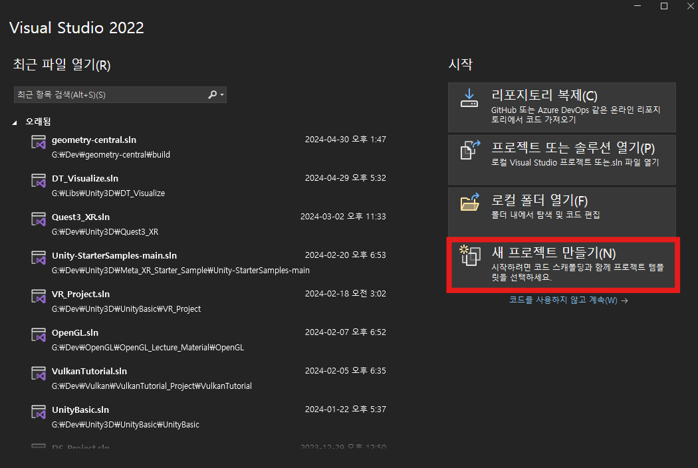

프로젝트 템플릿에서는 우측 상단에 C++가 선택되어 있는지 확인하시고 **빈 프로젝트**를 선택하세요. 이후 적절한 프로젝트 이름과 경로를 선택하여 프로젝트를 생성하세요. 저의 경우 프로젝트 이름을 `Tutorial`로 해서 `G:/Dev/OpenGL/OpenGL_Tutorial_Project/` 경로 아래에 프로젝트가 생성되도록 했습니다.

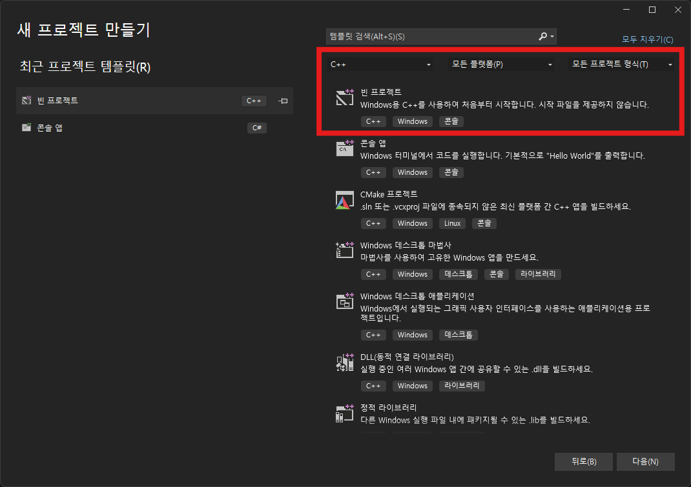

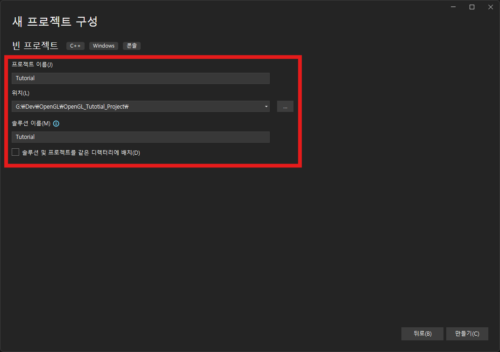

이제 Visual Studio가 자동으로 실행되며 방금 만든 프로젝트가 열리게 됩니다. C++ 설정을 위해서 먼저 파일을 하나 프로젝트에 추가해 보도록 하겠습니다.

우측 솔루션 탐색기의 "소스 파일"에 우클릭을 한 뒤 "추가▶새 항목" 메뉴를 클릭하면 아래와 같은 창이 나타납니다. "C++ 파일(.cpp)"가 선택된 상태에서 아래 파일 이름을 `main.cpp`로 수정한 뒤 추가 버튼을 클릭하세요.

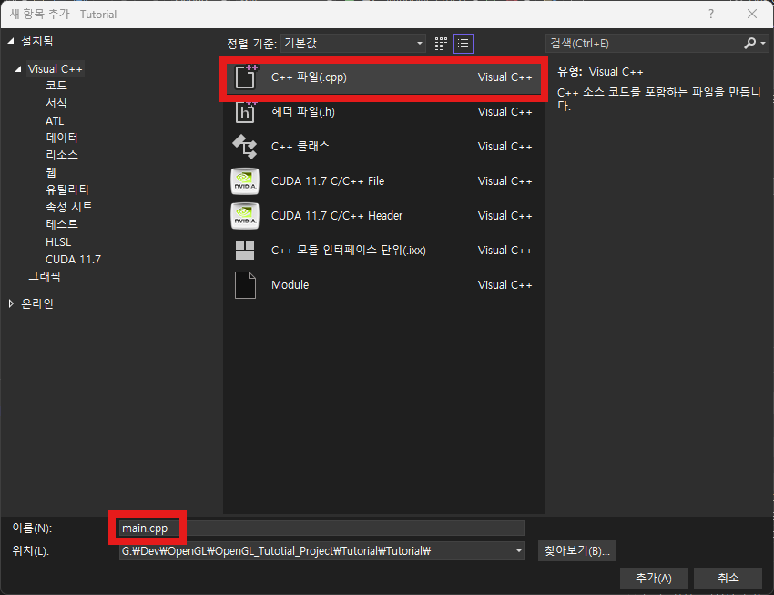

그러면 아래 그림처럼 우리 프로젝트에 `main.cpp` 파일이 추가된 것을 확인할 수 있습니다. 또한 이 `main.cpp` 파일이 왼쪽 코드 편집 창에서 자동으로 열려서 내용을 입력할 수 있는 상태가 되었습니다.

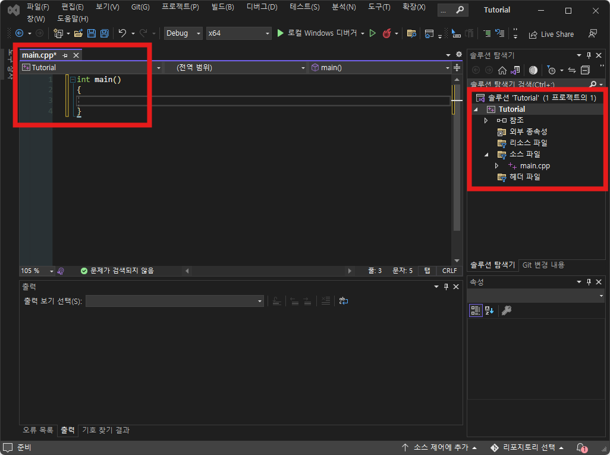

:::warning
이 내용은 C++ 관련한 내용이 아니기 때문에 Visual Studio의 상세 사용법 들을 모두 소개 드리진 않습니다. 최소한으로 필요한 내용만을 따라서 하실 수 있게 알려 드리는 데서 그칩니다.

이 강의를 들으시는 정도의 학년이시라면, 요 정도만 보여드려도 눈치껏(?) 파악하실 수 있을 것이라고 생각됩니다.

혹시 따라하는 과정에서 문제가 생긴다면 먼저 검색을 통해 스스로 해결을 시도해 보시고, 그래도 해결이 안된다면 코멘트를 남겨 주세요(TBD).
:::

## GLFW 및 GLEW 준비

### GLFW 다운로드 및 복사

먼저 [GLFW 사이트](https://www.glfw.org/)에 들어가서 GLFW를 다운로드 할 것인데, 기본적으로는 라이브러리를 빌드할 수 있는 소스 코드를 제공합니다.

직접 CMake를 활용해 빌드를 해 보는것도 좋은 경험이 될 것이지만(개인적으로는 꼭 시도해 보시는 것을 추천합니다), 여기서는 간편하게 미리 빌드된 라이브러리를 사용하도록 하겠습니다.

사이트 링크에 들어가셔서 첫 화면의 "Download GLFW 3.X"를 클릭하지 **마시고**, 상단의 "Download" 탭으로 이동하세요. 그리고 **"64-bit Windows binaries"** 를 클릭하여 다운로드 하세요.

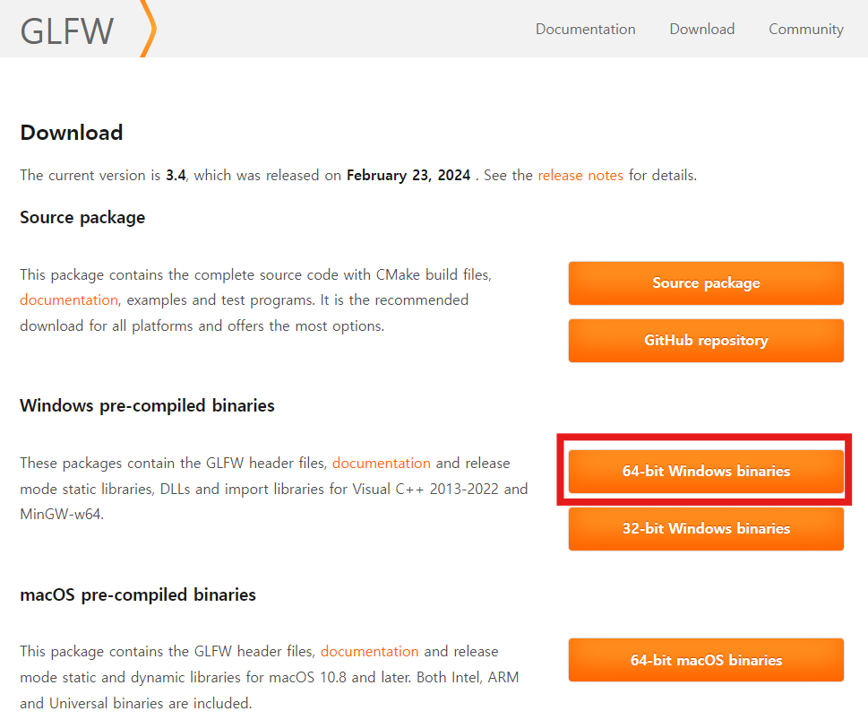

`glfw-3.X.bin.WIN64` 파일이 다운로드 될 것인데, 압축을 풀어 보면 아래와 같은 파일들이 있을 것입니다. 이 중에서 `include` 폴더와 `lib-vc2022` 폴더, 그리고 `LICENSE.md` 파일을 우리 프로젝트 쪽으로 복사할 것입니다.

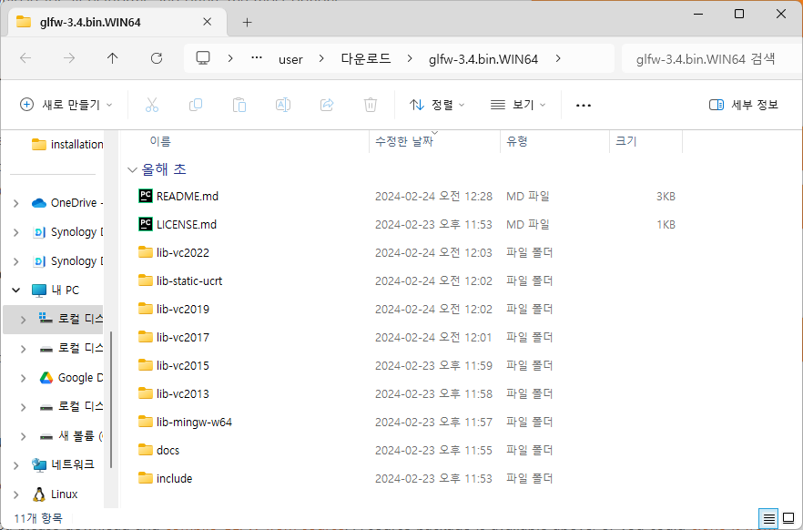

그러니 프로젝트를 생성한 폴더를 열어서, `.sln` 파일이 있는 위치를 찾아보세요. 아까 프로젝트를 생성할 때 입력한 `<경로>/<프로젝트 이름>` 폴더로 가 보시면 아래와 같이 `<프로젝트 이름>.sln` 파일이 있을 겁니다. 이 위치를 **솔루션 경로**라고 하겠습니다.

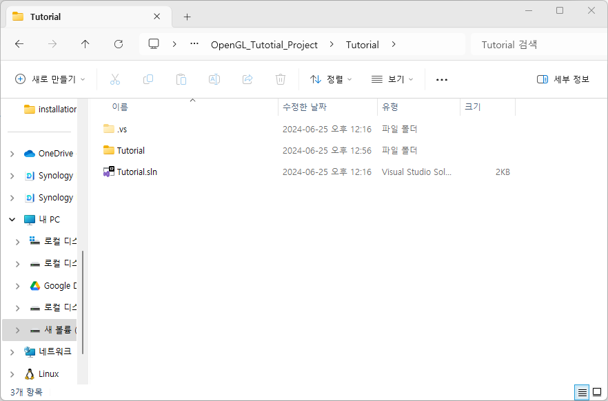

이제 이 솔루견 경로에 `Dependencies` 폴더를 만들고, 그 하위에 다시 `GLFW` 폴더를 만들어 줍니다. 그리고 그 안에 아까 이야기한 GLFW에서 압축을 푼 `include` 폴더와 `lib-vc2022` 폴더와 `LICENSE.md` 파일을 복사해 줍니다.

결과적으로 아래와 같은 폴더 구조가 된 상태가 되어야 합니다. (확장자 표기가 되지 않은 것은 폴더)

```
<솔루션 경로>
├── Dependencies
│   └── GLFW
│       ├── include
|       ├── lib-vc2022
│       └── LICENSE.md
├── <프로젝트이름>
└── <프로젝트이름>.sln
```

### GLEW 다운로드 및 복사

다음으로 [GLEW 사이트](https://glew.sourceforge.net/)에 들어가서 GLEW를 다운로드 할 것입니다. 마찬가지로 소스코드와 빌드된 바이너리가 있는데 빌드된 것을 다운로드 할 것입니다.

페이지 가운데 "Windows 32-bit and 64-bit" 링크를 클릭하면 어딘가로 납치되고, 곧 다운로드가 시작될 겁니다.

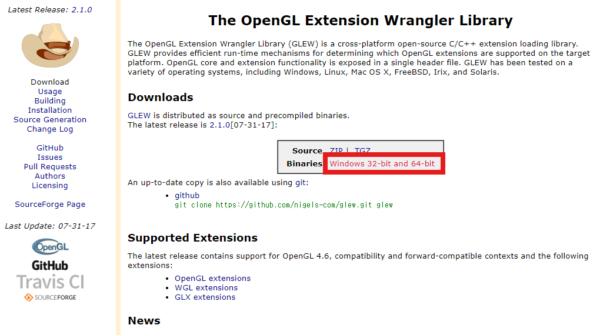

압축을 풀면 나오는 것들 중, `doc`폴더만 **제외하고** 우리 프로젝트 쪽으로 복사할 것입니다. 결과적으로 아래와 같은 구조가 되도록 `GLEW` 폴더를 만들고 복사해 주세요.

```
<솔루션 경로>
├── Dependencies
│   ├── GLFW
│   │   ├── include
|   │   ├── lib-vc2022
│   │   └── LICENSE.md
│   └── GLEW
│       ├── bin
|       ├── include
|       ├── lib
│       └── LICENSE.txt
├── <프로젝트이름>
└── <프로젝트이름>.sln
```

## 프로젝트 설정

여기까지는 GLFW와 GLEW를 다운로드해서 우리가 사용하기 편한 곳에 배치한 것이고, 이제 실제로 우리 프로젝트에서 이 라이브러리들로부터 기능들을 가져와서 사용하도록 설정해 주어야 합니다.

이러한 설정은 Visual Studio의 프로젝트 설정에서 수행을 해야 합니다. 프로젝트 이름을 우클릭해서 가장 아래의 "속성" 메뉴를 클릭해 주세요. 솔루션 이름이 아니고, 프로젝트 이름을 우클릭 해야 하는 것에 유의하세요. 그러면 아래와 같은 창이 나타납니다.

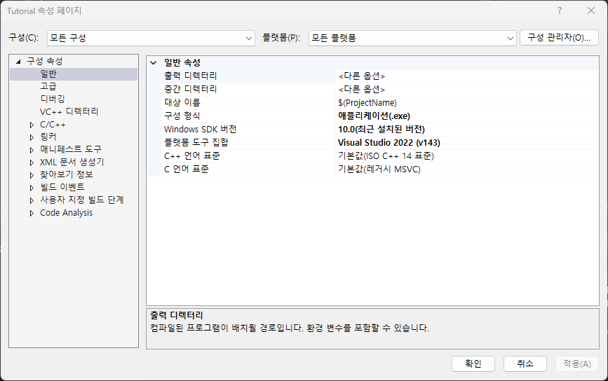

이제 이 창에서 많은 것들을 설정해 주어야 합니다. 잘 따라와 주세요.

<details>
<summary>솔루션과 프로젝트의 이해</summary>
:::note
Visual Studio에서는 프로젝트들은 솔루션 하위에 속해 있습니다. 아래 그림에서 그 구조를 볼 수 있는데, 우리는 현재 "Tutorial"이라는 이름의 솔루션 하나와 그 솔루션에 속해있는 "Tutorial"이라는 이름의 프로젝트 하나를 만든 상태입니다.

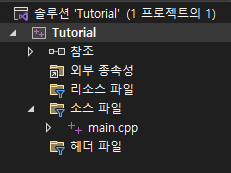

하나의 프로그램을 만들 때에, 최종적으로 빌드할 실행 파일(exe)과, 그 실행 파일에서 사용할 기능들(lib, dll)을 분리해서 개발하는 경우가 많습니다. 따라서 모든 코드들을 하나의 "솔루션" 하위에서 개별적인 "프로젝트"로 관리한다는 것이 Visual Studio의 프로젝트 관리 개념입니다.

참고로 아까 폴더에서 봤던 `Tutorial.sln`은 솔루션 정보가 담겨있는 파일이고, `Tutorial/Tutorial.vcxproj` 파일이 프로젝트 정보가 담겨있는 파일입니다. 또한 아까 추가한 `main.cpp`는 이 프로젝트에 포함된 파일이니 `Tutorial/main.cpp` 경로에 담겨 있는 것을 볼 수 있습니다.

만일 우리가 또 다른 프로젝트(예를들어 Tutorial2)를 이 솔루션 안에 추가로 만든다면, `Tutorial2/Tutorial2.vcproj` 파일에 프로젝트 정보가 담겨 있을 것입니다.
:::
</details>

:::tip
오타가 발생하지 않도록 그냥 복사 붙여넣기를 하시는 것을 추천 드립니다.
:::

### 프로젝트 기본 설정

- 상단의 구성: `모든 구성`으로, 플랫폼: `모든 플랫폼`으로 선택하세요.
- 좌측 탭에서 "구성 속성▶일반"을 클릭하고, 우측에서 아래 두 항목을 다음과 같이 설정하세요.
  - `출력 디렉터리`: `$(ProjectDir)\..\Build\$(Platform)$(Configuration)\`
  - `중간 디렉터리`: `$(ProjectDir)\..\Output\$(Platform)$(Configuration)\$(ProjectName)\`

<details>
<summary>참고</summary>
:::note
출력 디렉터리와 중간 디렉터리 설정은 꼭 필요한 것은 아니지만 깔끔한 프로젝트 빌드 파일 관리를 위해 설정합니다.

모든 플랫폼으로 설정하긴 했지만 사실 GLFW는 64비트 버전이기 때문에 32비트로 빌드하면 실행이 불가능합니다.
:::
</details>

### 라이브러리 포함(include) 경로 설정

- 좌측 탭에서 "구성 속성▶C/C++▶일반"을 클릭하고, 우측에서 아래 항목을 다음과 같이 설정하세요.
  - `추가 포함 디렉터리`: `$(SolutionDir)Dependencies/GLFW/include;$(SolutionDir)Dependencies/GLEW/include`

:::note
구성 속성에 `C/C++` 메뉴가 없다면 `main.cpp` 파일을 프로젝트에 추가하지 않아서 그렇습니다.
:::

### 라이브러리 경로 설정

- 좌측 탭에서 "구성 속성▶링커▶일반"을 클릭하고, 우측에서 아래 항목을 다음과 같이 설정하세요.
  - `추가 라이브러리 디렉터리`: `$(SolutionDir)Dependencies/GLFW/lib-vc2022;$(SolutionDir)Dependencies/GLEW/lib/Release/$(Platform)`
- 좌측 탭에서 "구성 속성▶링커▶입력"을 클릭하고, 우측에서 아래 항목을 다음과 같이 설정하세요.
  - `추가 종속성`: `glew32s.lib;glfw3.lib;opengl32.lib;User32.lib;Gdi32.lib;Shell32.lib`


## 테스트

위 사항들이 제대로 설정 되었다면, 이제 GLFW를 사용해 창을 띄우고 그 창에 GLEW를 활용해 OpenGL API를 호출해서 무언가를 그릴 수 있는 준비가 다 된 것입니다.

실제로 모든 라이브러리가 잘 동작한다면, 아래 테스트 코드를 main.cpp에 작성해서 실행했을 때 아래와 같은 창이 나타나야 합니다.

:::tip
빌드 후 실행을 위해서는 `F5` 키를 누르면 됩니다.
:::

```cpp main.cpp
#define GLEW_STATIC
#include <GL/glew.h>
#include <GLFW/glfw3.h>
#include <iostream>

// Error callback function for GLFW
void glfwErrorCallback(int error, const char* description) {
    std::cerr << "GLFW Error: " << description << std::endl;
}

int main() {
    // Set the error callback for GLFW
    glfwSetErrorCallback(glfwErrorCallback);

    // Initialize GLFW
    if (!glfwInit()) {
        std::cerr << "Failed to initialize GLFW" << std::endl;
        return -1;
    }

    // Set the GLFW window properties
    glfwWindowHint(GLFW_CONTEXT_VERSION_MAJOR, 3);
    glfwWindowHint(GLFW_CONTEXT_VERSION_MINOR, 3);
    glfwWindowHint(GLFW_OPENGL_PROFILE, GLFW_OPENGL_CORE_PROFILE);

    // Create a GLFW window
    GLFWwindow* window = glfwCreateWindow(800, 600, "GLEW Test Window", NULL, NULL);
    if (!window) {
        std::cerr << "Failed to create GLFW window" << std::endl;
        glfwTerminate();
        return -1;
    }

    // Make the OpenGL context current
    glfwMakeContextCurrent(window);

    // Initialize GLEW
    glewExperimental = GL_TRUE;
    GLenum err = glewInit();
    if (err != GLEW_OK) {
        std::cerr << "Failed to initialize GLEW: " << glewGetErrorString(err) << std::endl;
        glfwDestroyWindow(window);
        glfwTerminate();
        return -1;
    }

    glClearColor(0.25, 0.25, 0.7, 1);

    // Main loop
    while (!glfwWindowShouldClose(window)) {
        // Clear the screen
        glClear(GL_COLOR_BUFFER_BIT);

        // Swap buffers
        glfwSwapBuffers(window);

        // Poll for and process events
        glfwPollEvents();
    }

    // Clean up and exit
    glfwDestroyWindow(window);
    glfwTerminate();
    return 0;
}
```

- 실행 결과 윈도우

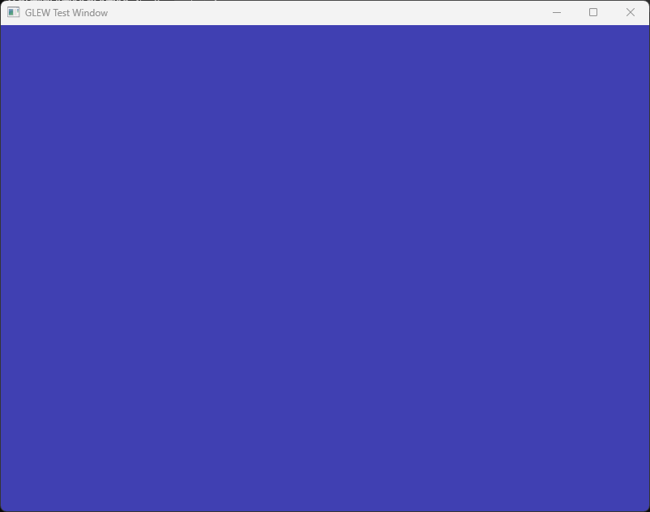

축하 합니다! 🎉🎉🎉 

이제 첫 단계가 완료 되었으니 다음 장에서부터는 본격적으로 OpenGL 실습을 진행해 보도록 하겠습니다.

몇 가지 추가 정보와 연습 문제를 말씀드리고 마치도록 하겠습니다.

## 추가 정보

1. 앞서 말씀드렸듯이 우리는 64비트 버전의 GLFW만 설정해 두었기 때문에 64비트 플랫폼으로 빌드해야 올바로 동작합니다. 또한 무언가 문제가 생겼을 때 파악하기 쉽도록 하기 위해서는 Debug 빌드를 통해 확인하는 것이 좋습니다. 앞으로는 항상 Visual Studio 상단을 아래와 같이 설정한 상태에서 진행할 예정이니, 뭔가 문제가 생기면 이 부분이 올바로 되어 있는지 체크하세요.

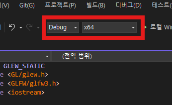

2. 빌드를 한다는 것은 exe 파일을 만든다는 이야기입니다. F5를 누르게 되면 솔루션 경로(어디인지 기억 하시죠?)에 `Build/x64Debug/Tutorial.exe` 파일이 생성됩니다. 이 파일을 더블클릭 해 보시면 우리가 만든 프로그램을 별도로 실행해 볼 수 있습니다.

3. 무언가 오류가 발생한다면, 링크 문제인지, 컴파일 문제인지, GLFW 문제인지, GLEW 문제인지 등을 출력 로그를 통해 알 수 있습니다. 너무나 당연하지만, 문제가 생기면 코드부터 살펴볼 것이 아니라 출력 창부터 확인을 해야 합니다!

## 연습 문제

앞서 작성한 `main.cpp` 파일의 자세한 내용은 알 수 없어도, 코드를 보다 보면 눈치챌 수 있는 내용이 몇 가지 있을 겁니다. 여러분의 센스를 테스트 해 보세요.

1. 프로그램을 실행하면 윈도우의 이름이 "GLFW Test Window"인 것을 알 수 있습니다. 이 윈도우의 이름을 다른 것으로 바꾸어 보세요.

2. 윈도우의 크기를 더 크게, 혹은 더 작게 바꾸어 보세요. 마우스로 드래그해서 크기를 바꾸는 것이 아닌, 프로그램을 실행했을 때 나타나는 초기 크기를 의미합니다.

3. 현재 윈도우의 색상은 옅은 파란색입니다. 다른 색으로 바꿔 보세요.

---

## 관련 링크
- [소스 코드](../assets/opengl/installation/src/main.cpp)
- [GLFW(Graphics Library FrameWork)](https://www.glfw.org/)
- [GLEW(OpenGL Extension Wrangler Library)](https://glew.sourceforge.net/)
