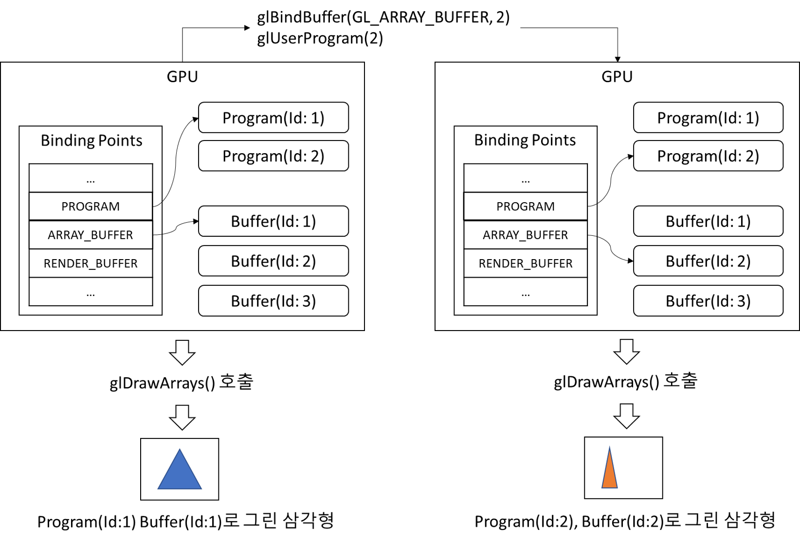
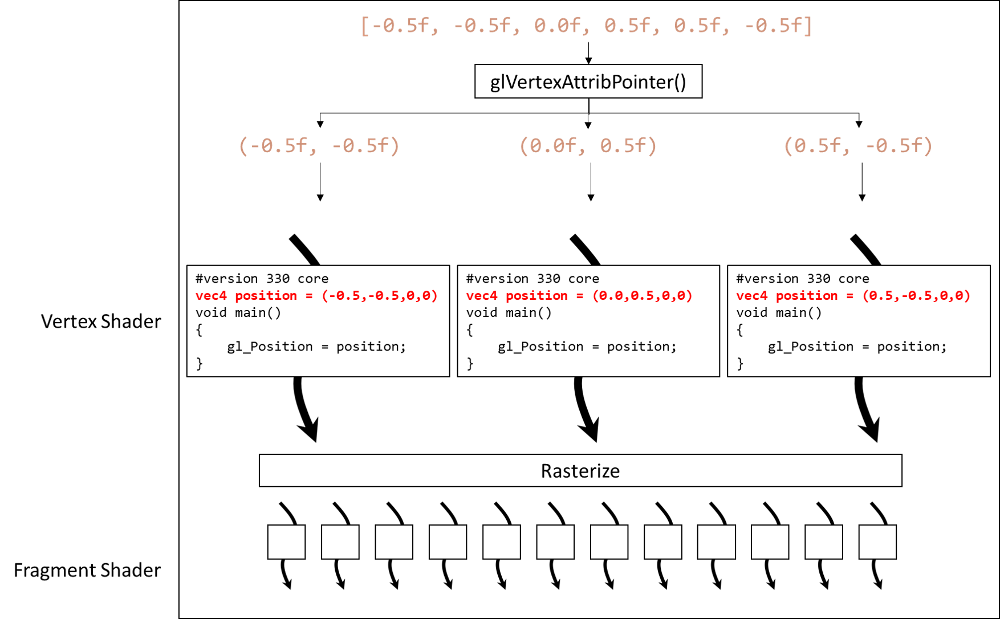
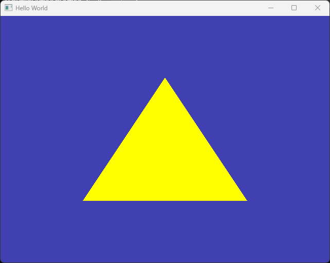

# Shader and Vertex Attribute

이번 문서에서는 셰이더와 정점(Vertex) 어트리뷰트에 대해 알아보도록 하겠습니다.

이번 문서의 결과로 화면에 삼각형을 그릴 수 있게 될텐데, [정점 버퍼](./vertex_buffer.md)에서 말씀드린 것처럼 "어떻게" 삼각형을 그릴지를 알려줄 셰이더를 통해 알려줄겁니다.

또한 데이터를 "어떻게 읽어야 하는지"도 알려주어야 하는데 이를 위해 정점 어트리뷰트를 정의해야 합니다. (정점 버퍼 마지막에 말씀드린, 점이 2개인지 3개인지 어떻게 아느냐 하는 문제가 여기에서 해결됩니다.)

## 셰이더

셰이더란, GPU에서 실행되는 프로그램으로써 일련의 데이터를 GPU 코어들에서 병렬적으로 처리하기 위한 특수한 프로그램입니다.

이번 학기에 배우는 그래픽스 파이프라인과 관련하여 (최소한) 정점 셰이더와 프래그먼트 셰이더가 필요하다고 설명을 드렸을 것입니다.

따라서 여기에서 두 가지 셰이더 프로그램을 작성하고, 사용해 보겠습니다.

셰이더 프로그램 사용을 위한 단계는 네 단계로 정리해 볼 수 있습니다. 하나씩 진행해 봅시다.

1. (준비) 셰이더 프로그램 작성
2. (준비) 셰이더 프로그램 컴파일 & 링킹
3. (준비) 셰이더 프로그램 생성
4. (렌더링) GPU에서 활성화된 버퍼의 데이터와 셰이더를 활용해 삼각형 그리기

:::note
"컴파일"과 "링킹"의 개념에 대해서는 알고 있으시리라 가정합니다.
:::

### 1. (준비) 셰이더 프로그램 작성

우리가 프로그래밍을 할 때, 보통 Visual Studio, VSCode와 같은 IDE를 사용하지만, 사실 실제 코드를 작성하는 행위는 메모장에 글을 쓰는것과 다를 바 없습니다.

간단하게 이야기하자면 IDE들은 메모장에 여러 가지 부가 기능을 붙여 놓은 것이 불과하지요.

따라서 셰이더 프로그램을 작성한다는 것은, 셰이더 프로그래밍 언어 문법에 맞게 작성된 문자열을 만든다는 것과 다를 바 없습니다.

우리가 사용할 셰이더 프로그램은 아래와 같이 작성됩니다. 렌더링 루프 상단에 추가하였습니다.

```cpp title="main.cpp"
...
glBindBuffer(GL_ARRAY_BUFFER, bufferID);
glBufferData(GL_ARRAY_BUFFER, 6 * sizeof(float), positions, GL_STATIC_DRAW);

//diff-add
std::string vertexShader =
//diff-add
    //diff-add
    "#version 330 core\n"
    //diff-add
    "layout(location = 0) in vec4 position;\n"
    //diff-add
    "void main()\n"
    //diff-add
    "{\n"
    //diff-add
    "	gl_Position = position;\n"
    //diff-add
    "}\n";
//diff-add
std::string fragShader =
//diff-add
    "#version 330 core\n"
    //diff-add
    "layout(location = 0) out vec4 color;\n"
    //diff-add
    "void main()\n"
    //diff-add
    "{\n"
    //diff-add
    "	color = vec4(1.0, 1.0 ,0.0, 1.0);\n"
    //diff-add
    "}\n";

// Rendering Loop
int frame_count = 0;
while (!glfwWindowShouldClose(window)) 
...
```

보기가 별로 좋지 않죠? 일단은 `vertexShader`라는 문자열 변수와 `fragShader`라는 문자열 변수를 정의한 것이 보일거고, 거기에 집어넣은 문자열을 깔끔하게 정리해 보자면 아래와 같습니다.

이 프로그램을 사용해서 삼각형을 그리면, 노란색(RGB=(1,1,0)) 삼각형이 화면에 나타날 수 있습니다.

```glsl title="vertexShader"
#version 330 core
layout(location = 0) in vec4 position;
void main()
{
    gl_Position = position;
}
```
```glsl title="fragShader"
#version 330 core
layout(location = 0) out vec4 color;
void main()
{
    color = vec4(1.0, 1.0 ,0.0, 1.0);
}
```

두 셰이더 모두 위의 첫 두줄은 생소하시겠지만, 중요한 내용이어서 [뒤에](#정점-어트리뷰트) 다시 설명드리겠습니다.

그 아래를 보면, 우리가 흔히 알고 있는 프로그램의 진입점인 `main()` 함수가 보이고, 그 안에는 각각 한 줄의 명령문들이 적혀 있습니다.

내용은 모르겠지만, "프로그램"을 작성하는 코드의 형태를 띠고 있다는 것만 알고 계시면 됩니다. 우리가 사용하는 셰이더 프로그래밍 언어는 GLSL이라는, C를 기반으로 확장 정의된 형태의 프로그래밍 언어입니다.

:::note
안타깝게도, 우리가 셰이더 프로그래밍을 하면서 GLSL을 계속 사용할 것이긴 한데, GLSL 문법을 별도로 설명드릴 시간은 없습니다.

C언어와 비슷하기 때문에 보기만 해도 대부분 이해하실 수 있을거고, 생소한 부분 (위에서 `layout`, `out`, `vec4`, `gl_Position`과 같은 키워드들)은 모두 강의를 진행하면서 설명 드릴 것입니다.

좀 더 미리 잘 알고싶다 하시는 분들은 [learnopengl.com](https://learnopengl.com/Getting-started/Shaders)의 문서를 참고하시면 좋겠습니다.
:::

### 2. (준비) 셰이더 프로그램 컴파일 & 링킹

다음으로는 위와 같이 작성한 셰이더 프로그램을 컴파일 & 링킹하여 실제 실행 가능한 프로그램을 만들어야 합니다. 

그런데 셰이더 프로그램은 GPU에서 내부적으로 동작하는 프로그램이죠? 따라서 컴파일 & 링킹을 통해 만들어진 프로그램은 GPU 내부에 존재하게 됩니다. 즉, 우리가 CPU에서 실행할 수 있는 파일(exe)로 만들어지는 것이 아니고, GPU 메모리에 올라가 있어야 합니다.

이러한 컴파일 & 링킹 역시 OpenGL API를 통해 GPU에 명령을 내려서 수행해야 합니다. 전체 코드는 아래와 같으며, 기존의 우리 `main()`함수 위쪽에 static 함수로 정의합니다.

:::note
함수 전체를 추가하는 것이어서 굳이 앞에 +를 표시하지 않았습니다만, 추가하는 코드입니다.
:::


```cpp title="main.cpp"
...
#include <iostream>

//--------Shader 컴파일 함수----------//
static unsigned int CompileShader(unsigned int type, const std::string& source)
{
	unsigned int id = glCreateShader(type); 
	const char* src = source.c_str();
	glShaderSource(id, 1, &src, nullptr); 
	glCompileShader(id); 

	int result;
	glGetShaderiv(id, GL_COMPILE_STATUS, &result); 
	if (result == GL_FALSE) //컴파일 실패
	{
		int length;
		glGetShaderiv(id, GL_INFO_LOG_LENGTH, &length); 
		char* message = (char*)alloca(length * sizeof(char)); 
		glGetShaderInfoLog(id, length, &length, message); 
		std::cout << "셰이더 컴파일 실패! " << (type == GL_VERTEX_SHADER ? "vertex" : "fragment") << std::endl;
		std::cout << message << std::endl;
		glDeleteShader(id); 
		return 0;
	}

	return id;
}

//--------Shader 프로그램 생성, 컴파일, 링크----------//
static unsigned int CreateShader(const std::string& vertexShader, const std::string& fragShader)
{
	unsigned int programID = glCreateProgram(); //셰이더 프로그램 객체 생성(int에 저장되는 것은 id)
	unsigned int vs = CompileShader(GL_VERTEX_SHADER, vertexShader); 
	unsigned int fs = CompileShader(GL_FRAGMENT_SHADER, fragShader);

	//컴파일된 셰이더 코드를 program에 추가하고 링크
	glAttachShader(programID, vs);
	glAttachShader(programID, fs);
	glLinkProgram(programID);
	glValidateProgram(programID);

	//셰이더 프로그램을 생성했으므로 vs, fs 개별 프로그램은 더이상 필요 없음
	glDeleteShader(vs);
	glDeleteShader(fs);

	return programID;
}

int main(void)
...
```

코드가 좀 길죠? 그런데 다 아실 필요는 없습니다. 왜냐하면 이 코드는 우리가 수정할 일이 없기 때문입니다. 

그냥 이 두 함수를 사용하기만 하면 앞서 작성한 셰이더 프로그램이 컴파일 & 링킹되어 GPU에 올라가고, 실행 가능한 상태가 된다는 것만 알고 계십시오.

다만, OpenGL의 동작 방식에 익숙해지자는 차원에서, 밑의 `CreateShader()` 함수만 약간 설명해 보겠습니다.

```cpp
unsigned int programID = glCreateProgram(); //셰이더 프로그램 객체 생성(int에 저장되는 것은 id)
unsigned int vs = CompileShader(GL_VERTEX_SHADER, vertexShader); 
unsigned int fs = CompileShader(GL_FRAGMENT_SHADER, fragShader);

//컴파일된 셰이더 코드를 program에 추가하고 링크
glAttachShader(programID, vs);
glAttachShader(programID, fs);
glLinkProgram(programID);
glValidateProgram(programID);

//셰이더 프로그램을 생성했으므로 vs, fs 개별 프로그램은 더이상 필요 없음
glDeleteShader(vs);
glDeleteShader(fs);
```

- `glCreateProgram()`은 지난 시간의 `glGenBuffers()`와 유사합니다. GPU에게 프로그램이 들어갈 공간을 하나 예약받고, 그 ID를 얻습니다.
- `CompileShader()`는 위에서 우리가 정의한 함수입니다. 인자로 셰이더가 정점 셰이더인지 프래그먼트 셰이더인지를 명시하는 상수와, 실제 셰이더 코드를 넘겨줍니다. 코드 문자열을 집어넣어 컴파일하면 기계어 코드가 될텐데, GPU에서 컴파일을 통해 이 기계어 코드를 생성한 후 ID(`vs`,`fs`)를 반환하도록 만들어져 있습니다.
- 셰이더는 하나의 프로그램이기 때문에 `glAttachShader()`를 사용해 정점 셰이더와 프래그먼트 셰이더를 묶어서 하나의 프로그램으로 만들 것이라고 알려줍니다.
- `glLinkProgram()`으로 GPU에 링킹 과정을 거쳐 셰이더를 만들게 하고, `glValidateProgram()`을 통해 문제가 없는지 확인합니다.
- 이제 `programID`만 있으면 GPU 내의 프로그램에 접근할 수 있으므로 컴파일 결과는 필요 없습니다. `glDeleteShader()`로 `vs`,`fs` ID에 들어있는 컴파일 결과물들을 지워줍니다.

정점 버퍼에서 `bufferID`를 가지고 어떤 데이터를 사용할지를 지정할 수 있는것처럼, 셰이더도 `programID`만 있으면 어떤 셰이더를 사용할지 지정할 수 있습니다. 나머지 관련된 모든 정보들은 GPU가 내부적으로 알아서 매니징을 하고 있습니다.


### 3. (준비) 셰이더 프로그램 생성

이제 위 함수들을 사용해서 셰이더 프로그램을 생성합니다. 또한 사용이 끝난 후 정리하는 부분도 작성해 줍니다.

```cpp title="main.cpp"
...
"{\n"
"	color = vec4(1.0, 1.0 ,0.0, 1.0);\n" 
"}\n";

//diff-add
unsigned int shaderID = CreateShader(vertexShader, fragShader);
//diff-add
glUseProgram(shaderID); 

while (!glfwWindowShouldClose(window))
{
    ...
}

//diff-add
glDeleteProgram(shaderID);

glfwTerminate();
...
```

2번 과정에서 설명했듯이, `CreateShader()`의 인자로 셰이더 코드 문자열을 넘겨주면 함수를 사용해 컴파일 & 링킹을 수행하고 GPU 내부에 생성된 프로그램 ID를 반환해 줍니다.

우리는 `main()`함수에서 그 프로그램 ID를 `shaderID`라는 변수에 저장해 두었습니다.

`glUseProgram(shaderID)`는 `shaderID`에 해당하는 프로그램을 바인딩하겠다는 뜻입니다. 

마지막으로 프로그램이 끝나면 GPU에 있는 셰이더는 더이상 쓸모가 없기 때문에 `glDeleteProgram()`을 사용해 삭제해 줍니다.


### 4. (렌더링) GPU에서 활성화된 버퍼의 데이터와 셰이더를 활용해 삼각형 그리기

이제 실제 렌더링 과정에서는 이렇게 만든 셰이더를 활용해서 삼각형을 그리면 됩니다.

어떤 코드를 추가해야 하냐고요? 아무것도 추가할 필요가 없습니다! 아래 그림을 통해 설명해 보죠.



[지난 문서](vertex_buffer.md)의 그림과 비슷한데 이번에는 Program(=셰이더) 바인딩 포인트와 프로그램들이 추가되었습니다.

그림에 요약된 대로, GPU에서는 `glDrawArrays()` 명령을 받게 되면, 현재 ARRAY_BUFFER와 PROGRAM에 바인딩되어있는 그 데이터를 가지고 삼각형을 그릴 뿐입니다. 심플하죠.

내가 다른 데이터로 삼각형을 그리고 싶으면, 그리기 전에 `glBindBuffer()`로 다른 버퍼를 바인딩해야 하며, 다른 셰이더로 삼각형을 그리고 싶으면 그리기 전에 `glUseProgram()`으로 다른 셰이더를 바인딩해야 합니다. 

:::note
`glUseProgram()`은 `glBindBuffer()`와 달리 PROGRAM이라는 바인딩 포인트만 바꾸는 API이기 때문에 인자로 ID만 넘겨주면 됩니다.

`glBindBuffer()`는 ARRAY_BUFFER 이외에도 COPY_READ_BUFFER, TEXTURE_BUFFER 등 다른 State의 바인딩을 변경할 수도 있기 때문에 첫 번째 인자로 어떤 State를 바꾸려고 하는 것인지 명시해 주어야 합니다. [문서를 참고하세요.](https://docs.gl/gl3/glBindBuffer)
:::


이제 프로그램을 실행해 보면 여전히 아무것도 화면에 나오지 않습니다. 😭 

해결해야 할 것이 아직 하나 더 남았습니다.


## 정점 어트리뷰트

정점 어트리뷰트는 [지난 시간의 마치며](vertex_buffer.md#마치며)에서 언급했던 두 번째 문제와 관련이 있습니다.

우리가 버퍼에 float값 6개를 복사해 두었는데 이 데이터를 도대체 어떻게 해석해서 써먹어야 하는지를 셰이더에게 알려주어야 하는 과정이 빠져 있습니다.

OpenGL이 항상 그렇지만, 코드로는 두 줄이면 끝나는데 그 의미를 알지 못하면 제대로 사용할 수가 없습니다. 일단 코드부터 소개할께요.

```cpp title="main.cpp"
...
glBufferData(GL_ARRAY_BUFFER, 6 * sizeof(float), positions, GL_STATIC_DRAW);

//diff-add
glEnableVertexAttribArray(0); 
//diff-add
glVertexAttribPointer(0, 2, GL_FLOAT, GL_FALSE, sizeof(float) * 2, 0); 

std::string vertexShader =
...
```

우선 추가된 두 함수 모두 첫 번째 인자에 `0`을 전달해주었습니다. 이 `0`은 정점 셰이더 두 번째 줄의 `location = 0`에 대응되는 값입니다. 

```cpp
layout(location = 0) in vec4 position;
```

말로 풀어서 써보자면 `glEnableVertexAttribArray(0)`는 "셰이더의 0번 location(즉 `position` 변수)에 값을 전달할 수 있게 활성화한다"는 것이고 `glVertexAttribPointer(0, ...)`은 "셰이더의 0번 location(즉 `position` 변수)에 이러한 방식으로 값을 전달한다"는 의미라고 해석할 수 있겠죠.

만일 위에 나온 세 개의 `0` 값들 중 하나라도 다른 값으로 바꾸면 제대로 삼각형이 그려지지 않는 것을 볼 수 있습니다.

:::note
활성화를 먼저 해 주어야 하는 이유는 기본값으로는 버퍼로부터 값을 전달하는 것이 비활성화 되어있기 때문입니다.
:::

조금 복잡한 것은 `glVertexAttribPointer()` 함수의 나머지 인자들입니다.

- 첫 번째 인자: 앞서 이야기한대로 정점 셰이더의 대상 location
- 두 번째 인자: 버퍼의 데이터 몇 개가 하나의 정점 데이터인지(우리의 경우 두 개의 float이 하나의 정점 위치를 표현하므로 `2`)
- 세 번째 인자: 데이터의 타입(우리의 경우 float이므로 GL_FLOAT)
- 네 번째 인자: 데이터의 정규화가 필요한지(예를들어 0~1사이의 값이어야 하는데 실수로 1 이상의 값이 들어있는경우, GL_TRUE로 설정하면 알아서 값을 조정해줌)
- 다섯 번째 인자: 정점과 정점 사이에 데이터를 얼마나 건너뛰어야(stride) 하는지(우리의 경우 데이터가 정점마다 float 2개 간격만큼 떨어져 있으므로 8 byte)
- 마지막 인자: 정점 데이터를 읽기 시작하는 지점(offset)

따라서 버퍼에 있는 `[-0.5f, -0.5f, 0.0f, 0.5f, 0.5f, -0.5f]` 값들이 float 2개씩 끊어서 `(-0.5f, -0.5f)/(0.0f, 0.5f)/(0.5f, -0.5f)`로 나뉘어 정점 셰이더에 있는 position 변수에 들어가게 됩니다. **그러면 GPU에서는 3개의 정점 셰이더가 하나는 `position=(-0.5f, -0.5f)`인 상태로, 하나는 `position=(0.5f, 0.5f)`인 상태로, 하나는 `position=(0.5f, -0.5f)`인 상태로 병렬적으로 실행됩니다.**

개념적으로 그려 보자면 아래와 같은 상태로 볼 수 있겠습니다.



:::warning
위 그림은 말 그대로 이해를 돕기 위해 "개념적으로" 그려진 그림이며 실제 GPU 내부 동작과는 다릅니다.
:::

결과적으로 실행해 보면 아래 그림과 같이 드디어 삼각형이 그려진 것을 볼 수 있습니다!



삼각형 하나 그리는 것이 쉽지 않지요? 하지만 OpenGL이 가장 간단합니다. Direct3D 11(좀 더 어려움), Direct3D 12/Vulkan(매우 어려움)에 비하면 천사입니다. 

어쨌든 몇 가지만 더 말씀 드리고, 연습문제를 진행한 뒤 마치도록 하겠습니다.


## 마치며

1. 셰이더 코드의 `#version 330 core`는 우리가 OpenGL/GLSL 3.3 버전의 최신 기능만을 사용하겠다는 의미입니다. GPU가 지원한다면 다른 버전을 사용할 수도 있고, 레거시 기능을 포함하도록 core가 아닌 compatibility 등의 키워드를 사용할 수도 있습니다만, 이 강의에서는 3.3을 기준으로 진행하겠습니다. 유의할 것은 이 `#version` 키워드는 항상 셰이더 코드 최상단에 위치해야 합니다.

2. 정점 셰이더 코드 `layout(location = 0) in vec4 position;`에서 `in` 키워드는 버퍼로부터 데이터를 입력받는 변수다 라는 것을 의미합니다.

3. `vec4 position;`에서 `vec4`는 GLSL의 내장(built-in) 자료형으로, 4차원 벡터 자료형입니다. 즉 4개의 좌표값을 가지고 있다는 뜻입니다. 그런데 우리는 여기에 데이터를 넣을 때 2개 float값만 넣어줬죠? 나머지 빈 값들은 자동으로 `0`으로 초기화 됩니다. 따라서 `(0.0f, 0.5f)`로 `position` 값을 채우면 `(0.0f, 0.5f, 0.0f, 0.0f)`가 됩니다.

4. 정점 셰이더 코드 `main()` 함수 내부에 있는 `gl_Position`은 내장 변수로, 정점 셰이더가 꼭 해야 하는 작업은 이 내장 변수에 값을 채워넣는 것입니다. 이 변수에 저장된 값이 프래그먼트 셰이더로 넘어가면서 삼각형이 칠해져야 할 위치를 결정하게 됩니다. (채워야 하는 값은 클립 공간 좌표입니다.)

3. 프래그먼트 셰이더에 대한 설명은 강의/실습을 진행하면서 차차 설명 드리도록 하겠습니다. 그래도 삼각형 색깔은 다른 색으로 그려지도록 바꿔 볼 수 있으시겠죠?


## 연습 문제

1. `positions` 배열을 아래와 같이 변경했을 때도, 기존과 동일한 삼각형이 그려지도록 코드를 수정해 보세요.

```cpp
float positions[9] = {
    -0.5f, -0.5f, 0.0f,
     0.0f,  0.5f, 0.0f,
     0.5f, -0.5f, 0.0f
};
```

2. 이번에는 아래와 같이 변경했을 때, 동일한 삼각형이 그려지도록 수정해 보세요.

```cpp
float positions[12] = {
     0.0f,  0.0f, 0.0f,
    -0.5f, -0.5f, 0.0f,
     0.0f,  0.5f, 0.0f,
     0.5f, -0.5f, 0.0f
};
```

3. 정점 셰이더의 location을 아래와 같이 변경했을 때도, 올바른 삼각형이 그려지도록 코드를 수정해 보세요.

```glsl title="vertexShader"
#version 330 core
layout(location = 3) in vec4 position;
void main()
{
    gl_Position = position;
}
```

---

## 관련 링크
- [소스 코드](assets/shader_and_vertex_attribute/src/main_end.cpp)
- [learnopengl.com GLSL 셰이더](https://learnopengl.com/Getting-started/Shaders)

